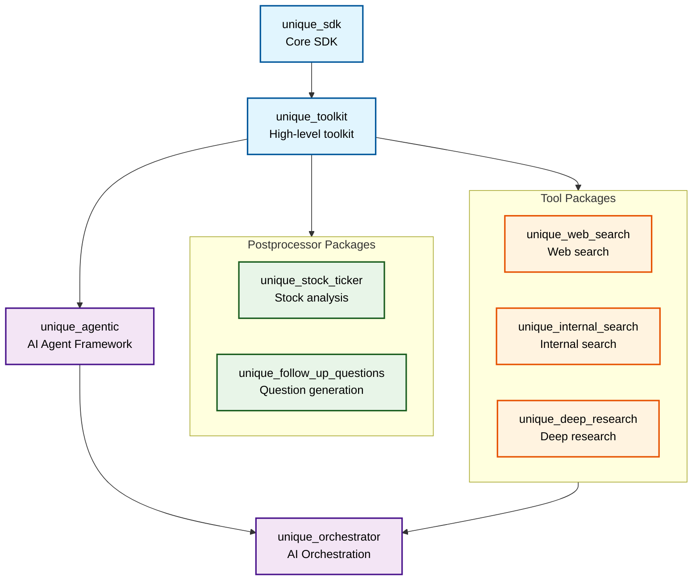

# Unique AI Workspace

Unique AI libraries, tools and resources for public consumption, managed as a [uv workspace](https://docs.astral.sh/uv/concepts/projects/workspaces/).

## 📦 Workspace Structure

This repository contains multiple interconnected Python packages:

- **`unique_sdk`** - Core SDK for Unique AI services
- **`unique_toolkit`** - High-level toolkit built on the SDK
- **`unique_agentic`** - AI Agent Framework for building intelligent agents
- **`unique_orchestrator`** - AI Orchestration Framework for coordinating AI workflows
- **`unique_stock_ticker`** - Stock ticker analysis tools
- **`unique_follow_up_questions`** - Follow-up question generation
- **`unique_web_search`** - Web search capabilities
- **`unique_internal_search`** - Internal search functionality

## 🚀 Getting Started

### Prerequisites

- [uv](https://docs.astral.sh/uv/) installed on your system
- Python 3.11 or higher

### Installation

1. Clone the repository:
   ```shell
   git clone <repository-url>
   cd ai
   ```

2. Install the workspace (installs all dependencies including dev tools):
   ```shell
   make install
   ```

## 💻 Usage

### Quick Start with Makefile

```shell
# See all available commands
make help

# Install and sync workspace
make install

# Run all tests
make test

# Run linting on all packages
make lint

# Validate workspace configuration
make validate
```

### Working with the Entire Workspace

```shell
# Install/sync all workspace dependencies
make sync

# Update the lockfile
make lock

# Run a command in the workspace root (using uv directly when needed)
uv run python -c "print('Hello from workspace')"
```

### Working with Specific Packages

```shell
# Run a command in a specific package
uv run --package unique-sdk python -c "import unique_sdk; print('SDK loaded')"
uv run --package unique-toolkit python -c "import unique_toolkit; print('Toolkit loaded')"

# Run tests for a specific package
uv run --package unique-sdk pytest tests/

# Add a dependency to a specific package
uv add --package unique-sdk requests
```

### Development Commands

```shell
# Run linting across the workspace
make lint

# Run linting on specific packages
make lint-sdk
make lint-toolkit

# Run type checking
make type-check

# Run unit tests for all packages
make test

# Run unit tests for specific packages
make test-sdk
make test-toolkit
make test-stock

# For advanced pytest options, use uv directly
uv run --package unique-sdk pytest tests/ -v
cd unique_sdk && uv run --package unique-sdk pytest tests/ -v
```

### Package Dependencies

The packages have the following dependency relationships:



All workspace dependencies are automatically resolved and installed in editable mode.

## 🔧 Development Setup

### Pre-commit Hooks

The python code in this repository is strictly checked for linting, formatting and imports sorting.
Please use git `pre-commit` hooks to ensure your commits always remain compatible and clean.

```shell
# Install workspace with dev dependencies (includes pre-commit)
make install

# Setup pre-commit hooks
uv run pre-commit install

# Test pre-commit checks manually
make pre-commit
```

### Adding New Dependencies

```shell
# Add a dependency to the workspace root
uv add <package-name>

# Add a dependency to a specific package
uv add --package unique-sdk <package-name>

# Add a development dependency
uv add --package unique-sdk --dev <package-name>
```

### Working with Optional Dependencies

The workspace has centralized development dependencies and some package-specific optional dependencies:

```shell
# Install with development dependencies (default with make)
make install

# For specific extras, use uv directly
uv sync --preview --extra langchain  # For unique-toolkit's langchain extras
uv sync --preview --extra dev --extra langchain  # Multiple extras
```

## 🏗️ Workspace Benefits

This uv workspace setup provides:

- **Single lockfile** (`uv.lock`) ensuring consistent dependency versions
- **Fast dependency resolution** with uv's Rust-based resolver
- **Editable installs** for all workspace packages
- **Cross-package development** with automatic dependency linking
- **Simplified CI/CD** with single environment management
- **Centralized dev dependencies** - All development tools (ruff, pytest, pyright) managed in one place

## 📚 Individual Package Usage

Each package can also be imported and used independently:

```python
# Using the SDK
import unique_sdk

# Using the toolkit
import unique_toolkit

# Using core framework packages
import unique_agentic
import unique_orchestrator

# Using domain-specific packages
import unique_stock_ticker
import unique_follow_up_questions
```

## 🤝 Contributing

1. Make your changes in the appropriate package directory
2. Run tests: `make test` or `make test-<package-name>`
3. Run linting: `make lint` or `make lint-<package-name>`
4. Run type checking: `make type-check`
5. Commit your changes (pre-commit hooks will run automatically)

### Testing Guidelines

- **Run all tests**: `make test`
- **Run package-specific tests**: `make test-sdk`, `make test-toolkit`, etc.
- **Run linting**: `make lint` (all packages) or `make lint-sdk` (specific package)
- **Validate workspace**: `make validate`
- **Clean up**: `make clean`

For advanced testing options, use uv directly:
- **Run specific test files**: `uv run --package <package-name> pytest tests/test_specific.py -v`
- **Run tests with coverage**: `uv run --package <package-name> pytest tests/ --cov=<package-name>`
- **Run only sync tests**: `uv run --package <package-name> pytest tests/ -v -k "not async"`

### Package-Specific Testing

```shell
# Test specific packages using make
make test-sdk      # Test the core SDK
make test-toolkit  # Test toolkit (import validation)
make test-stock    # Test stock ticker package
make test-follow-up # Test follow-up questions
make test-web-search # Test web search tool
make test-internal-search # Test internal search tool

# For full pytest runs with all tests including async
cd unique_sdk && uv run --package unique-sdk pytest tests/ -v
```

## 📖 Further Reading

- [uv Workspaces Documentation](https://docs.astral.sh/uv/concepts/projects/workspaces/)
- [uv Project Management](https://docs.astral.sh/uv/concepts/projects/)
- [Python Project Standards (PEP 621)](https://peps.python.org/pep-0621/)

## License

Refer to [`LICENSE.md`](./LICENSE.md).

## Security

Refer to [`SECURITY.md`](./SECURITY.md).