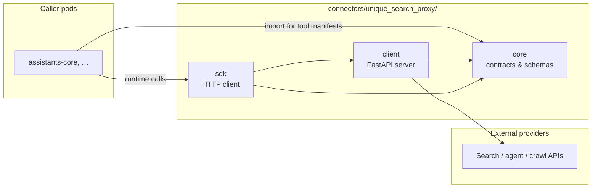
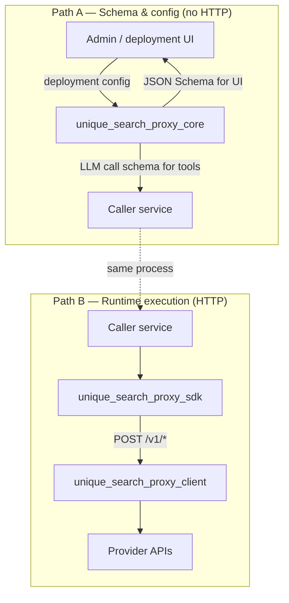
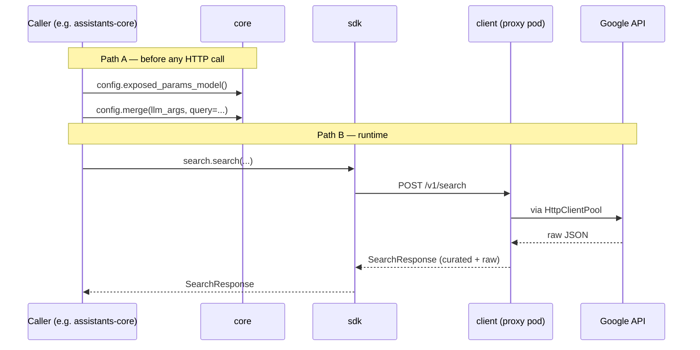

# Unique Search Proxy

Platform services need web search, grounded agent research, and URL crawling — but should not embed provider SDKs, manage API keys, or configure corporate egress in every pod. **Unique Search Proxy** centralises that: one deployable service, one HTTP contract, three Python packages with a strict separation of concerns.

## Recommended for all tenants

**Search Proxy is the recommended way** for every tenant to run Web Search. Callers (notably `assistants-core` via `unique_web_search`) should talk only to the `search-proxy` pod; that pod owns provider credentials and internet egress. Network policies can then keep assistant pods cluster-internal for web access.

**Legacy direct-provider calls** (Search Proxy disabled — `SEARCH_PROXY_BASE_URL` unset) remain available for engines that already supported them. Behaviour is preserved, but **new providers and future development target Search Proxy only**. Today, **Brave** and **Perplexity** standard search are **proxy-only**.

| Without the proxy | With the proxy |
|-------------------|----------------|
| Each service integrates Google, Brave, Tavily, … separately | Callers use one HTTP API |
| Secrets scattered across pods | Credentials live in the proxy pod only |
| Egress/proxy config duplicated | Shared `HttpClientPool` handles outbound networking |
| Tool schemas drift from runtime behaviour | **Core** defines contracts once; server and SDK share them |
| Assistants need open-web egress | Assistants reach only `search-proxy`; providers from one pod |

The proxy exposes three **capabilities**:

1. **Standard search** — query a search engine, get normalised results (`google`, `brave`, `perplexity`)
2. **Agent search (grounding)** — grounded research via LLM agents (`bing`, `vertexai`); returns opaque text for the caller to parse
3. **URL crawl** — fetch and extract page content (`Basic`, `Tavily`, `Jina`, `Firecrawl`)

---

## 1. Three packages, three responsibilities



| Package | PyPI name | One-line role |
|---------|-----------|---------------|
| [`unique_search_proxy_core/`](unique_search_proxy_core/README.md) | `unique-search-proxy-core` | **Contracts** — Pydantic models, deployment config with config-owned request/LLM-schema derivation. No HTTP. |
| [`unique_search_proxy_client/`](unique_search_proxy_client/README.md) | `unique-search-proxy` | **Execution** — FastAPI server, secrets, egress, provider adapters, Prometheus. |
| [`unique_search_proxy_sdk/`](unique_search_proxy_sdk/README.md) | `unique-search-proxy-sdk` | **Transport** — async HTTP client generated from the server's OpenAPI spec. |

**Dependency rule:** core and SDK never import the client. Callers may import core alone (for tool manifests) without installing the server.

→ Deeper treatment: [Core README](unique_search_proxy_core/README.md) · [Client README](unique_search_proxy_client/README.md) · [SDK README](unique_search_proxy_sdk/README.md)

---

## 2. How the system fits together

Two paths connect the packages. Most confusion comes from treating them as one — they serve different lifecycle stages.



| Path | When | What moves |
|------|------|------------|
| **A — Schema & config** | Deploy time, tool registration | Deployment config → JSON Schema; `config.exposed_params_model()` supplies the LLM knobs; `config.merge()` builds the flat request body |
| **B — Runtime HTTP** | Each search / crawl / agent call | SDK → proxy route → provider service → upstream API |

Path A never hits the network. Path B never re-derives schemas — it consumes the flat JSON body that Path A (or manual construction) already produced.

---

## 3. Capabilities at a glance

| Capability | Endpoint | Providers | Kind |
|------------|----------|-----------|------|
| Standard search | `POST /v1/search` | `google`, `brave`, `perplexity` | Classic SERP-style APIs |
| Agent search (grounding) | `POST /v1/agent-search` | `bing`, `vertexai` | Grounded agents / models |
| Agent search (stream) | `POST /v1/agent-search/stream` | `bing`, `vertexai` | Same, streaming |
| URL crawl | `POST /v1/crawl` | `Basic`, `Tavily`, `Jina`, `Firecrawl` | Page readers |
| Provider discovery | `GET /v1/configuration/providers` | — | — |
| Health / metrics | `GET /health`, `/ready`, `/metrics` | — | — |

Endpoint details, payloads, and env vars → [Client README](unique_search_proxy_client/README.md).

---

## 4. End-to-end flow (search)



---

## 5. Design principles

1. **Core owns contracts** — one source of truth for request/response shapes and config models.
2. **Client owns execution** — secrets, egress, and provider SDKs stay in the proxy pod.
3. **SDK owns transport** — thin OpenAPI wrapper; no duplicated business logic.
4. **Flat HTTP bodies** — no nested `config` + `invocation` on the wire; merge happens in core before the call.
5. **Thin agent egress** — agent search returns opaque `answer`; parsing is a caller concern.
6. **Fail closed** — missing credentials → `503 ENGINE_NOT_CONFIGURED` with env var names.

---

## 6. Repository layout

```
connectors/unique_search_proxy/
├── README.md                     ← you are here (system overview)
├── unique_search_proxy_core/     ← contracts & schema helpers
├── unique_search_proxy_client/   ← FastAPI server, Docker, Helm
└── unique_search_proxy_sdk/      ← HTTP client for callers
```

---

## 7. Quick start

Run the proxy locally:

```bash
cd unique_search_proxy_client
uv sync && cp .env.example .env   # set provider keys
uv run uvicorn unique_search_proxy_client.web.app:app --reload --port 2349
```

Call it from Python:

```python
from unique_search_proxy_sdk import UniqueSearchProxyClient

async with UniqueSearchProxyClient("http://localhost:2349") as client:
    result = await client.search.search("EU AI Act", engine="google", fetchSize=10)
```

Package-specific install, configuration, and development → see the [Client](unique_search_proxy_client/README.md), [Core](unique_search_proxy_core/README.md), and [SDK](unique_search_proxy_sdk/README.md) READMEs.

---

## License

Proprietary — Unique AG
