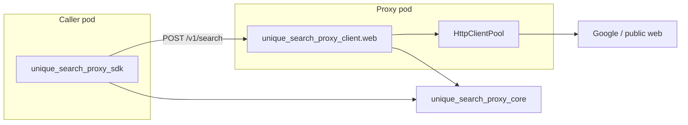

# Unique Search Proxy

Unified web egress proxy for search engines and crawlers. **Three publishable packages** in this repo:

| PyPI name | Module | Role |
|-----------|--------|------|
| `unique-search-proxy` | `unique_search_proxy_client.web` | FastAPI server (proxy pod) |
| `unique-search-proxy-sdk` | `unique_search_proxy_sdk` | Async HTTP client for callers |
| `unique-search-proxy-core` | `unique_search_proxy_core` | Shared Pydantic types (no FastAPI) |



- **Server** owns registry, secrets, Prometheus, and egress (`HttpClientPool`).
- **SDK** wraps the [OpenAPI](http://localhost:2349/docs) contract; depends on **core** for `GoogleConfig`, errors, etc.
- **Core** is server-free and safe to install without FastAPI/uvicorn.

## Quick Start

### Prerequisites

- Python 3.12+
- uv for dependency management

### Installation

```bash
uv sync
cp .env.example .env
# Edit .env: set GOOGLE_SEARCH_API_KEY and GOOGLE_SEARCH_ENGINE_ID for live /v1/search
```

### Running

```bash
uv run python -m unique_search_proxy_client.web.app
# or
uv run uvicorn unique_search_proxy_client.web.app:app --reload --port 2349
```

## Python SDK (`unique-search-proxy-sdk`)

Workspace path: `connectors/unique_search_proxy/unique_search_proxy_sdk/`. Generated from the server OpenAPI spec via [openapi-python-client](https://github.com/openapi-generators/openapi-python-client).

| Path | Role |
|------|------|
| `unique_search_proxy_sdk/_generated/` | Regenerated httpx client + attrs models |
| `unique_search_proxy_sdk/client.py` | `UniqueSearchProxyClient` facade |
| `connectors/unique_search_proxy/unique_search_proxy_client/openapi.json` | Exported spec (codegen input) |

### Regenerate after API changes

```bash
cd connectors/unique_search_proxy/unique_search_proxy_client
uv sync
uv run python scripts/generate_sdk.py
```

### Usage

```python
from unique_search_proxy_sdk import UniqueSearchProxyClient

async with UniqueSearchProxyClient("http://unique-search-proxy:2349") as client:
    await client.health()
    result = await client.search.search("unique ag", engine="google", fetchSize=10)
    crawl = await client.crawl.crawl(["https://example.com"], crawler="basic")

    # Low-level: one generated function per route
    raw = client.openapi  # OpenAPIClient from _generated
```

| Facade method | HTTP |
|---------------|------|
| `health()` | `GET /health` |
| `ready()` | `GET /ready` |
| `search.search(...)` | `POST /v1/search` |
| `crawl.crawl(...)` | `POST /v1/crawl` |

Deployment config JSON Schema, defaults, and LLM call-schema projection live in **`unique_search_proxy_core`** (not HTTP). Assistants-core and tooling import those helpers directly.

Non-success responses raise the same `ProxyError` subclasses as the service. Generated request/response models live under `sdk._generated.models`.

For tests, pass an `httpx.AsyncClient` with `ASGITransport(app=create_app())` and run the app lifespan so in-app egress is initialized.

### Other OpenAPI codegen tools

| Tool | Notes |
|------|--------|
| [OpenAPI Generator](https://github.com/OpenAPITools/openapi-generator) | Broad language support; verbose Python output |
| [openapi-python-client](https://github.com/openapi-generators/openapi-python-client) | **Used here** — async httpx + attrs |
| [datamodel-code-generator](https://github.com/koxudaxi/datamodel-code-generator) | Pydantic models only |
| [Kiota](https://github.com/microsoft/kiota) | Multi-language SDKs |

## API (application)

| Endpoint | Description |
|----------|-------------|
| `GET /health` | Liveness |
| `GET /ready` | Readiness (httpx pool + registered providers) |
| `GET /v1/configuration/providers` | Registered search engine and crawler ids |
| `POST /v1/search` | Execute search (flat request: `engine`, `query`, provider params, `timeout`) |
| `POST /v1/crawl` | Crawl URLs via configured crawler (flat request: `crawler`, `urls`, `timeout`, …) |
| `GET /metrics` | Prometheus scrape endpoint (when enabled) |
| `/docs` | OpenAPI (Swagger UI) — use **Try it out** and the request-body **Examples** dropdown on `/v1/search` and `/v1/crawl` |

Set `ENABLED=false` on monitoring settings (`PrometheusSettings`) to disable metrics. With `WORKERS > 1`, the entrypoint sets `PROMETHEUS_MULTIPROC_DIR` for correct aggregation across uvicorn workers.

Settings are colocated with each component and use env prefixes:

| Component | Prefix / vars | Example |
|-----------|----------------|---------|
| Google search | (no prefix) | `GOOGLE_SEARCH_API_KEY`, `GOOGLE_SEARCH_ENGINE_ID` |
| Brave search | (no prefix) | `BRAVE_SEARCH_API_KEY`, `BRAVE_SEARCH_API_ENDPOINT` |
| Perplexity search | (no prefix) | `PERPLEXITY_SEARCH_API_KEY`, `PERPLEXITY_SEARCH_API_ENDPOINT` |

Unset secrets default to the sentinel `NOT_PROVIDED`. Search calls against an unconfigured provider return **503** `ENGINE_NOT_CONFIGURED` with the missing env var names in the error message (for operators and LLM tool consumers).
| HTTP client | `HTTP_CLIENT_` | `HTTP_CLIENT_PROXY_HOST`, `HTTP_CLIENT_POOL_TIMEOUT_SECONDS` |
| Prometheus | `PROMETHEUS_` | `PROMETHEUS_ENABLED` |
| Container entrypoint | (shell) | `HOST`, `PORT`, `WORKERS`, `LOG_LEVEL`, `PROMETHEUS_MULTIPROC_DIR` |

Copy `.env.example` to `.env` for an annotated template of all settings. Outbound HTTP/proxy pool settings live in `web/settings/client.py`; provider credentials in `web/settings/providers/`; shared helpers in `web/settings/base.py`.

### Runtime discovery (`GET /v1/configuration/providers`)

Lists search engine and crawler ids registered in the proxy pod (depends on env/secrets). Use this for health checks and capability discovery at runtime.

Deployment config JSON Schema, defaults, and LLM call-schema projection are **core library** concerns — import from `unique_search_proxy_core.providers.schema` and `unique_search_proxy_core.search_engines.call_schema` (or the crawl equivalents). Assistants-core embeds those shapes in tool manifests rather than calling extra HTTP routes on the proxy.

### Search (`POST /v1/search`)

Flat request body: all execution fields at the top level (`engine`, `query`, optional provider knobs, `timeout`). Tooling merges deployment config with LLM invocation in **core** (`merge_config_and_invocation`) before calling the proxy.

```json
{
  "engine": "google",
  "query": "example query",
  "fetchSize": 10,
  "gl": "de",
  "dateRestrict": "d7",
  "timeout": 30
}
```

- **`engine`**: registered search engine id (discriminator)
- **`query`**, **`fetchSize`**, optional provider knobs, **`timeout`**: flat execution payload on `POST /v1/search`
- **Deployment config** (`ExposableParam` with `expose` + `value`): resolved in core before building the flat search request — not a separate HTTP surface on the proxy
- **LLM call schema**: `unique_search_proxy_core.search_engines.call_schema.resolve_search_call_schema(...)` with optional `strict=False` for nullable exposed fields

Response:

```json
{
  "engine": "google",
  "query": "example query",
  "raw": {
    "pages": [
      {
        "pageIndex": 1,
        "offset": 1,
        "requestedCount": 10,
        "response": {}
      }
    ]
  },
  "curated": [
    {
      "url": "https://example.com",
      "title": "Example",
      "snippet": "...",
      "content": ""
    }
  ]
}
```

### Crawl (`POST /v1/crawl`)

```json
{
  "urls": ["https://example.com"],
  "crawler": "basic",
  "timeout": 30
}
```

### Errors

Non-2xx responses use a structured envelope:

```json
{
  "error": {
    "code": "ENGINE_NOT_CONFIGURED",
    "message": "Engine 'google' is not registered or not configured",
    "engine": "google",
    "retryable": false
  }
}
```

## Project Structure

```
connectors/unique_search_proxy/
├── unique_search_proxy/
│   ├── sdk/                    # HTTP SDK (callers → proxy API)
│   │   ├── _generated/         # openapi-python-client output (regenerate via scripts/)
│   │   ├── client.py           # UniqueSearchProxyClient facade
│   │   ├── converters.py       # App Pydantic config → generated models
│   │   └── errors.py           # Maps API error envelope → ProxyError
│   ├── openapi.json            # Exported OpenAPI (codegen input)
│   ├── scripts/generate_sdk.py
│   └── web/                    # FastAPI application (proxy pod)
│       ├── app.py              # App factory + lifespan (HttpClientPool)
│       ├── settings/
│       ├── api/
│       │   ├── health.py
│       │   └── v1/
│       │       ├── configuration.py
│       │       ├── search.py
│       │       └── crawl.py
│       ├── monitoring/
│       └── core/
│           ├── client/         # Egress pool — application only, not SDK
│           ├── search_engines/
│           └── crawlers/
├── tests/
└── deploy/
```

Engines and crawlers register via `web/core/registry.py` at application startup.

## Development

```bash
uv run ruff check .
uv run ruff format .
uv run pytest
uv run basedpyright
```

## License

Proprietary - Unique AG
