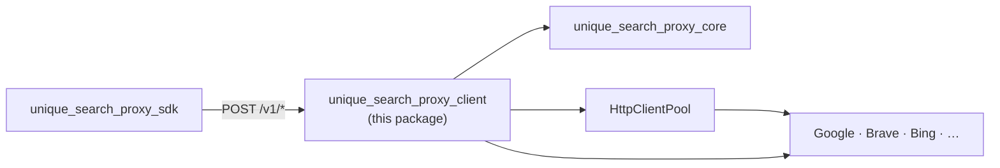
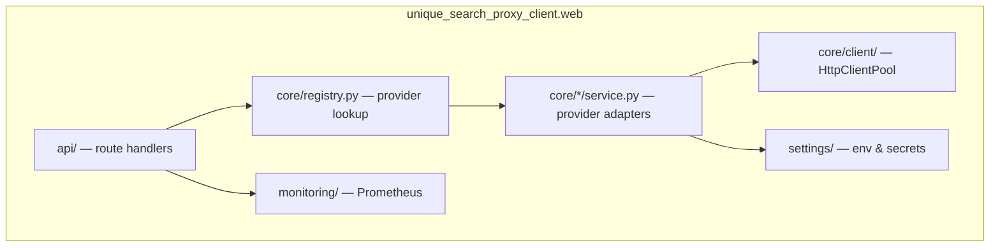

# unique-search-proxy (client)

Part of [Unique Search Proxy](../README.md) · PyPI: `unique-search-proxy` · Helm: `unique-search-proxy`

---

## 1. What this package is

**The client is the proxy pod.** It is the only deployable service in the stack — a FastAPI application that owns secrets, outbound networking, provider adapters, and observability.

Platform services do not talk to Google or Tavily directly. They call this server's HTTP API (usually via the [SDK](../unique_search_proxy_sdk/README.md)). Shared types and config models come from [core](../unique_search_proxy_core/README.md).

| Package | Question it answers |
|---------|---------------------|
| [Core](../unique_search_proxy_core/README.md) | *What* can be configured and *what* does a valid request/response look like? |
| **Client** (this) | *How* are provider calls executed at runtime? |
| [SDK](../unique_search_proxy_sdk/README.md) | *How* do callers reach the proxy over HTTP? |

---

## 2. Role in the system



System overview → [../README.md](../README.md)

**What the client owns:** HTTP routes, provider registry, credential loading, httpx egress pool, Prometheus, Docker/Helm deployment.

**What it does not own:** Deployment config JSON Schema, LLM exposed-params derivation, config/invocation merge — those live in core (as config-class methods) and run in caller processes.

---

## 3. Internal architecture

Requests flow through four layers inside the FastAPI app:



| Layer | Path | Responsibility |
|-------|------|----------------|
| **Entry** | `app.py` | App factory, lifespan (start/stop pool), router mount |
| **API** | `api/health.py`, `api/v1/*.py` | Validate body via core models, dispatch, record metrics |
| **Registry** | `core/registry.py`, `core/providers.py` | Register built-in engines/crawlers at startup |
| **Services** | `core/search_engines/`, `core/agent_engines/`, `core/crawlers/` | Provider-specific HTTP/SDK calls, response curation |
| **Egress** | `core/client/service.py` | Shared httpx client (optional corporate proxy / mTLS) |
| **Settings** | `settings/providers/*`, `settings/client.py` | Per-provider credentials; unset → `NOT_PROVIDED` → 503 |
| **Monitoring** | `monitoring/` | Search / agent / crawl latency and error counters |
| **Deploy** | `deploy/` | Dockerfile, Helm chart, uvicorn entrypoint |

Built-in providers register in `register_builtin_providers()` during `create_app()`.

---

## 4. HTTP API

| Endpoint | Description |
|----------|-------------|
| `GET /health` | Liveness |
| `GET /ready` | Readiness (httpx pool + registered providers) |
| `GET /v1/configuration/providers` | Registered search engine, agent engine, and crawler ids |
| `POST /v1/search` | Standard search (flat body: `engine`, `query`, provider params, `timeout`) |
| `POST /v1/agent-search` | Grounded agent search — opaque `answer` + `raw` |
| `POST /v1/agent-search/stream` | Same, streamed as SSE (`delta` + `done`) |
| `POST /v1/crawl` | Crawl URLs (flat body: `crawler`, `urls`, `timeout`, …) |
| `GET /metrics` | Prometheus (when enabled) |
| `/docs` | Swagger UI with preset examples |

OpenAPI spec: `openapi.json` (input for [SDK codegen](../unique_search_proxy_sdk/README.md)).

---

## 5. Providers

### 5.1 Summary

| Provider | Type | Upstream | Credentials |
|----------|------|----------|-------------|
| Google | Search | Custom Search JSON API | `GOOGLE_SEARCH_API_KEY`, `GOOGLE_SEARCH_ENGINE_ID` |
| Brave | Search | Brave Search API | `BRAVE_SEARCH_API_KEY` |
| Perplexity | Search | Perplexity API | `PERPLEXITY_SEARCH_API_KEY` |
| Bing | Agent | Azure AI Projects grounding | `BING_AGENT_*` |
| VertexAI | Agent | Google GenAI + grounding | `VERTEXAI_AGENT_*` or ADC |
| Basic | Crawl | Direct httpx + HTML/PDF processors | (none) |
| Tavily | Crawl | Tavily extract API | `TAVILY_API_KEY` |
| Jina | Crawl | Jina Reader API | `JINA_API_KEY` |
| Firecrawl | Crawl | Firecrawl scrape (with polling) | `FIRECRAWL_API_KEY` |

Unconfigured providers return **503** `ENGINE_NOT_CONFIGURED` with missing env var names. `GET /v1/configuration/providers` lists what is registered in the running pod.

### 5.2 Search (`POST /v1/search`)

Flat request — tooling merges deployment config with LLM args in **core** before calling the proxy:

```json
{
  "engine": "google",
  "query": "example query",
  "fetchSize": 10,
  "gl": "de",
  "dateRestrict": "d7",
  "timeout": 30
}
```

Response includes **curated** normalised results and opaque **raw** provider payload:

```json
{
  "engine": "google",
  "query": "example query",
  "raw": { "pages": [{ "pageIndex": 1, "response": {} }] },
  "curated": [
    { "url": "https://example.com", "title": "Example", "snippet": "...", "content": "" }
  ]
}
```

### 5.3 Agent search (`POST /v1/agent-search`)

Thin egress — proxy returns opaque agent text; callers own parsing and citation extraction:

```json
{
  "engine": "bing",
  "query": "latest EU AI Act timeline",
  "generationInstructions": "...",
  "fetchSize": 5,
  "timeout": 120
}
```

Streaming (`/v1/agent-search/stream`) emits SSE `{ "type": "delta", "text": "..." }` chunks and a terminal `{ "type": "done", "response": { … } }`.

**Bing auto-provisioned agents:** when `agent_id` / `BING_AGENT_AGENT_ID` is unset, the proxy creates Foundry agents named `unique-grounding-with-bing-<hash>` (hash of model, fetch size, and instructions) on first miss. Set `BING_AGENT_CLEANUP_ON_START=true` to delete those prefix-matched agents on process start (best-effort; failures and multi-worker/replica races are logged and never block boot; create-on-miss recovers transient misses). Preconfigured agent names that do not use this prefix are not deleted.

### 5.4 Crawl (`POST /v1/crawl`)

Per-URL outcomes — one URL failing does not fail the batch:

```json
{
  "urls": ["https://example.com"],
  "crawler": "Basic",
  "timeout": 30
}
```

Crawler discriminators: `Basic`, `Tavily`, `Jina`, `Firecrawl`.

### 5.5 Errors

Structured envelope on all non-2xx responses:

```json
{
  "error": {
    "code": "ENGINE_NOT_CONFIGURED",
    "message": "Provider is not configured. Set environment variable(s): GOOGLE_SEARCH_API_KEY",
    "retryable": false
  }
}
```

Error types are defined in [core](../unique_search_proxy_core/README.md) and raised by the [SDK](../unique_search_proxy_sdk/README.md) on the caller side.

---

## 6. Configuration

Settings use pydantic-settings with per-provider env vars. Copy `.env.example` to `.env` for an annotated template.

| Component | Prefix / vars | Example |
|-----------|---------------|---------|
| Google search | (none) | `GOOGLE_SEARCH_API_KEY`, `GOOGLE_SEARCH_ENGINE_ID` |
| Brave search | (none) | `BRAVE_SEARCH_API_KEY`, `BRAVE_SEARCH_API_ENDPOINT` |
| Perplexity | (none) | `PERPLEXITY_SEARCH_API_KEY` |
| Tavily | `TAVILY_` | `TAVILY_API_KEY` |
| Jina | `JINA_` | `JINA_API_KEY`, `JINA_DEPLOYMENT` |
| Firecrawl | `FIRECRAWL_` | `FIRECRAWL_API_KEY`, `FIRECRAWL_API_VERSION` |
| Bing agent | `BING_AGENT_` | `BING_AGENT_ENDPOINT`, `BING_AGENT_BING_RESOURCE_CONNECTION_STRING`, optional `BING_AGENT_CLEANUP_ON_START` |
| VertexAI agent | `VERTEXAI_AGENT_` | `VERTEXAI_AGENT_SERVICE_ACCOUNT_CREDENTIALS` (optional) |
| HTTP client | `HTTP_CLIENT_` | `HTTP_CLIENT_PROXY_HOST`, `HTTP_CLIENT_POOL_TIMEOUT_SECONDS` |
| Prometheus | `PROMETHEUS_` | `PROMETHEUS_ENABLED` |
| Container | (shell) | `HOST`, `PORT`, `WORKERS`, `LOG_LEVEL` |

With `WORKERS > 1`, the entrypoint sets `PROMETHEUS_MULTIPROC_DIR` for correct metric aggregation.

---

## 7. Quick start

**Prerequisites:** Python 3.12+, uv

```bash
uv sync
cp .env.example .env
# Edit .env: set GOOGLE_SEARCH_API_KEY and GOOGLE_SEARCH_ENGINE_ID for live /v1/search
```

```bash
uv run python -m unique_search_proxy_client.web.app
# or
uv run uvicorn unique_search_proxy_client.web.app:app --reload --port 2349
```

Call from Python via the [SDK](../unique_search_proxy_sdk/README.md):

```python
from unique_search_proxy_sdk import UniqueSearchProxyClient

async with UniqueSearchProxyClient("http://localhost:2349") as client:
    result = await client.search.search("unique ag", engine="google", fetchSize=10)
```

Regenerate SDK after API changes:

```bash
uv run python scripts/generate_sdk.py
```

---

## 8. Dev testing

1. Start the server and configure `.env` (`.env.example` sets `REQUIRE_CONTEXT_HEADERS=false` for local use; production keeps enforcement enabled).
2. **Swagger** — `/docs` → **Try it out** on `/v1/search` or `/v1/crawl` → pick an **Examples** preset. Context headers default to `local` in the UI.
3. **CLI** — same presets from the terminal (`scripts/try_presets.py` sends the same local context headers):

```bash
uv run python scripts/try_presets.py list
uv run python scripts/try_presets.py run google_minimal
uv run python scripts/try_presets.py run-all --kind crawl
uv run python scripts/try_presets.py run google_minimal --base-url http://127.0.0.1:8080
```

Presets live in `web/presets/` (shared with Swagger examples). Add `--strict` to exit non-zero on any non-2xx response.

---

## 9. Project structure

```
unique_search_proxy_client/
├── openapi.json              # Exported spec (SDK codegen input)
├── scripts/
│   ├── generate_sdk.py
│   └── try_presets.py
├── deploy/                   # Dockerfile, Helm chart
├── tests/
└── unique_search_proxy_client/web/
    ├── app.py
    ├── api/                  # health + v1 routes
    ├── core/                 # registry, services, HttpClientPool
    ├── settings/             # env & provider credentials
    ├── monitoring/
    └── presets/
```

---

## 10. Development

```bash
uv run ruff check .
uv run ruff format .
uv run pytest
uv run basedpyright
```

---

## License

Proprietary — Unique AG
