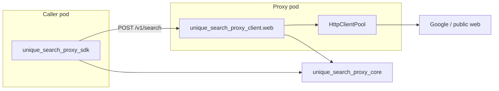

# Unique Search Proxy

Unified web egress proxy for search engines and crawlers. **Three publishable packages** in this repo:

| PyPI name | Module | Role |
|-----------|--------|------|
| `unique-search-proxy` | `unique_search_proxy_client.web` | FastAPI server (proxy pod) |
| `unique-search-proxy-sdk` | `unique_search_proxy_sdk` | Async HTTP client for callers |
| `unique-search-proxy-core` | `unique_search_proxy_core` | Shared Pydantic types (no FastAPI) |



- **Server** owns registry, secrets, Prometheus, and egress (`HttpClientPool`).
- **SDK** wraps the [OpenAPI](http://localhost:2349/docs) contract; depends on **core** for `GoogleConfig`, errors, etc.
- **Core** is server-free and safe to install without FastAPI/uvicorn.

## Quick Start

### Prerequisites

- Python 3.12+
- uv for dependency management

### Installation

```bash
uv sync
cp .env.example .env
# Edit .env: set GOOGLE_SEARCH_API_KEY and GOOGLE_SEARCH_ENGINE_ID for live /v1/search
```

### Running

```bash
uv run python -m unique_search_proxy_client.web.app
# or
uv run uvicorn unique_search_proxy_client.web.app:app --reload --port 2349
```

## Python SDK (`unique-search-proxy-sdk`)

Workspace path: `connectors/unique_search_proxy/unique_search_proxy_sdk/`. Generated from the server OpenAPI spec via [openapi-python-client](https://github.com/openapi-generators/openapi-python-client).

| Path | Role |
|------|------|
| `unique_search_proxy_sdk/_generated/` | Regenerated httpx client + attrs models |
| `unique_search_proxy_sdk/client.py` | `UniqueSearchProxyClient` facade |
| `connectors/unique_search_proxy/unique_search_proxy_client/openapi.json` | Exported spec (codegen input) |

### Regenerate after API changes

```bash
cd connectors/unique_search_proxy/unique_search_proxy_client
uv sync
uv run python scripts/generate_sdk.py
```

### Usage

```python
from unique_search_proxy_sdk import UniqueSearchProxyClient
from unique_search_proxy_core.search_engines.base import SearchEngineType
from unique_search_proxy_core.search_engines.google.schema import (
    GoogleConfig,
    GoogleSearchRequest,
)

async with UniqueSearchProxyClient("http://unique-search-proxy:2349") as client:
    config = GoogleConfig(gl={"expose": True, "value": "ch"})
    schema = await client.search_call_schema("google", config=config)
    providers = await client.list_providers()
    from unique_search_proxy_core.search_engines.params import (
        merge_config_and_invocation,
    )

    request = merge_config_and_invocation(
        config,
        {"query": "unique ag"},
        engine=SearchEngineType.GOOGLE,
    )
    result = await client.search_with(
        engine=SearchEngineType.GOOGLE,
        request=request,
    )

    # Low-level: one generated function per route
    raw = await client.openapi  # OpenAPIClient from _generated
```

| Facade method | HTTP |
|---------------|------|
| `health()` | `GET /health` |
| `ready()` | `GET /ready` |
| `list_providers()` | `GET /v1/configuration/providers` |
| `search_engines_config_json_schema()` | `GET /v1/configuration/search-engines/json-schema` |
| `search_engine_config_json_schema(id)` | `GET /v1/configuration/search-engines/{id}/json-schema` |
| `search_engine_default_config(id)` | `GET /v1/configuration/search-engines/{id}/default-config` |
| `crawlers_config_json_schema()` | `GET /v1/configuration/crawlers/json-schema` |
| `crawler_config_json_schema(id)` | `GET /v1/configuration/crawlers/{id}/json-schema` |
| `crawler_default_config(id)` | `GET /v1/configuration/crawlers/{id}/default-config` |
| `search_call_schema(engine_id, config=...)` | `POST /v1/configuration/search-engines/{id}/call-schema` |
| `search(request)` / `search_with(engine, request)` | `POST /v1/search` (derived `GoogleConfigRequest`) |
| `crawl(request)` / `crawl_urls(...)` | `POST /v1/crawl` |

Non-success responses raise the same `ProxyError` subclasses as the service. Generated models live under `sdk._generated.models`; the facade accepts application Pydantic configs (`GoogleConfig`, `BasicCrawlerConfig`) and converts them for requests.

For tests, pass an `httpx.AsyncClient` with `ASGITransport(app=create_app())` and run the app lifespan so in-app egress is initialized.

### Other OpenAPI codegen tools

| Tool | Notes |
|------|--------|
| [OpenAPI Generator](https://github.com/OpenAPITools/openapi-generator) | Broad language support; verbose Python output |
| [openapi-python-client](https://github.com/openapi-generators/openapi-python-client) | **Used here** — async httpx + attrs |
| [datamodel-code-generator](https://github.com/koxudaxi/datamodel-code-generator) | Pydantic models only |
| [Kiota](https://github.com/microsoft/kiota) | Multi-language SDKs |

## API (application)

| Endpoint | Description |
|----------|-------------|
| `GET /health` | Liveness |
| `GET /ready` | Readiness (httpx pool + registered providers) |
| `GET /v1/configuration/providers` | Registered search engine and crawler ids |
| `GET /v1/configuration/search-engines/json-schema` | JSON Schema for search-engine deployment config (union) |
| `GET /v1/configuration/search-engines/{id}/json-schema` | JSON Schema for one search engine |
| `GET /v1/configuration/search-engines/{id}/default-config` | Default deployment config for one search engine |
| `GET /v1/configuration/crawlers/json-schema` | JSON Schema for crawler deployment config (union) |
| `GET /v1/configuration/crawlers/{id}/json-schema` | JSON Schema for one crawler |
| `GET /v1/configuration/crawlers/{id}/default-config` | Default deployment config for one crawler |
| `POST /v1/configuration/search-engines/{id}/call-schema` | LLM call JSON Schema from deployment `GoogleConfig` body |
| `POST /v1/search` | Execute search (derived request: `engine`, `query`, `fetchSize`, `timeout`, …) |
| `POST /v1/crawl` | Crawl URLs via configured crawler |
| `GET /metrics` | Prometheus scrape endpoint (when enabled) |
| `/docs` | OpenAPI (Swagger UI) — use **Try it out** and the request-body **Examples** dropdown on `/v1/search`, `/v1/search/call-schema`, and `/v1/crawl` |

Set `ENABLED=false` on monitoring settings (`PrometheusSettings`) to disable metrics. With `WORKERS > 1`, the entrypoint sets `PROMETHEUS_MULTIPROC_DIR` for correct aggregation across uvicorn workers.

Settings are colocated with each component and use env prefixes:

| Component | Prefix / vars | Example |
|-----------|----------------|---------|
| Google search | (no prefix) | `GOOGLE_SEARCH_API_KEY`, `GOOGLE_SEARCH_ENGINE_ID` |
| HTTP client | `HTTP_CLIENT_` | `HTTP_CLIENT_PROXY_HOST`, `HTTP_CLIENT_POOL_TIMEOUT_SECONDS` |
| Prometheus | `PROMETHEUS_` | `PROMETHEUS_ENABLED` |
| Container entrypoint | (shell) | `HOST`, `PORT`, `WORKERS`, `LOG_LEVEL`, `PROMETHEUS_MULTIPROC_DIR` |

Copy `.example.env` to `.env` for a annotated template of all settings. Shared helpers live in `web/settings/`.

### Configuration discovery (`GET /v1/configuration/...`)

Replaces the embedded `search_engine_config` / `crawler_config` unions that used to live in `unique_web_search` and were exposed via assistants-core `GET /configuration/tools/WebSearch/json-schema`.

| Old surface | New proxy surface |
|-------------|-------------------|
| `WebSearchConfig.search_engine_config` (discriminator `search_engine_name`) | `GET /v1/configuration/search-engines/json-schema` (discriminator `engine`) |
| `WebSearchConfig.crawler_config` (discriminator `crawler_type`) | `GET /v1/configuration/crawlers/json-schema` (discriminator `crawler`) |
| Per-engine nested config in tool JSON Schema | `GET /v1/configuration/search-engines/{id}/json-schema` |
| LLM invocation params for search | `POST /v1/configuration/search-engines/{id}/call-schema` (body = deployment config) |

Assistants-core can keep exposing the full `WebSearch` tool manifest for modes, citations, and content processing; provider deployment shapes should be sourced from the proxy as engines and crawlers register there.

### Search (`POST /v1/search`)

One hand-written **`GoogleConfig`** per engine drives admin schema, LLM call-schema, and the derived search request. Callers load defaults via `GET /v1/configuration/search-engines/...`, merge with `merge_config_and_invocation`, then `POST /v1/search`. Crawling is separate (`POST /v1/crawl`).

```json
{
  "engine": "google",
  "query": "example query",
  "fetchSize": 10,
  "gl": "de",
  "dateRestrict": "d7",
  "timeout": 30
}
```

- **`engine`**: registered search engine id (discriminator)
- **`query`**, **`fetchSize`**, optional provider knobs: execution payload on `POST /v1/search`
- **Deployment config** (`ExposableParam` with `expose` + `value`; optional knobs use `Annotated[T | None, DeactivatedNone]` and `Field(default_factory=...)` with `value=None` when inactive): configuration routes only — not sent on `POST /v1/search`
- **LLM call schema**: `POST /v1/configuration/search-engines/{id}/call-schema?strict=true` (default) with parsed `GoogleConfig` body; use `strict=false` for optional fields with defaults

Response:

```json
{
  "engine": "google",
  "query": "example query",
  "raw": {
    "pages": [
      {
        "pageIndex": 1,
        "offset": 1,
        "requestedCount": 10,
        "response": {}
      }
    ]
  },
  "curated": [
    {
      "url": "https://example.com",
      "title": "Example",
      "snippet": "...",
      "content": ""
    }
  ]
}
```

### Crawl (`POST /v1/crawl`)

```json
{
  "urls": ["https://example.com"],
  "config": { "crawler": "basic" },
  "parallel": true,
  "timeout": 30
}
```

### Errors

Non-2xx responses use a structured envelope:

```json
{
  "error": {
    "code": "ENGINE_NOT_CONFIGURED",
    "message": "Engine 'google' is not registered or not configured",
    "engine": "google",
    "retryable": false
  }
}
```

## Project Structure

```
connectors/unique_search_proxy/
├── unique_search_proxy/
│   ├── sdk/                    # HTTP SDK (callers → proxy API)
│   │   ├── _generated/         # openapi-python-client output (regenerate via scripts/)
│   │   ├── client.py           # UniqueSearchProxyClient facade
│   │   ├── converters.py       # App Pydantic config → generated models
│   │   └── errors.py           # Maps API error envelope → ProxyError
│   ├── openapi.json            # Exported OpenAPI (codegen input)
│   ├── scripts/generate_sdk.py
│   └── web/                    # FastAPI application (proxy pod)
│       ├── app.py              # App factory + lifespan (HttpClientPool)
│       ├── settings/
│       ├── api/
│       │   ├── health.py
│       │   └── v1/
│       │       ├── schema.py   # OpenAPI models (shared with SDK)
│       │       ├── configuration.py
│       │       ├── search.py
│       │       └── crawl.py
│       ├── monitoring/
│       └── core/
│           ├── client/         # Egress pool — application only, not SDK
│           ├── search_engines/
│           └── crawlers/
├── tests/
└── deploy/
```

Engines and crawlers register via `web/core/registry.py` at application startup.

## Development

```bash
uv run ruff check .
uv run ruff format .
uv run pytest
uv run basedpyright
```

## License

Proprietary - Unique AG
