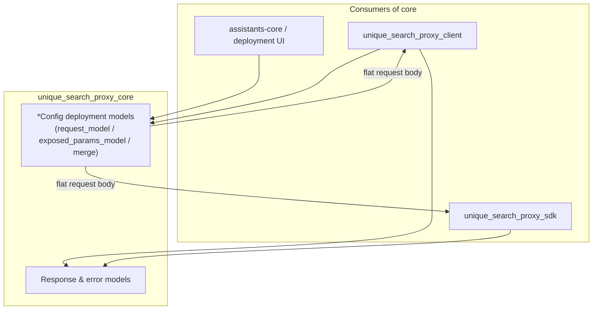
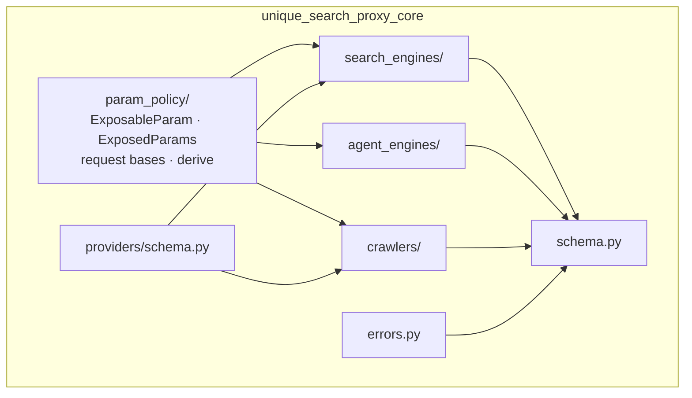

# unique-search-proxy-core

Part of [Unique Search Proxy](../README.md) · PyPI: `unique-search-proxy-core`

---

## 1. What this package is

**Core is the contract layer.** It defines every shared type — deployment configs, HTTP request/response shapes, error codes, and LLM tool schemas — without importing FastAPI, httpx pools, or provider SDKs.

Install it anywhere you need to **describe** or **validate** proxy behaviour: the proxy server, the HTTP SDK, assistants-core tool manifests, deployment UIs.

| Package | Question it answers |
|---------|---------------------|
| **Core** (this) | *What* can be configured and *what* does a valid request/response look like? |
| [Client](../unique_search_proxy_client/README.md) | *How* are provider calls executed at runtime? |
| [SDK](../unique_search_proxy_sdk/README.md) | *How* do callers reach the proxy over HTTP? |

---

## 2. Role in the system

Core sits at the centre of **Path A** (schema & config). It is imported by both the proxy pod and caller services; it never makes HTTP calls itself.



System overview → [../README.md](../README.md)

---

## 3. Key concepts

**The config class owns its entire parameter lifecycle.** Every derived surface is a method on the deployment config — there are no standalone projection or resolver modules.

### 3.1 Config-owned API (search engines)

```
Admin JSON → GoogleConfig {expose, value}
  ├─ GoogleConfig.request_model()            → GoogleSearchRequest (HTTP body, query required)
  ├─ config.exposed_params_model()           → GoogleExposedParams (LLM knobs; tool inherits it)
  ├─ config.merge(llm_args, query=…)         → validated GoogleSearchRequest
  └─ GoogleConfig.provider_query_params(req) → upstream provider dict
```

| Method | Kind | Returns |
|--------|------|---------|
| `request_model()` (classmethod, cached) | search / agent / crawl | `SearchRequestBase` (required `query`) or `CrawlRequestBase` (required `urls`) + config fields; `ExposableParam` knobs unwrapped to optional plain types |
| `exposed_params_model()` (instance) | search only | `ExposedParams` subclass with exactly the `expose=True` knobs (camelCase aliases, description-only schema), or `None` |
| `merge(overrides, *, query)` (instance) | search only | deployment defaults + LLM overrides + query → validated `request_model()` instance |
| `provider_query_params(request)` (classmethod) | search only | request serialized for the upstream provider, minus `_provider_param_exclude_fields` (Google adds `search_engine_id`) |

Agent engines (`BingAgentConfig`, …) and crawlers (`BasicConfig`, …) only implement `request_model()`; crawlers additionally keep `merge_crawler_config_and_invocation`.

### 3.2 ExposableParam — search-engine only

Optional **search** parameters use `ExposableParam[T]`:

- **`value`** — admin default merged into every request (`null` = deactivated)
- **`expose`** — when `true`, the parameter appears on the LLM-facing exposed-params model

```python
gl: ExposableParam[str | None] = ExposableParam(expose=False, value="de")  # admin-fixed
gl: ExposableParam[str | None] = ExposableParam(expose=True, value=None)   # LLM-overridable
```

Bare scalars are **not** coerced — deployment JSON must use the explicit `{"expose": …, "value": …}` shape.

### 3.3 ExposedParams — the LLM tool-schema contract

`config.exposed_params_model()` returns a plain Pydantic model class. Tool-parameter models graft the knobs on by **ordinary inheritance** — no field-def plumbing, no stamped attributes:

```python
Exposed = config.exposed_params_model()          # GoogleExposedParams | None
class ToolParams(ToolParamsBase, Exposed): ...   # or create_model(__base__=(...))

ToolParams.model_json_schema()   # camelCase knobs, no title/default noise
Exposed.model_fields             # the exposed field names
```

The shared `ExposedParams` base owns the single JSON-schema concern: its `model_json_schema` strips Pydantic's auto-`title` and `default` noise, so admin defaults never leak into what the LLM sees.

### 3.4 merge — deployment defaults + LLM overrides

```python
request = google_config.merge({"gl": "de"}, query="EU AI Act")
# → validated GoogleSearchRequest ready for POST /v1/search
```

Deactivated knobs (`value=None`) are dropped, overrides win over admin defaults, `engine` always comes from the config. The proxy receives a flat body; it does not resolve deployment config over HTTP.

### 3.5 merge_crawler_config_and_invocation — crawler only

```python
from unique_search_proxy_core.crawlers import merge_crawler_config_and_invocation

request = merge_crawler_config_and_invocation(basic_config, {"urls": ["https://example.com"]})
# → validated BasicCrawlRequest ready for POST /v1/crawl
```

---

## 4. Architecture (modules)



| Module | Responsibility |
|--------|----------------|
| `schema.py` | Shared API models: `SearchResponse`, `AgentSearchResponse`, `CrawlResponse`, `WebSearchResult`, `ErrorResponse`, SSE events |
| `errors.py` | `ProxyError` hierarchy and stable `ProxyErrorCode` enum |
| `param_policy/exposable_param.py` | `ExposableParam` value object, factory-default merge, type introspection, OpenAPI naming |
| `param_policy/exposed_params.py` | `ExposedParams` base for LLM-facing parameter models (schema noise stripping) |
| `param_policy/request_base.py` | `SearchRequestBase` / `AgentRequestBase` / `CrawlRequestBase` (required leading fields) |
| `param_policy/annotations.py` | Annotation unwrapping helpers (private, used by `derive`) |
| `param_policy/derive.py` | `derive_request_model` / `derive_exposed_params_model` factories called by the config base classes |
| `providers/schema.py` | JSON Schema + defaults for deployment UIs (`provider_config_json_schema`, …) |
| `search_engines/` | Config models with the config-owned API (`request_model` / `exposed_params_model` / `merge` / `provider_query_params`), request union |
| `agent_engines/` | Agent config/request models (`request_model`), output schema |
| `crawlers/` | `*Config` deployment models + derived `*CrawlRequest` bodies, `merge_crawler_config_and_invocation` |

---

## 5. Provider contracts

Core registers the **discriminator ids** and config models. Runtime registration of service classes lives in the [client](../unique_search_proxy_client/README.md).

| Kind | IDs | Config model |
|------|-----|--------------|
| Search engines | `google`, `brave`, `perplexity` | `GoogleConfig`, `BraveConfig`, `PerplexityConfig` |
| Agent engines | `bing`, `vertexai` | `BingAgentConfig`, `VertexAIAgentConfig` |
| Crawlers | `Basic`, `Tavily`, `Jina`, `Firecrawl` | `BasicConfig`, `TavilyConfig`, … → `BasicCrawlRequest`, … |

Search engines share `BaseSearchEngineConfig` (`fetch_size`, `timeout`). Crawlers share `BaseCrawlerConfig` (`timeout` only — `urls` live on derived request models).

---

## 6. Key APIs (by use case)

### Deployment UI — JSON Schema for a provider

```python
from unique_search_proxy_core.providers.schema import (
    provider_config_json_schema,
    provider_default_config,
)

schema = provider_config_json_schema("search_engine", "google")
defaults = provider_default_config("search_engine", "google")
```

### Tool manifest — exposed LLM knobs

```python
Exposed = google_config.exposed_params_model()   # GoogleExposedParams | None
class ToolParams(ToolParamsBase, Exposed): ...   # graft knobs by inheritance
ToolParams.model_json_schema()                   # camelCase, no title/default noise
```

### Runtime — build flat request before HTTP call

```python
request = google_config.merge(llm_invocation_dict, query="EU AI Act")
body = GoogleConfig.provider_query_params(request)  # upstream provider dict
```

### Shared types and errors

```python
from unique_search_proxy_core import (
    SearchResponse,
    ProxyError,
    EngineNotConfiguredError,
    WebSearchResult,
)
```

---

## 7. Features summary

- Discriminated provider configs (`engine`, `crawler` Literal discriminators)
- **Search-only:** `ExposableParam` policy; config-owned `request_model` / `exposed_params_model` / `merge` / `provider_query_params`
- **Agent:** `BingAgentConfig.request_model()` (injects `query`; excludes `output_schema`)
- **Crawl:** `BasicConfig.request_model()` (injects `urls`); `merge_crawler_config_and_invocation`
- CamelCase JSON aliases on all models
- Zero server dependencies (import-linter enforced in the client package)

---

## 8. Installation & development

```bash
cd unique_search_proxy_core
uv sync
uv run pytest
uv run ruff check .
uv run basedpyright
```

Consumers needing HTTP access should use [`unique-search-proxy-sdk`](../unique_search_proxy_sdk/README.md) rather than calling the proxy with raw httpx.

---

## License

Proprietary — Unique AG
