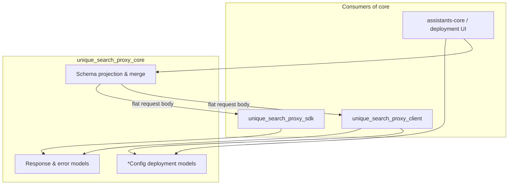
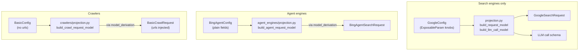
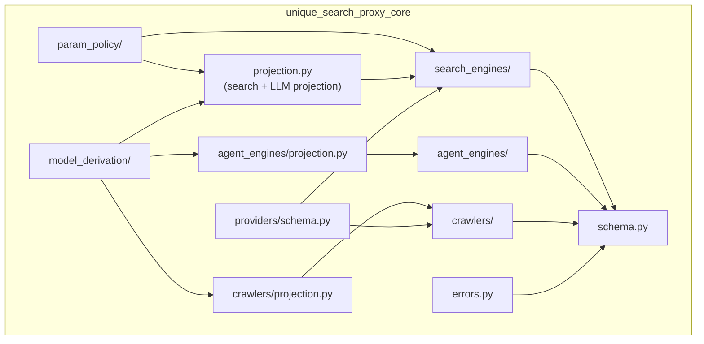

# unique-search-proxy-core

Part of [Unique Search Proxy](../README.md) · PyPI: `unique-search-proxy-core`

---

## 1. What this package is

**Core is the contract layer.** It defines every shared type — deployment configs, HTTP request/response shapes, error codes, and LLM tool schemas — without importing FastAPI, httpx pools, or provider SDKs.

Install it anywhere you need to **describe** or **validate** proxy behaviour: the proxy server, the HTTP SDK, assistants-core tool manifests, deployment UIs.

| Package | Question it answers |
|---------|---------------------|
| **Core** (this) | *What* can be configured and *what* does a valid request/response look like? |
| [Client](../unique_search_proxy_client/README.md) | *How* are provider calls executed at runtime? |
| [SDK](../unique_search_proxy_sdk/README.md) | *How* do callers reach the proxy over HTTP? |

---

## 2. Role in the system

Core sits at the centre of **Path A** (schema & config). It is imported by both the proxy pod and caller services; it never makes HTTP calls itself.



System overview → [../README.md](../README.md)

---

## 3. Key concepts

Core uses **three different config patterns** depending on provider kind. Only search engines use `ExposableParam` and the full projection pipeline.

### 3.1 Three provider patterns (search vs agent vs crawl)

| Kind | Config → request | `ExposableParam` | LLM call schema | Config/invocation merge |
|------|------------------|------------------|-----------------|-------------------------|
| **Search engines** | `GoogleConfig` → `GoogleSearchRequest` via `projection.build_request_model` | Yes | `build_llm_call_model` + `call_schema.resolve_*` | `merge_config_and_invocation` |
| **Agent engines** | `BingAgentConfig` → `BingAgentSearchRequest` via `agent_engines/projection.build_agent_request_model` | No (plain fields) | Not implemented in core | Not implemented in core |
| **Crawlers** | `BasicConfig` → `BasicCrawlRequest` via `crawlers/projection.build_crawl_request_model` | No | Not implemented in core | `merge_crawler_config_and_invocation` |



### 3.2 Search engines — three surfaces from one config

Search is the only kind where a single `*Config` fans out into three derived surfaces:

| Surface | Audience | Example |
|---------|----------|---------|
| **Deployment config** | Admin / deployment UI | `{ "engine": "google", "gl": { "expose": true, "value": "de" }, … }` |
| **LLM call schema** | Tool manifest shown to the model | `{ "query", "gl" }` — only fields where `expose: true` |
| **HTTP request body** | `POST /v1/search` wire format | `{ "engine": "google", "query": "…", "gl": "de", "fetchSize": 10 }` |

`projection.py` and `search_engines/params.py` derive the latter two from the first. Agent and crawl use `model_derivation.derive_request_model` via per-kind projection modules to inject `query` or `urls`.

### 3.3 ExposableParam — search-engine only

Optional **search** parameters use `ExposableParam[T]`:

- **`value`** — admin default merged into every request (`null` = deactivated)
- **`expose`** — when `true`, the parameter appears on the LLM call schema

```python
gl: ExposableParam[str | None] = ExposableParam(expose=False, value="de")  # admin-fixed
gl: ExposableParam[str | None] = ExposableParam(expose=True, value=None)   # LLM-overridable
```

No agent or crawler schema imports `ExposableParam` today.

### 3.4 merge_config_and_invocation — search-engine only

```python
from unique_search_proxy_core.search_engines import merge_config_and_invocation

request = merge_config_and_invocation(google_config, {"query": "EU AI Act"})
# → validated GoogleSearchRequest ready for POST /v1/search
```

The proxy receives a flat body; it does not resolve deployment config over HTTP.

### 3.5 merge_crawler_config_and_invocation — crawler only

```python
from unique_search_proxy_core.crawlers import merge_crawler_config_and_invocation

request = merge_crawler_config_and_invocation(basic_config, {"urls": ["https://example.com"]})
# → validated BasicCrawlRequest ready for POST /v1/crawl
```

---

## 4. Architecture (modules)



| Module | Responsibility |
|--------|----------------|
| `schema.py` | Shared API models: `SearchResponse`, `AgentSearchResponse`, `CrawlResponse`, `WebSearchResult`, `ErrorResponse`, SSE events |
| `errors.py` | `ProxyError` hierarchy and stable `ProxyErrorCode` enum |
| `model_derivation/` | Shared `derive_request_model` + field/annotation helpers used by all three provider kinds |
| `param_policy/` | `ExposableParam` — used by **search engine** config models only |
| `projection.py` | Search-only: `build_request_model`, `build_llm_call_model`, `project_call_schema` |
| `agent_engines/projection.py` | Agent-only: `build_agent_request_model` (injects `query`; excludes `output_schema`) |
| `crawlers/projection.py` | Crawler-only: `build_crawl_request_model` (injects `urls`) |
| `providers/schema.py` | JSON Schema + defaults for deployment UIs (`provider_config_json_schema`, …) |
| `search_engines/` | Config models, request union, `merge_config_and_invocation`, call-schema resolution |
| `agent_engines/` | Agent config/request models, output schema |
| `crawlers/` | `*Config` deployment models + derived `*CrawlRequest` HTTP bodies |

---

## 5. Provider contracts

Core registers the **discriminator ids** and config models. Runtime registration of service classes lives in the [client](../unique_search_proxy_client/README.md).

| Kind | IDs | Config model |
|------|-----|--------------|
| Search engines | `google`, `brave`, `perplexity` | `GoogleConfig`, `BraveConfig`, `PerplexityConfig` |
| Agent engines | `bing`, `vertexai` | `BingAgentConfig`, `VertexAIAgentConfig` |
| Crawlers | `Basic`, `Tavily`, `Jina`, `Firecrawl` | `BasicConfig`, `TavilyConfig`, … → `BasicCrawlRequest`, … |

Search engines share `BaseSearchEngineConfig` (`fetch_size`, `timeout`). Crawlers share `BaseCrawlerConfig` (`timeout` only — `urls` live on derived request models).

---

## 6. Key APIs (by use case)

### Deployment UI — JSON Schema for a provider

```python
from unique_search_proxy_core.providers.schema import (
    provider_config_json_schema,
    provider_default_config,
)

schema = provider_config_json_schema("search_engine", "google")
defaults = provider_default_config("search_engine", "google")
```

### Tool manifest — LLM call schema

```python
from unique_search_proxy_core.search_engines.call_schema import resolve_search_call_schema

descriptor = resolve_search_call_schema("google", config=google_config, strict=False)
# descriptor.call_schema → JSON Schema for the LLM tool
```

### Runtime — build flat request before HTTP call

```python
from unique_search_proxy_core.search_engines import merge_config_and_invocation

body = merge_config_and_invocation(config, llm_invocation_dict)
```

### Shared types and errors

```python
from unique_search_proxy_core import (
    SearchResponse,
    ProxyError,
    EngineNotConfiguredError,
    WebSearchResult,
)
```

---

## 7. Features summary

- Discriminated provider configs (`engine`, `crawler` Literal discriminators)
- **Search-only:** `ExposableParam` policy, three-surface projection, LLM call schema, `merge_config_and_invocation`
- **Agent:** config → request derivation via `model_derivation` + `build_agent_request_model`
- **Crawl:** `*Config` + `build_crawl_request_model` (injects `urls`); `merge_crawler_config_and_invocation`
- CamelCase JSON aliases on all models
- Zero server dependencies (import-linter enforced in the client package)

---

## 8. Installation & development

```bash
cd unique_search_proxy_core
uv sync
uv run pytest
uv run ruff check .
uv run basedpyright
```

Consumers needing HTTP access should use [`unique-search-proxy-sdk`](../unique_search_proxy_sdk/README.md) rather than calling the proxy with raw httpx.

---

## License

Proprietary — Unique AG
