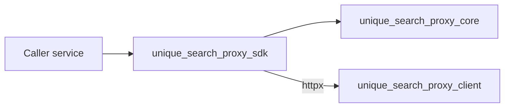
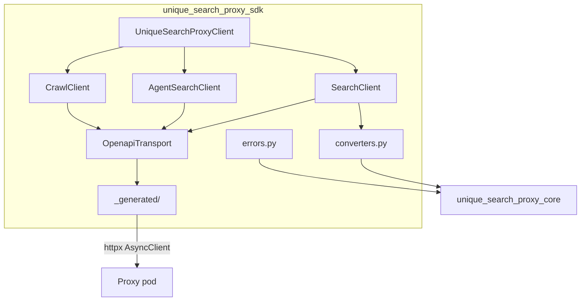

# unique-search-proxy-sdk

Part of [Unique Search Proxy](../README.md) · PyPI: `unique-search-proxy-sdk`

---

## 1. What this package is

**The SDK is the caller's HTTP client.** Platform services (e.g. assistants-core) use it to reach the proxy pod at runtime — search, agent search, and crawl — without hand-crafting httpx calls or duplicating route paths.

It depends on [core](../unique_search_proxy_core/README.md) for request validation and typed errors. It does **not** include the FastAPI server.

| Package | Question it answers |
|---------|---------------------|
| [Core](../unique_search_proxy_core/README.md) | *What* can be configured and *what* does a valid request/response look like? |
| [Client](../unique_search_proxy_client/README.md) | *How* are provider calls executed at runtime? |
| **SDK** (this) | *How* do callers reach the proxy over HTTP? |

---

## 2. Role in the system

The SDK implements **Path B** (runtime HTTP) from the [system overview](../README.md). Schema work (Path A) stays in core — the SDK does not expose deployment config or LLM call-schema endpoints.



Before a search call, the caller (or SDK) validates the payload against core request models. Non-2xx responses become the same `ProxyError` subclasses defined in core.

---

## 3. Architecture

Two layers: a **hand-written facade** over **OpenAPI-generated code**.



| Layer | Path | Responsibility |
|-------|------|----------------|
| **Facade** | `client.py` | `UniqueSearchProxyClient` — composes sub-clients, `health()`, `ready()` |
| **Sub-clients** | `search_client.py`, `agent_search_client.py`, `crawl_client.py` | Ergonomic methods per capability |
| **Transport** | `_transport.py`, `_http.py` | Shared httpx lifecycle, base URL, timeout |
| **Generated** | `_generated/` | Route functions + attrs models from OpenAPI (**do not edit**) |
| **Converters** | `converters.py` | Core Pydantic models → generated SDK models |
| **Errors** | `errors.py` | Error envelope → core `ProxyError` subclasses |

The client package is the **source of truth** for the HTTP contract. When routes change, regenerate `_generated/` from `unique_search_proxy_client/openapi.json`.

---

## 4. Usage

```python
from unique_search_proxy_sdk import UniqueSearchProxyClient

async with UniqueSearchProxyClient("http://unique-search-proxy:2349") as client:
    await client.health()

    result = await client.search.search("unique ag", engine="google", fetchSize=10)

    agent = await client.agent_search.search(
        "EU AI Act timeline",
        engine="bing",
        generationInstructions="...",
    )

    crawl = await client.crawl.crawl(["https://example.com"], crawler="Basic")

    # Low-level: one generated function per route
    raw_client = client.openapi
```

Search payloads are validated through core's `parse_search_request()` before serialization. Agent and crawl clients follow the same pattern where applicable.

---

## 5. API mapping

| Facade method | HTTP |
|---------------|------|
| `health()` | `GET /health` |
| `ready()` | `GET /ready` |
| `search.search(...)` | `POST /v1/search` |
| `agent_search.search(...)` | `POST /v1/agent-search` |
| `agent_search.stream(...)` | `POST /v1/agent-search/stream` (SSE) |
| `crawl.crawl(...)` | `POST /v1/crawl` |
| `openapi` | Low-level generated client (one function per route) |

Endpoint payloads and provider ids → [Client README](../unique_search_proxy_client/README.md).

---

## 6. Error handling

Non-success responses with a proxy error envelope raise typed exceptions from core:

```python
from unique_search_proxy_core import EngineNotConfiguredError, UpstreamError
```

`ENGINE_NOT_CONFIGURED` (503) includes `missing_env_vars` parsed from the error `details` list — useful for operators and LLM tool consumers.

Transport failures (non-JSON body, connection errors) raise `UniqueSearchProxyClientError`.

---

## 7. Codegen workflow

Generated via [openapi-python-client](https://github.com/openapi-generators/openapi-python-client) from the server's OpenAPI spec.

```bash
cd ../unique_search_proxy_client
uv sync
uv run python scripts/generate_sdk.py
```

| Path | Role |
|------|------|
| `unique_search_proxy_sdk/_generated/` | Regenerated httpx client + attrs models |
| `unique_search_proxy_client/openapi.json` | Exported spec (codegen input) |
| `unique_search_proxy_sdk/client.py` | Hand-written facade (not regenerated) |

Other codegen tools considered: OpenAPI Generator, datamodel-code-generator, Kiota — see git history in the client README if needed.

---

## 8. Testing

Pass an injected `httpx.AsyncClient` with `ASGITransport` for in-process tests against `create_app()`:

```python
import httpx
from httpx import ASGITransport
from unique_search_proxy_client.web.app import create_app
from unique_search_proxy_sdk import UniqueSearchProxyClient

app = create_app()
async with httpx.AsyncClient(
    transport=ASGITransport(app=app),
    base_url="http://test",
) as http:
    async with UniqueSearchProxyClient("http://test", http_client=http) as client:
        ...
```

Run the app lifespan so the in-process `HttpClientPool` is initialised.

---

## 9. Installation & development

```bash
cd unique_search_proxy_sdk
uv sync
uv run pytest
uv run ruff check .
uv run basedpyright
```

Depends on `unique-search-proxy-core`. Does not depend on `unique-search-proxy` at runtime (only as a dev dependency for integration tests).

---

## License

Proprietary — Unique AG
