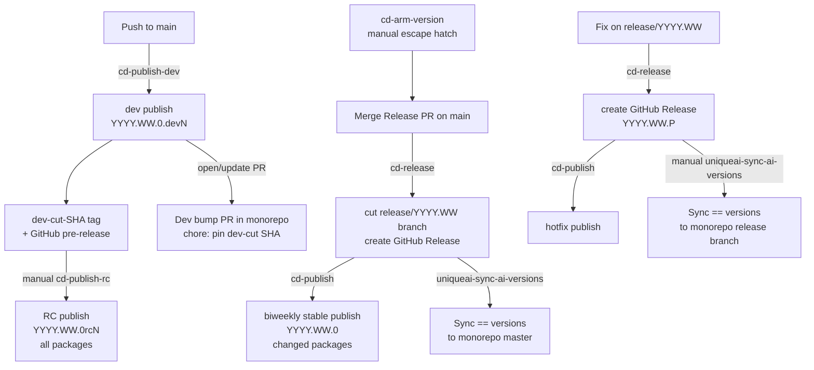

# Release Process

This page documents the full lifecycle of AI package releases — from a developer pushing to `main` through stable biweekly releases, hotfixes, and the optional RC path for pre-shipping to a specific customer.

---

## Version scheme

All packages use **CalVer**: `YYYY.WW.PATCH`.

| Segment | Meaning |
|---------|---------|
| `YYYY` | Calendar year |
| `WW` | Next even ISO week number (the target release week) |
| `PATCH` | `0` for biweekly releases; `1`, `2`, … for hotfixes on the same branch |

Pre-release suffixes follow PEP 440 ordering (`dev < rc < final`):

| Suffix | Example | Published by |
|--------|---------|--------------|
| `.devN` | `2026.20.0.dev3` | Every push to `main` (automated) |
| `rcN` | `2026.20.0rc2` | Manual promotion of a dev cut |
| *(none)* | `2026.20.0` | Biweekly release (automated via release-please) |
| `.N` (hotfix) | `2026.20.1` | Patch on a `release/YYYY.WW` branch |

---

## Dev releases

**Trigger:** every push to `main` that touches a publishable package.

**Workflow:** `.github/workflows/cd-publish-dev.yaml`

On each qualifying push the workflow:

1. Detects which packages changed (same logic as PR CI).
2. Queries PyPI for the highest `.devN` already published for each changed package in the current cycle, increments, and emits `YYYY.WW.0.dev(N+1)`.
3. Rewrites cross-package AI dependencies in each wheel's `Requires-Dist`:
   - Co-publishing sibling → `>=<its new dev version>`
   - Existing dev version in this cycle → `>=<highest dev>`
   - No dev yet in this cycle → `>=<last stable>`
4. Builds and publishes to PyPI under the `publish-prerelease` concurrency group (serialized, no races).
5. Tags the head SHA as `dev-cut-<SHORT_SHA>` and creates a GitHub pre-release listing every package version produced.

!!! note "Why only changed packages?"
    Dev releases are incremental. Only packages that actually changed are republished; unchanged siblings keep their last dev (or stable) version.

---

## Dev cuts

A **dev cut** is the unit of promotion. It is defined by:

- A single Git SHA on `main`
- The set of `(package, devN version)` pairs produced from that push

Every successful dev publish creates a `dev-cut-<SHORT_SHA>` tag (visible on the [GitHub tags page](https://github.com/Unique-AG/ai/tags)) and a matching GitHub pre-release that lists every package version in the cut.

You can promote a specific dev cut to an RC — see [RC releases](#rc-releases) below.

---

## RC releases

**Use case:** shipping a tested snapshot to a customer between two biweekly releases, without using a dev version (which some package managers treat specially) and without conflicting with the upcoming biweekly or future hotfixes.

**Workflow:** `.github/workflows/cd-publish-rc.yaml` — triggered manually via `workflow_dispatch`.

### Inputs

| Input | Required | Description |
|-------|----------|-------------|
| `ref` | yes | A `dev-cut-<SHORT_SHA>` tag identifying the exact cut to promote |
| `force_non_linear` | no | Skip the ancestor check (escape hatch, off by default) |

### What happens

1. Checks out the exact SHA from the `dev-cut` tag.
2. Derives the CalVer cycle from `.release-please-manifest.json` at that SHA.
3. Queries PyPI for the highest `rcN` already published in this cycle across all packages.
4. Assigns `{cycle}.0rc(N+1)` to **every** publishable package (rc cuts always republish the full set).
5. Rewrites cross-package AI dependencies to `>={cycle}.0rcN` (floor at this rc; customers can upgrade to later rcs or the final stable).
6. Builds and publishes all packages to PyPI under the `publish-prerelease` concurrency group.
7. Tags the commit as `rc-{cycle}.0rc(N+1)` and creates a GitHub pre-release with auto-generated notes covering commits since the previous rc (or stable) in this cycle.

### RC monotonicity

By default the workflow checks that the chosen dev cut is a descendant of any previous RC SHA in the same cycle. This ensures RC 2 is always a superset of RC 1. Use `force_non_linear: true` only when intentionally releasing a parallel cut.

### Customer pinning

A customer who wants to floor at an RC can write:

```
unique-toolkit>=2026.20.0rc1
```

`pip` will resolve this to the latest compatible version — either a later RC or the eventual `2026.20.0` stable.

---

## Dev bump PR

After every successful dev publish the workflow opens (or updates) a pull request in the **monorepo** with title:

```
chore: pin dev-cut <SHORT_SHA>
```

This PR bumps the AI package version floors in the monorepo to the latest dev versions. **You only need to merge it when you are actively mixing dev AI dependencies with local monorepo sources** — for example, when developing a monorepo feature that depends on unreleased AI changes. In the typical development flow the PR can be left open and will be superseded by the next stable release sync.

!!! tip "One-person merge"
    Because the PR is opened by the bot, it only requires your approval — you can approve and merge it yourself without a second reviewer.

---

## Stable biweekly releases

**Trigger:** a Release PR is merged on `main`.

**Workflow:** `.github/workflows/cd-release.yaml` (release-please) + `.github/workflows/cd-publish.yaml`

### Cadence

1. **Arm the cycle** (usually automated, manual escape hatch available — see [Arming a cycle](#arming-a-cycle)).
2. Developers merge features to `main`. Each merge triggers a dev publish (see above) and keeps the standing Release PR up to date.
3. When ready to ship, **merge the Release PR** on `main`. Its title is:
   ```
   chore: stable release <version>
   ```
   Because this PR is opened by the bot, it only requires your approval — you can approve and merge it yourself without a second reviewer.
4. release-please bumps all `pyproject.toml` versions and `CHANGELOG.md` entries.
5. `cd-release.yaml` cuts the `release/YYYY.WW` branch, creates a GitHub Release, and triggers `cd-publish.yaml`.
6. `cd-publish.yaml` builds and publishes every changed package to PyPI. Dependencies in the stable wheels are pinned with `>=` (updated by `update-dep-floors.py` at release time).
7. `uniqueai-sync-ai-versions.yaml` (monorepo) automatically syncs the new stable versions to `master` with `==` pins.

### Arming a cycle

In steady state `cd-release.yaml` arms the next cycle automatically after cutting a release. Use the manual escape hatch when needed:

**Workflow:** `.github/workflows/cd-arm-version.yaml` — triggered manually via `workflow_dispatch`.

| Input | Default | Description |
|-------|---------|-------------|
| `year_week` | computed from manifest | Override target cycle, e.g. `2026.22` |

The workflow pushes an empty `Release-As: YYYY.WW.0` footer commit to `main`. release-please picks this up and retargets the standing Release PR.

---

## Hotfix releases

**Use case:** a critical fix that must ship on a release branch without waiting for the next biweekly cycle.

**Workflow:** `.github/workflows/cd-release.yaml` (running on a `release/*` branch) + `cd-publish.yaml`

1. Create a branch off `release/YYYY.WW`, commit or cherry-pick the fix, and open a PR targeting `release/YYYY.WW`.
2. Get the PR reviewed and merged normally (standard review process applies).
3. release-please opens a second PR on the release branch with title:
   ```
   chore: hotfix release/YYYY.WW to <version>
   ```
   where `<version>` is `YYYY.WW.1` (or `.2`, etc.). Because this PR is opened by the bot, it only requires your approval — you can approve and merge it yourself without a second reviewer.
4. release-please cuts a GitHub Release and triggers `cd-publish.yaml`.
5. `cd-publish.yaml` publishes the patched packages.
6. Run `uniqueai-sync-ai-versions.yaml` manually (target `release`, source `release/YYYY.WW`) to sync the patch versions to the matching monorepo release branch.

---

## `sync-ai-versions` workflow

**Location:** monorepo `.github/workflows/uniqueai-sync-ai-versions.yaml`

Syncs AI package version floors from the AI repo into the monorepo. Runs automatically after a stable release cuts a new `release/YYYY.WW` branch, and can be triggered manually for hotfixes or dev baseline updates.

### Manual inputs

| Input | Required | Values | Notes |
|-------|----------|--------|-------|
| `target` | yes | `master` / `release` | Monorepo branch to update |
| `release_branch` | if `release` | e.g. `release/2026.18` | Required when `target=release` |
| `ai_source_branch` | no | `main` or `release/YYYY.WW` | Defaults: `main` (master target), same as `release_branch` (release target) |

### Pin operator rules

| AI source branch | Pin operator | Use case |
|-----------------|-------------|---------|
| `main` | `>=` | Dev baseline bump on monorepo `master` |
| `release/YYYY.WW` | `==` | Exact stable or hotfix sync |

!!! warning "Dev releases cannot be synced to monorepo release branches"
    The workflow rejects any run where `target=release` and `ai_source_branch=main`. Dev versions are not suitable for release branches.

---

## Flow overview


