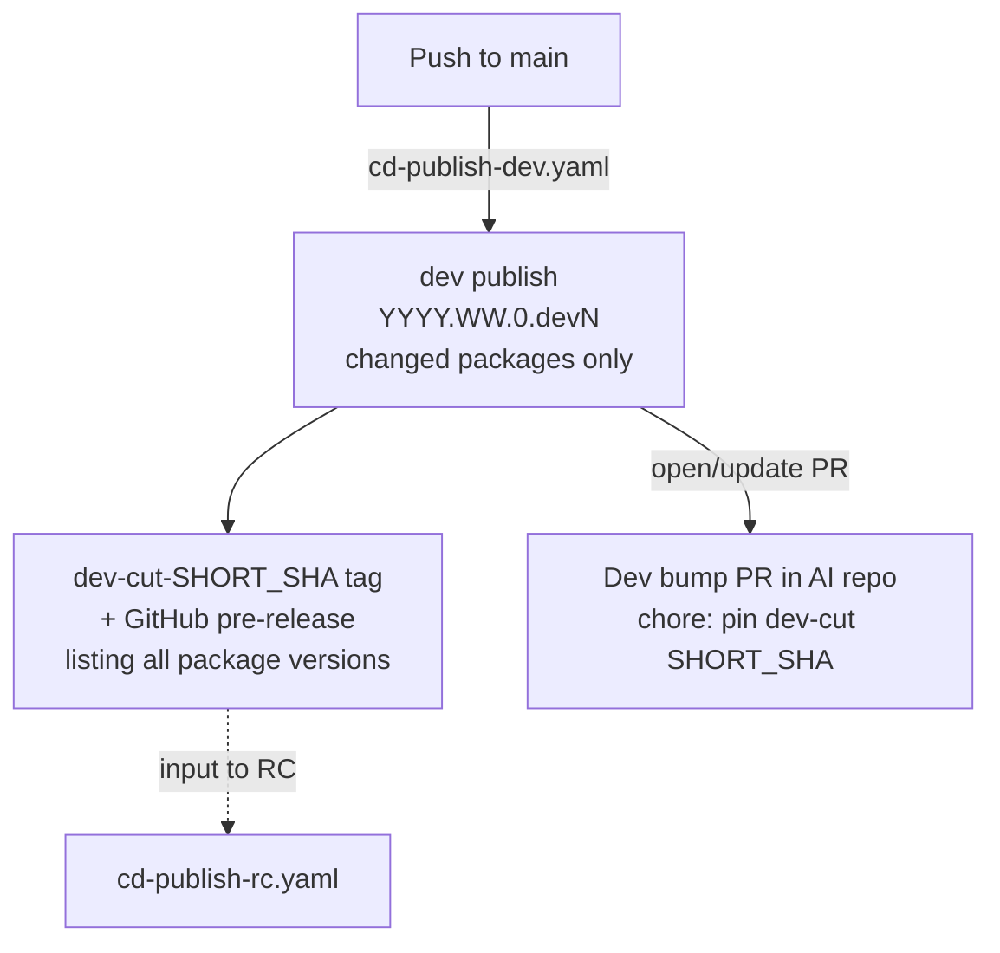
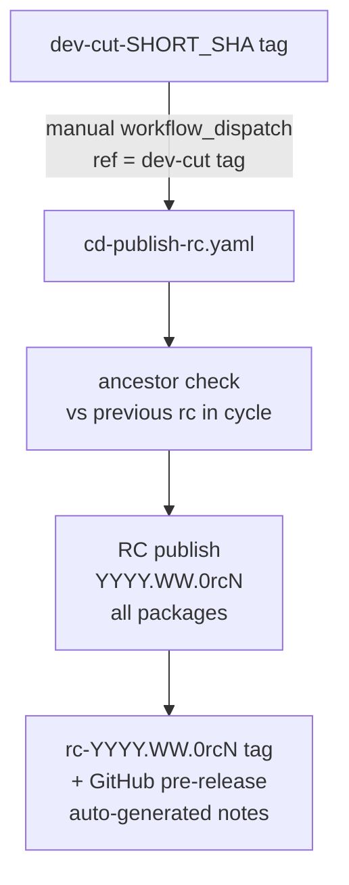
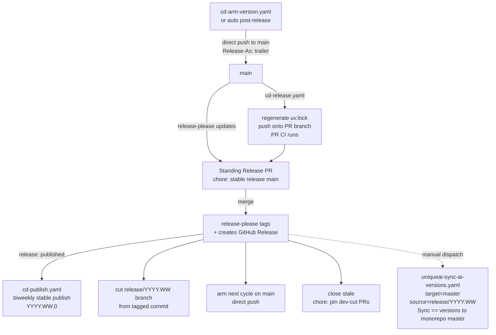
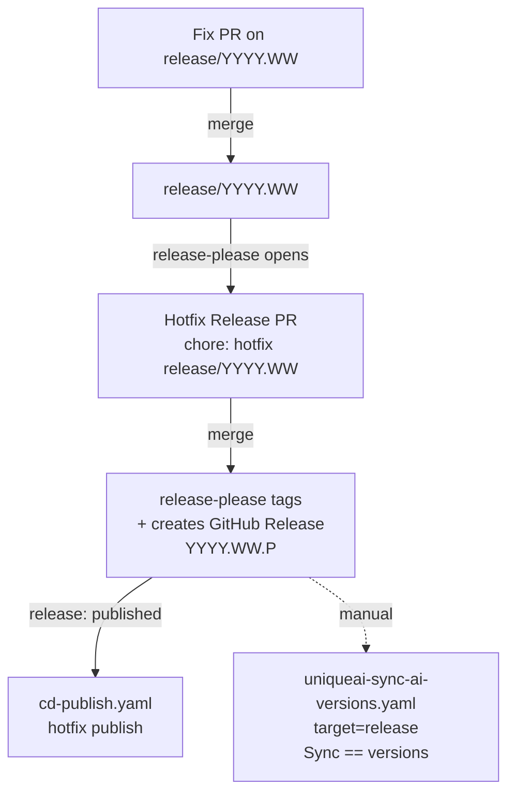

# Release Process

This page documents the full lifecycle of AI package releases — from a developer pushing to `main` through stable biweekly releases, hotfixes, and the optional RC path for pre-shipping to a specific customer.

---

## Version scheme

All packages use **CalVer**: `YYYY.WW.PATCH`.

| Segment | Meaning |
|---------|---------|
| `YYYY` | Calendar year |
| `WW` | Next even ISO week number (the target release week) |
| `PATCH` | `0` for biweekly releases; `1`, `2`, … for hotfixes on the same branch |

Pre-release suffixes follow PEP 440 ordering (`dev < rc < final`):

| Suffix | Example | Published by |
|--------|---------|--------------|
| `.devN` | `2026.20.0.dev3` | Every push to `main` (automated) |
| `rcN` | `2026.20.0rc2` | Manual promotion of a dev cut |
| *(none)* | `2026.20.0` | Biweekly release (automated via release-please) |
| `.N` (hotfix) | `2026.20.1` | Patch on a `release/YYYY.WW` branch |

---

## Conventional commits and changelogs

release-please builds changelogs and decides whether to open or update a Release PR from **merged commit subjects** on `main` or `release/*` (the first line of each commit message, parsed as [Conventional Commits](https://www.conventionalcommits.org/)). It does not inspect individual commits inside a squash-merged PR — only the single commit that lands on the branch.

Configuration lives in:

| Branch target | Config file | Notable options |
|---------------|-------------|-----------------|
| `main` | `release-please-config.json` | Standing Release PR title: `chore: stable release main` |
| `release/*` | `release-please-config.release.json` | `versioning: always-bump-patch`; hotfix Release PR title: `chore: hotfix release/YYYY.WW` |

Both configs share the same `changelog-sections` (see table below). All publishable packages are **linked** (`linked-versions` plugin): one standing Release PR bumps every package version and changelog together.

### Commit types and release-please behaviour

| Type | Changelog section | In published changelog? | Drives a release? |
|------|-------------------|-------------------------|-------------------|
| `feat` | Features | yes | yes |
| `fix` | Bug Fixes | yes | yes |
| `perf` | Performance | yes | yes |
| `revert` | Reverts | yes | yes |
| `docs` | Documentation | no (`hidden`) | no |
| `chore` | Miscellaneous | no (`hidden`) | no |
| `refactor` | Miscellaneous | no (`hidden`) | no |
| `test` | Tests | no (`hidden`) | no |
| `ci` | CI | no (`hidden`) | no |
| `build` | Build | no (`hidden`) | no |

**Drives a release** means release-please will include the commit in pending changelog work and, once enough such commits have landed, open or refresh the standing Release PR (stable on `main`, hotfix on `release/*`). Hidden types are intentionally omitted from user-facing notes and do not trigger a release on their own.

Use scopes that match the package when helpful (`feat(toolkit): …`, `fix(sdk): …`). A `feat(scope)!:` subject or `BREAKING CHANGE:` footer is still interpreted by release-please for semver-style bumps on `main`; on `release/*`, `always-bump-patch` limits hotfixes to patch increments regardless.

### Why squash merge broke hotfix changelogs

Historically, `release/*` allowed squash merge. A hotfix PR that cherry-picked several commits from `main` (e.g. one `feat`, one `fix`, and one `chore`) was squashed into **one** commit on the release branch. GitHub uses the **PR title** as that commit subject. If the title was `chore: …`, release-please saw only a hidden `chore` commit: no changelog entries for the feature or fix, no hotfix Release PR, and no version bump — even though the squashed diff contained release-worthy changes.

**Going forward:** `release/*` requires **Rebase and merge** so each cherry-picked commit keeps its original subject. CI (`.github/scripts/check-release-lineage.sh`) additionally requires every commit in a release PR to already exist on `main` or be patch-equivalent to a commit on `main` (`git cherry`), so release history stays a subset of `main` and changelogs stay cross-checkable.

`main` continues to use **squash merge** (one commit per feature PR is fine there because the squashed subject should match the PR title, which you control when merging to `main`).

---

## Automation identity

All write operations performed by release workflows (creating/updating release-please PRs, pushing lockfile updates, tagging commits, creating GitHub Releases, opening dev-bump PRs, cutting `release/*` branches, arming the next cycle) authenticate as the **Release Workflow App**, a GitHub App provisioned in the [`infrastructure`](https://github.com/Unique-AG/infrastructure) repo and shared with the monorepo.

Why it matters:

- **Bypasses branch protection** — the App is registered as a bypass actor on the `main-branch` and `release-branches` rulesets, so the arm-next-cycle commit can be pushed directly to `main` and the cut step can push the new `release/YYYY.WW` branch without going through a PR.
- **Triggers downstream CI** — pushes, tags, and releases authored by the App are *not* covered by GitHub's anti-recursion rule (which suppresses follow-up workflows for `GITHUB_TOKEN`-authored events). This is what makes lockfile commits on the Release PR run PR CI, and what makes the `release: published` event natively fan out to `cd-publish.yaml`.
- **IP-origin-bound** — the App's installation token is only usable from the static-IP runner pool, so any job that mints one must declare `runs-on: gh-static-ip-slim` and `environment: release-workflow`.

You should never need to interact with the App directly; this section exists so the references throughout the rest of this document make sense.

---

## Dev releases

**Trigger:** every push to `main` that touches a publishable package.

**Workflow:** `.github/workflows/cd-publish-dev.yaml`

On each qualifying push the workflow:

1. Detects which packages changed (same logic as PR CI).
2. Queries PyPI for the highest `.devN` already published for each changed package in the current cycle, increments, and emits `YYYY.WW.0.dev(N+1)`.
3. Rewrites cross-package AI dependencies in each wheel's `Requires-Dist` (via `rewrite-pyproject-pre-release.py` and pins from `resolve-dev-versions.py`):
   - **Cycle dev sibling** (`YYYY.WW.P.devN`) — ``>=V,<YYY.WW.Prc0``: admits later `.dev*` builds on the same patch triple but excludes sibling **RC** releases (PEP 440 ranks RC above dev on that line).
   - **No cycle dev yet** for that package (unchanged since last stable; honest floor is still the stable line) → ``>=<last stable>`` only.
4. Builds and publishes to PyPI under the `publish-prerelease` concurrency group (serialized, no races).
5. Tags the head SHA as `dev-cut-<SHORT_SHA>` and creates a GitHub pre-release listing every package version produced.

!!! note "Why only changed packages?"
    Dev releases are incremental. Only packages that actually changed are republished; unchanged siblings keep their last dev (or stable) version.

### Dev cuts

A **dev cut** is the unit of promotion. It is defined by:

- A single Git SHA on `main`
- The set of `(package, devN version)` pairs produced from that push

Every successful dev publish creates a `dev-cut-<SHORT_SHA>` tag (visible on the [GitHub tags page](https://github.com/Unique-AG/ai/tags)) and a matching GitHub pre-release that lists every package version in the cut. A dev cut is the only thing the [RC workflow](#rc-releases) accepts as input — you promote a specific cut, never "the latest dev".

### Dev bump PR

After every successful dev publish the workflow opens (or updates) a pull request **in the AI repo** with title:

```
chore: pin dev-cut <SHORT_SHA>
```

This PR rewrites every publishable package's `pyproject.toml` so its `version` and AI cross-package dep floors match the dev wheels just published to PyPI (cycle dev deps use the same ``>=V,<YYY.WW.Prc0`` pattern as `Requires-Dist`). **You only need to merge it when you are mixing freshly-published dev wheels with locally-checked-out AI packages** — for example, when developing in a worktree where one package is a path source and a sibling is consumed as a wheel. Without this, `uv`'s version-solver fails because the local clone still advertises the previous cycle version while the wheel constraint floor is newer.

In the typical flow the PR can sit untouched: it is automatically superseded by the next dev publish (the workflow closes the previous one before opening the new one).

!!! tip "One-person merge"
    Because the PR is opened by the Release Workflow App, it only requires your approval — you can approve and merge it yourself without a second reviewer. The PR also runs `pull_request:` CI normally, since the App-authored push is not subject to GitHub's anti-recursion rule.

### Flow



---

## RC releases

**Use case:** shipping a tested snapshot to a customer between two biweekly releases, without using a dev version (which some package managers treat specially) and without conflicting with the upcoming biweekly or future hotfixes.

**Workflow:** `.github/workflows/cd-publish-rc.yaml` — triggered manually via `workflow_dispatch`.

### Inputs

| Input | Required | Description |
|-------|----------|-------------|
| `ref` | yes | A `dev-cut-<SHORT_SHA>` tag identifying the exact cut to promote |
| `force_non_linear` | no | Skip the ancestor check (escape hatch, off by default) |

### What happens

1. Checks out the exact SHA from the `dev-cut` tag.
2. Derives the CalVer cycle from `.release-please-manifest.json` at that SHA.
3. Queries PyPI for the highest `rcN` already published in this cycle across all packages.
4. Assigns `{cycle}.0rc(N+1)` to **every** publishable package (rc cuts always republish the full set).
5. Rewrites cross-package AI dependencies to `>={cycle}.0rcN` (floor at this rc; customers can upgrade to later rcs or the final stable).
6. Builds and publishes all packages to PyPI under the `publish-prerelease` concurrency group.
7. Tags the commit as `rc-{cycle}.0rc(N+1)` and creates a GitHub pre-release with auto-generated notes covering commits since the previous rc (or stable) in this cycle.

### RC monotonicity

By default the workflow checks that the chosen dev cut is a descendant of any previous RC SHA in the same cycle. This ensures RC 2 is always a superset of RC 1. Use `force_non_linear: true` only when intentionally releasing a parallel cut.

### Customer pinning

A customer who wants to floor at an RC can write:

```
unique-toolkit>=2026.20.0rc1
```

`pip` will resolve this to the latest compatible version — either a later RC or the eventual `2026.20.0` stable.

### Flow



---

## Stable biweekly releases

**Trigger:** a Release PR is merged on `main`.

**Workflow:** `.github/workflows/cd-release.yaml` (release-please) + `.github/workflows/cd-publish.yaml`

### Cadence

1. **Arm the cycle** (usually automated, manual escape hatch available — see [Arming a cycle](#arming-a-cycle)).
2. Developers merge features to `main`. Each merge triggers a dev publish (see above) and keeps the standing Release PR up to date. Whenever release-please rewrites the PR, `cd-release.yaml` regenerates `uv.lock` in the same workflow run and pushes the result back onto the PR branch — that push runs PR CI like any other commit, so the PR's status is always against the actual lockfile that will land.
3. When ready to ship, **merge the Release PR** on `main`. Its title is always:
   ```
   chore: stable release main
   ```
   (`group-pull-request-title-pattern` uses `${branch}`, not the CalVer version.) The target release version (e.g. `2026.24.0`) appears in the PR diff — manifest, `pyproject.toml` versions, and changelogs — not in the title.
   Because this PR is opened by the bot, it only requires your approval — you can approve and merge it yourself without a second reviewer.
4. release-please bumps all `pyproject.toml` versions and `CHANGELOG.md` entries, then tags and creates a GitHub Release.
5. `cd-release.yaml`'s post-release job pushes the new `release/YYYY.WW` branch from the tagged commit (the Release Workflow App is a bypass actor on the `release-branches` ruleset), arms the next cycle on `main` — see [Arming a cycle](#arming-a-cycle) — and closes the currently-open `chore: pin dev-cut <SHA>` PR if one exists (`cd-publish-dev.yaml` keeps at most one open at a time; after a stable cut its floors are strictly older than what just landed on `main`).
6. The GitHub Release that release-please just published natively triggers `cd-publish.yaml`, which builds and publishes every changed package to PyPI. Dependencies in the stable wheels are pinned with `>=` (updated by `update-dep-floors.py` at release time).
7. Propagating the new stable versions to the monorepo is [documented in the monorepo](https://github.com/Unique-AG/monorepo/blob/master/docs/uniqueai/release-process/index.md#sync-ai-versions-workflow).

### Arming a cycle

In steady state `cd-release.yaml` arms the next cycle automatically after cutting a release: the same job that cuts `release/YYYY.WW` then runs `prepare-next-cycle.sh`, which pushes an empty `chore: arm release YYYY.WW.0` commit (with a `Release-As:` trailer) **directly onto `main`**. The Release Workflow App is a bypass actor on the `main-branch` ruleset, so the push is allowed despite branch protection. release-please picks the trailer up on the next workflow run and retargets the standing Release PR to that version.

There is no arm PR, no side branch, and no merge queue involvement — the trailer commit lands on `main` immediately. If two arm runs race for the same `main`, `prepare-next-cycle.sh` retries with a refetch+re-anchor loop (bounded at 5 attempts) so a non-fast-forward rejection is recovered automatically.

Use the manual escape hatch when the automation can't run on its own (bootstrap, skipped cycle, off-cadence release, miscomputed CalVer):

**Workflow:** `.github/workflows/cd-arm-version.yaml` — triggered manually via `workflow_dispatch`.

| Input | Default | Description |
|-------|---------|-------------|
| `year_week` | computed from manifest | Override target cycle, e.g. `2026.22` |

### Flow



---

## Hotfix releases

**Use case:** a critical fix that must ship on a release branch without waiting for the next biweekly cycle.

A hotfix is a PR merged into `release/YYYY.WW` that backports one or more commits already on `main` (usually via `git cherry-pick`). Each merged commit must use a [release-worthy conventional type](#commit-types-and-release-please-behaviour) (`feat`, `fix`, `perf`, or `revert`) so release-please can attribute changelog entries and bump `YYYY.WW.PATCH`.

**Workflow:** `.github/workflows/cd-release.yaml` (running on a `release/*` branch) + `cd-publish.yaml`

1. Create a branch off `release/YYYY.WW`, cherry-pick the fix(es) from `main` (oldest first), and open a PR targeting `release/YYYY.WW`. Preserve each commit's conventional subject; do not squash the cherry-picks locally into one commit.
2. Get the PR reviewed and merge with **Rebase and merge** only. Squash merge is disabled on `release/*` — see [Why squash merge broke hotfix changelogs](#why-squash-merge-broke-hotfix-changelogs). CI (`check-release-lineage.sh`) verifies each PR commit is on `main` or patch-equivalent to a commit on `main`.
3. After release-worthy commits land, release-please opens a second PR on the release branch with title:
   ```
   chore: hotfix release/YYYY.WW
   ```
   The target patch version (`YYYY.WW.1`, `.2`, …) appears in the PR diff (manifest, `pyproject.toml`, changelogs), not in the title. Because this PR is opened by the bot, it only requires your approval — you can approve and merge it yourself without a second reviewer. Merge it with **Rebase and merge** as well.
4. release-please tags the commit and creates a GitHub Release. The release event (authored by the Release Workflow App) natively triggers `cd-publish.yaml`.
5. `cd-publish.yaml` publishes the patched packages to PyPI.
6. Propagating the patch versions to the matching monorepo release branch is [documented in the monorepo](https://github.com/Unique-AG/monorepo/blob/master/docs/uniqueai/release-process/index.md#sync-ai-versions-workflow).

### Flow



---

## Syncing AI versions to the monorepo

Syncing AI package versions into the monorepo is [documented in the monorepo](https://github.com/Unique-AG/monorepo/blob/master/docs/uniqueai/release-process/index.md#sync-ai-versions-workflow).
