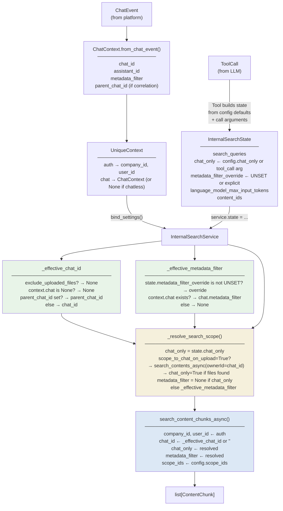

# Internal Search Tool

Internal Search Tool to find documents in the Knowledge Base.

## Architecture

The service is built on a mixin-based `BaseService` pattern. See `unique_internal_search/base_service.py` and `unique_internal_search/service_v2.py`.

## Chat scoping

How `chat_id`, `chat_only`, and `metadata_filter` are resolved before each search call:

