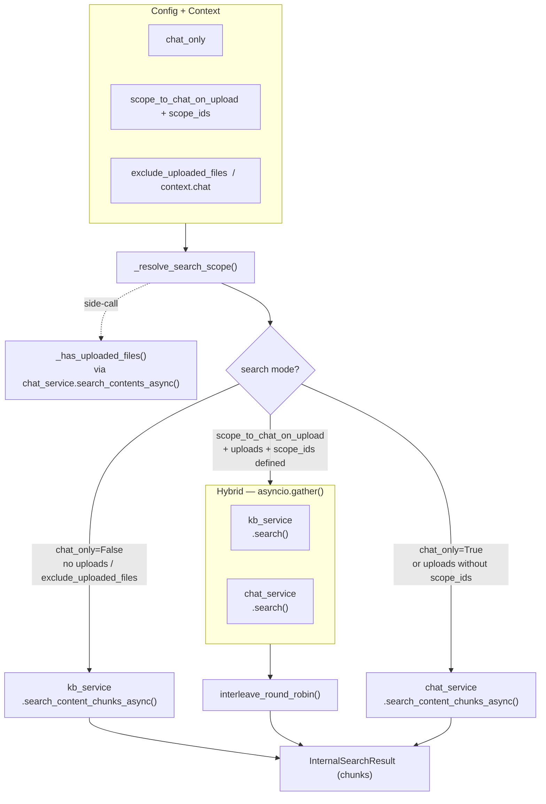

# InternalSearchService — Search Mode Resolution

```mermaid
flowchart TD
    subgraph CFG["Config + Context"]
        f1["chat_only"]
        f2["scope_to_chat_on_upload + scope_ids"]
        f3["exclude_uploaded_files  /  context.chat"]
    end

    CFG --> resolve["_resolve_search_scope()"]
    resolve -. side-call .-> hasF["_has_uploaded_files()\nvia chat_service.search_contents_async()"]

    resolve --> dec{search mode?}

    dec -->|"chat_only=False\nno uploads / exclude_uploaded_files"| kbBox
    dec -->|"scope_to_chat_on_upload\n+ uploads + scope_ids defined"| hybrid
    dec -->|"chat_only=True\nor uploads without scope_ids"| chatBox

    kbBox["kb_service\n.search_content_chunks_async()"]

    subgraph hybrid["Hybrid — asyncio.gather()"]
        hybKB["kb_service\n.search()"]
        hybChat["chat_service\n.search()"]
    end

    hybrid --> merge["interleave_round_robin()"]

    chatBox["chat_service\n.search_content_chunks_async()"]

    kbBox   --> result
    merge   --> result
    chatBox --> result

    result["InternalSearchResult  (chunks)"]
```
