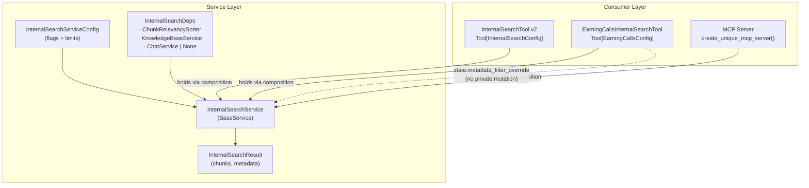

# InternalSearch Tool Architecture

## Key design principles

| Pattern | ✅ Do | ❌ Don't |
|---|---|---|
| Reuse | Compose `InternalSearchService` | Inherit `InternalSearchTool` |
| Customisation | `InternalSearchState(metadata_filter_override=…)` | `self.content_service._metadata_filter = …` |
| MCP swap | Replace consumer only | Rewrite service logic |
| Chat context | `ChatService.from_context(context)` | Call low-level functions directly |
