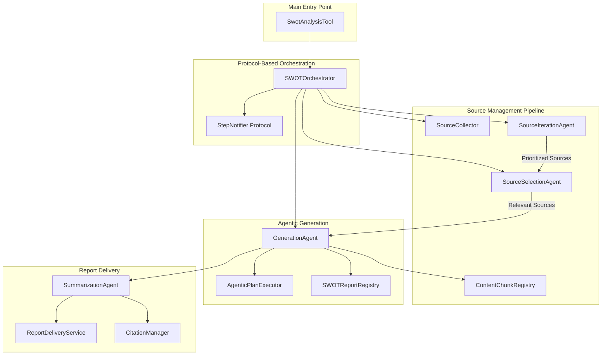

# SWOT Analysis Tool

A sophisticated AI-powered tool for generating comprehensive SWOT (Strengths, Weaknesses, Opportunities, Threats) analysis reports based on internal documents, earnings calls, and external web resources.

## Overview

The SWOT Analysis Tool is an agentic tool built on the Unique Toolkit framework that automatically analyzes multiple data sources to produce structured, well-cited SWOT analysis reports. It leverages large language models with structured output and protocol-based orchestration to deliver intelligent, modular, and testable analysis workflows.

## Architecture



## Project Structure

```
unique_swot/
├── service.py                      # Main SwotAnalysisTool
├── config.py                       # Tool configuration
├── services/
│   ├── orchestrator/
│   │   └── service.py             # SWOTOrchestrator + Protocols
│   ├── source_management/
│   │   ├── collection/            # SourceCollectionManager
│   │   ├── selection/             # SourceSelectionAgent
│   │   ├── iteration/             # SourceIterationAgent
│   │   └── registry.py            # ContentChunkRegistry
│   ├── generation/
│   │   ├── agentic/
│   │   │   ├── agent.py          # GenerationAgent
│   │   │   ├── executor.py       # AgenticPlanExecutor
│   │   │   └── operations.py     # Operation handlers
│   │   └── models/
│   │       └── registry.py        # SWOTReportRegistry
│   ├── summarization/
│   │   └── agent.py               # SummarizationAgent
│   ├── report/
│   │   └── delivery.py            # ReportDeliveryService
│   ├── notification/
│   │   └── notifier.py            # StepNotifier implementation
│   ├── memory/
│   │   └── base.py                # SwotMemoryService
│   └── citations.py               # CitationManager
├── tests/                          # Comprehensive test suite
│   ├── conftest.py                # Shared fixtures
│   ├── test_schemas.py            # Schema validation tests
│   ├── services/
│   │   ├── test_orchestrator.py  # Orchestration tests
│   │   ├── test_citations.py     # Citation tests
│   │   ├── test_registry.py      # Registry tests
│   │   ├── test_notification.py  # Notification tests
│   │   ├── test_summarization.py # Summarization tests
│   │   ├── generation/
│   │   │   ├── test_generation_agent.py
│   │   │   ├── test_plan_executor.py
│   │   │   └── test_report_registry.py
│   │   ├── source_management/
│   │   │   ├── test_collection.py
│   │   │   ├── test_selection.py
│   │   │   └── test_iteration.py
│   │   ├── report/
│   │   │   ├── test_delivery.py
│   │   │   └── test_docx_conversion.py
│   │   └── memory/
│   │       └── test_memory_service.py
│   └── README.md                  # Testing documentation
└── docs/                          # Architecture documentation
```

## How It Works

### 1. Plan Reception & Orchestration

The tool receives a SWOT plan specifying which components to analyze (Strengths, Weaknesses, Opportunities, Threats) and the analysis objective. Each component can be set to:
- `GENERATE` - Create new analysis from sources
- `MODIFY` - Update existing analysis with new information
- `NOT_REQUESTED` - Skip this component

The `SWOTOrchestrator` coordinates the entire workflow using protocol-based dependency injection, ensuring all components communicate through well-defined interfaces for maximum testability and modularity.

### 2. Source Management Pipeline (3-Phase Process)

#### Phase A: Collection
The `SourceCollectionManager` gathers content from multiple sources:
- **Knowledge Base**: Internal documents filtered by metadata
- **Earnings Calls**: Financial earnings call transcripts fetched from Quartr API, automatically converted to DOCX, and ingested into the knowledge base with intelligent caching
- **Web Sources**: External web research and articles

All collected content is registered in a central registry with unique identifiers for citation tracking.

#### Phase B: Prioritization
The `SourceIterationAgent` uses an LLM to intelligently order sources by relevance:
- Considers recency, document type, and analysis objective
- Evaluates content previews to determine optimal processing order
- Gracefully handles documents the LLM cannot confidently order
- Returns an async iterator for efficient streaming processing

#### Phase C: Selection
The `SourceSelectionAgent` filters each source for relevance:
- LLM determines if source contains pertinent information for the SWOT analysis
- Provides reasoning for inclusion/exclusion decisions
- Skips irrelevant documents to improve efficiency and reduce noise
- Includes safety fallback to avoid false negatives

### 3. Agentic Generation Process

The `GenerationAgent` processes each relevant source document-by-document:

- **Chunk Registration**: Content chunks are registered in `ContentChunkRegistry` with unique IDs for citation tracking
- **Source Batching**: Prepares source data with chunk IDs for citation references
- **Operation Processing**: Handles each SWOT component based on the plan operation (GENERATE/MODIFY/NOT_REQUESTED)
- **Flexible Execution**: `AgenticPlanExecutor` manages task execution with two modes:
  - **Sequential**: Processes components one at a time for predictable ordering
  - **Concurrent**: Parallel execution with configurable `max_concurrent_tasks` for performance
- **Structured Output**: Enforces schema validation for each SWOT component
- **Result Storage**: Results stored in `SWOTReportRegistry` organized by component for easy retrieval

### 4. Summarization & Delivery

#### Summarization
The `SummarizationAgent` generates an executive summary:
- Renders the full report with streaming-compatible citations
- Generates coherent narrative summary via LLM
- Performs reference remapping to ensure citation integrity
- Tracks number of unique references cited

#### Report Delivery
The `ReportDeliveryService` renders the final report in two formats:

**DOCX Mode** (Document):
- Markdown converted to professional Word document
- Full citations with document titles and page numbers
- Citation footer with comprehensive reference list
- Uploaded as downloadable attachment

**Chat Mode** (Markdown):
- Rich markdown formatting displayed in chat
- Inline superscript citations
- Clickable references to source documents
- Optimized for conversational interface

The `CitationManager` handles citation formatting, deduplication, and document-level reference conversion.

### 5. Progress Tracking

The `StepNotifier` protocol provides real-time progress updates:
- Progress percentage calculation per step
- Contextual status messages (e.g., "Processing `Document Name`...")
- Source references included in notifications
- Completed/failed state tracking with visual indicators
- Decoupled design allows flexible notification implementations

### 6. State Persistence

State management ensures consistency across the pipeline:
- **SwotMemoryService**: Manages cross-component state with cache scope isolation
- **ContentChunkRegistry**: Persisted for citation lookup and deduplication
- **SWOTReportRegistry**: Stores intermediate generation results per component
- **Memory Initialization**: Registry can be initialized from cached state for iterative workflows
- **Serialization**: Full support for state persistence and restoration

## Architecture Principles

### Protocol-Based Design
- All major components interact through well-defined protocols (Python `Protocol` types)
- Enables dependency injection for improved testability and decoupling
- Clear separation of concerns across the pipeline
- Facilitates component replacement and testing with mocks

### Agentic Processing
- LLM agents make intelligent decisions at each pipeline stage
- Source selection and prioritization powered by structured output
- Flexible execution strategies (sequential vs. concurrent)
- Operation-based workflow (GENERATE/MODIFY/NOT_REQUESTED)

### State Management
- Persistent memory service for cross-component state
- Registry pattern for content and report tracking
- Supports iterative workflows and modifications
- Cache scope isolation prevents cross-session contamination

### Citation Integrity
- Unique ID generation with collision detection and retry logic
- Reference tracking throughout the entire pipeline
- Automatic remapping during summarization phase
- Document-level citations with page numbers for traceability

## Key Features

### 🎯 Comprehensive Analysis
- Analyzes all four SWOT dimensions with structured output
- Processes multiple sources simultaneously
- Maintains context across large document sets

### 🤖 Agentic Source Management
- LLM-powered source selection filters irrelevant documents
- LLM-powered source prioritization orders by relevance
- Intelligent decision-making at each pipeline stage

### ⚡ Flexible Execution
- Sequential processing for predictable ordering
- Concurrent processing with configurable limits
- `AgenticPlanExecutor` handles task orchestration and error capture

### 🔌 Protocol-Based Architecture
- Dependency injection for testability and modularity
- Well-defined interfaces between components
- Easy to mock, test, and extend

### 🔗 Advanced Citation System
- Every point backed by source references
- Document-level inline citations with page numbers
- Citation footer in DOCX reports
- Unique ID generation with collision prevention
- Traceable to specific pages and documents

### 📈 Real-Time Progress Tracking
- Visual progress bar with contextual messages
- Step-by-step updates with source references
- Percentage completion calculation
- Support for success/failure states

### 💾 Persistent State
- Cross-component memory with `SwotMemoryService`
- Registry patterns for content and reports
- Cache scope isolation for multi-user scenarios
- Support for iterative refinement

### 🎨 Multiple Output Formats
- Professional DOCX reports with citation footer
- Rich markdown for chat interface
- Customizable Jinja2 templates
- Automatic format conversion

### 🛡️ Robust Error Handling
- Graceful degradation on LLM failures
- Exception capture in executor for task-level failures
- Fallback strategies throughout pipeline
- Detailed error logging

### 🧪 Comprehensive Test Coverage
- Component-level tests with mocked dependencies
- Protocol-based design enables easy mocking
- Async testing patterns with proper fixtures
- Tests for orchestration, generation, sources, and delivery

## Workflow Example

```
User Request → SWOT Plan
    ↓
[Orchestrator Initialized with Protocols]
    ↓
Source Collection (KB + Earnings + Web)
    ↓
Source Prioritization (LLM orders by relevance)
    ↓
For Each Source (in priority order):
    ├── Source Selection (LLM filters relevance)
    ├── [If Relevant] Register Chunks in Registry
    ├── [If Relevant] Agentic Generation
    │   ├── Process Each Component (S/W/O/T)
    │   ├── Execute via AgenticPlanExecutor
    │   └── Store in SWOTReportRegistry
    └── Progress Notification
    ↓
Summarization (Executive summary with citations)
    ↓
Citation Management (Formatting & deduplication)
    ↓
Report Rendering (DOCX or Markdown)
    ↓
Delivery to User
```

## Core Services

| Service | Responsibility |
|---------|---------------|
| **SWOTOrchestrator** | Protocol-based workflow coordination with dependency injection |
| **SourceCollectionManager** | Multi-source data collection (KB, earnings, web) |
| **SourceIterationAgent** | LLM-based source prioritization and ordering |
| **SourceSelectionAgent** | LLM-based relevance filtering |
| **GenerationAgent** | Agentic SWOT generation with operation-based processing |
| **AgenticPlanExecutor** | Sequential/concurrent task execution with concurrency control |
| **SWOTReportRegistry** | Component-organized report storage |
| **ContentChunkRegistry** | Citation tracking with unique ID generation |
| **SummarizationAgent** | Executive summary generation with reference remapping |
| **ReportDeliveryService** | Multi-format rendering (DOCX/Chat) |
| **CitationManager** | Citation formatting and deduplication |
| **StepNotifier** | Progress tracking protocol |
| **SwotMemoryService** | State persistence and caching |

## Configuration

The tool is configured via `SwotAnalysisToolConfig` which includes:
- Source management settings (selection, iteration, collection)
- Generation configuration (agentic prompts, execution mode)
- Report generation settings (batch size, token limits)
- Language model configuration
- Prompt templates for extraction, summarization, and commands
- Report rendering preferences (DOCX vs Chat)
- Cache scope for state management

## Technology Stack

- **Framework**: Unique Toolkit (Python)
- **Architecture**: Protocol-based with dependency injection
- **Validation**: Pydantic models with strict typing
- **LLM Integration**: Structured output with schema enforcement
- **Concurrency**: Async/await with `asyncio` and configurable semaphores
- **Storage**: Knowledge Base for persistence, Short-Term Memory for caching
- **Templating**: Jinja2 for prompts and report templates
- **Document Processing**: DOCX generation, Markdown rendering
- **Progress Tracking**: Real-time message execution updates
- **Testing**: Pytest with async support and comprehensive mocking

## Use Cases

- **Strategic Planning**: Generate comprehensive SWOT analyses for business strategy
- **Market Analysis**: Analyze market position based on multiple data sources
- **Competitive Intelligence**: Assess strengths and weaknesses vs competitors
- **Investment Research**: Evaluate opportunities and threats for investments
- **Due Diligence**: Comprehensive analysis for M&A or partnerships
- **Quarterly Reviews**: Process earnings calls and internal reports for executive summaries

## Output Quality

The tool produces high-quality analysis by:
- Using protocol-based architecture for modular, testable components
- Employing LLM agents for intelligent source selection and prioritization
- Using structured output to enforce consistency across all components
- Maintaining citation integrity throughout the entire pipeline
- Validating all outputs against Pydantic schemas
- Applying domain-specific prompt engineering for each SWOT component
- Supporting both sequential (predictable) and concurrent (fast) execution modes
- Providing comprehensive test coverage for reliability

## Development and Testing

The tool includes a comprehensive test suite in the `tests/` directory:
- Component-level tests with all external dependencies mocked
- Protocol-based design enables easy test fixture creation
- Async testing patterns with `pytest-asyncio`
- Tests for orchestration, generation, source management, and delivery
- See `tests/README.md` for detailed testing guidelines

Run tests with:
```bash
pytest unique_swot/tests/ -v
```
