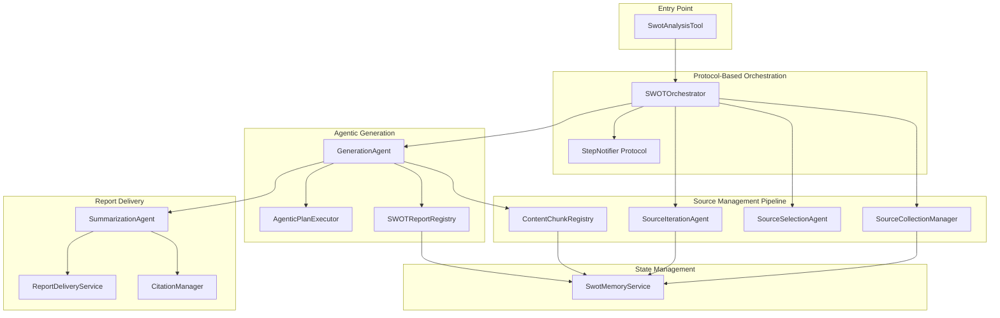
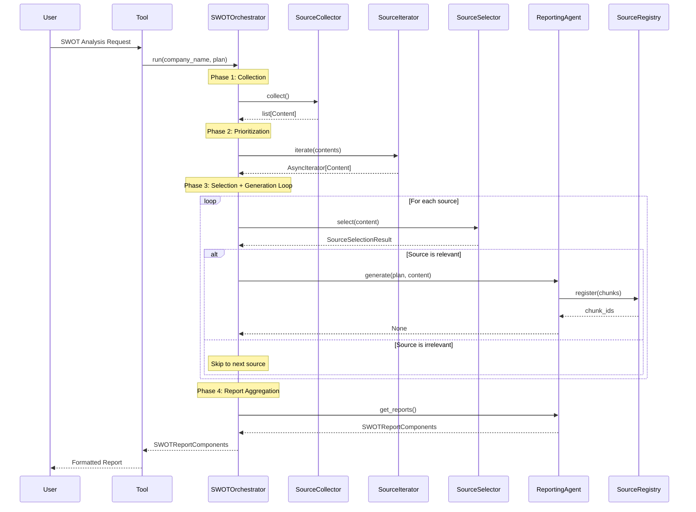
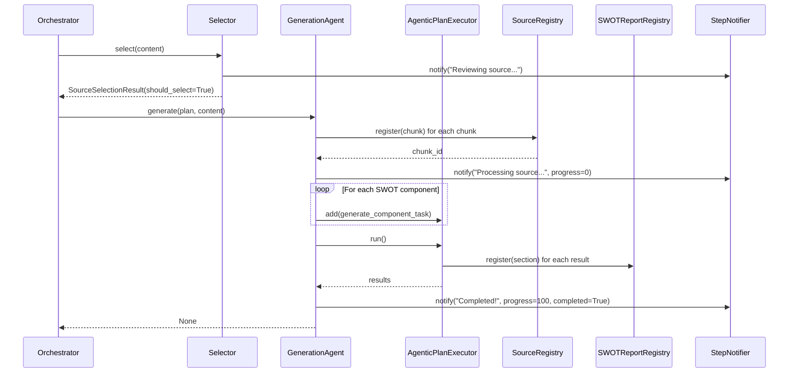

# SWOT Analysis Tool - Architecture v1.1.0

## Overview

The SWOT Analysis Tool implements a sophisticated protocol-based architecture that orchestrates intelligent source management, agentic generation, and multi-format report delivery. Version 1.1.0 introduces a modular design with dependency injection, enabling superior testability, maintainability, and flexibility.

### Key Architectural Principles

1. **Protocol-Based Design**: Components interact through well-defined Python protocols, enabling dependency injection and easy mocking for tests
2. **Agentic Processing**: LLM agents make intelligent decisions at each pipeline stage (source selection, prioritization, generation)
3. **State Management**: Persistent memory service with registry patterns for cross-component state and citation tracking
4. **Citation Integrity**: Unique ID generation and reference tracking throughout the entire pipeline

## High-Level Architecture



## Protocol-Based Orchestration

### What are Protocols?

Protocols in Python (using `typing.Protocol`) define interfaces without requiring inheritance. They enable structural subtyping (duck typing with type safety) and make dependency injection straightforward.

**Benefits:**
- **Testability**: Easy to create mock implementations for testing
- **Flexibility**: Swap implementations without changing orchestrator code
- **Decoupling**: Components depend on interfaces, not concrete classes
- **Type Safety**: Static type checkers can verify protocol compliance

### Core Protocols

#### 1. StepNotifier Protocol

**Purpose**: Real-time progress notifications throughout the pipeline

```python
class StepNotifier(Protocol):
    async def notify(
        self,
        title: str,
        description: str = "",
        sources: list[ContentReference] = [],
        progress: int | None = None,
        completed: bool = False,
    ): ...
```

**Usage**: Every major operation calls `notify()` to update users on progress.

#### 2. SourceCollector Protocol

**Purpose**: Multi-source data collection

```python
class SourceCollector(Protocol):
    async def collect(self, *, step_notifier: StepNotifier) -> list[Content]: ...
```

**Implementation**: `SourceCollectionManager` gathers from Knowledge Base, Earnings Calls, and Web sources.

#### 3. SourceSelector Protocol

**Purpose**: LLM-based relevance filtering

```python
class SourceSelector(Protocol):
    async def select(
        self, *, company_name: str, content: Content, step_notifier: StepNotifier
    ) -> SourceSelectionResult: ...
```

**Implementation**: `SourceSelectionAgent` determines if a source is relevant to the SWOT analysis.

#### 4. SourceIterator Protocol

**Purpose**: LLM-based source prioritization

```python
class SourceIterator(Protocol):
    async def iterate(
        self, *, contents: list[Content], step_notifier: StepNotifier
    ) -> AsyncIterator[Content]: ...
```

**Implementation**: `SourceIterationAgent` orders sources by relevance and returns an async iterator.

#### 5. SourceRegistry Protocol

**Purpose**: Content chunk tracking for citations

```python
class SourceRegistry(Protocol):
    def register(self, *, chunk: ContentChunk) -> str: ...
    def retrieve(self, *, id: str) -> ContentChunk | None: ...
```

**Implementation**: `ContentChunkRegistry` generates unique IDs and persists chunks to memory.

#### 6. ReportingAgent Protocol

**Purpose**: SWOT report generation

```python
class ReportingAgent(Protocol):
    async def generate(
        self,
        *,
        plan: SWOTPlan,
        content: Content,
        source_registry: SourceRegistry,
        step_notifier: StepNotifier,
    ) -> None: ...
    
    def get_reports(self) -> SWOTReportComponents: ...
```

**Implementation**: `GenerationAgent` processes sources and generates SWOT component reports.

## SWOTOrchestrator - The Central Coordinator

### Purpose

The `SWOTOrchestrator` is the central coordinator that orchestrates the entire SWOT analysis workflow. It uses dependency injection to receive all protocol implementations and coordinates them in a specific order.

### Dependency Injection

The orchestrator receives all dependencies through its constructor:

```python
class SWOTOrchestrator:
    def __init__(
        self,
        step_notifier: StepNotifier,
        source_collector: SourceCollector,
        source_selector: SourceSelector,
        source_iterator: SourceIterator,
        reporting_agent: ReportingAgent,
        source_registry: SourceRegistry,
        memory_service: SwotMemoryService,
    ):
        # Store all dependencies
```

This design enables:
- Easy testing with mock implementations
- Flexible component replacement
- Clear dependency visualization
- No tight coupling to concrete classes

### Workflow Coordination

The orchestrator executes a five-phase workflow:

#### Phase 1: Source Collection

```python
contents = await self._source_collector.collect(
    step_notifier=self._step_notifier
)
```

Gathers all available sources (Knowledge Base, Earnings Calls, Web).

#### Phase 2: Source Prioritization

```python
source_iterator = await self._source_iterator.iterate(
    contents=contents, 
    step_notifier=self._step_notifier
)
```

LLM orders sources by relevance, returning an async iterator for streaming processing.

#### Phase 3: Selection + Generation Loop

```python
async for content in source_iterator:
    # Select source for relevance
    source_selection_result = await self._source_selector.select(
        company_name=company_name,
        content=content,
        step_notifier=self._step_notifier,
    )
    
    if not source_selection_result.should_select:
        # Skip irrelevant source
        continue
    
    # Generate SWOT analysis from relevant source
    await self._reporting_agent.generate(
        plan=plan,
        content=content,
        step_notifier=self._step_notifier,
        source_registry=self._source_registry,
    )
```

For each source (in priority order):
1. **Selection**: LLM determines if source is relevant
2. **Skip Logic**: If irrelevant, skip to next source
3. **Generation**: If relevant, generate SWOT components

#### Phase 4: Report Aggregation

```python
return self._reporting_agent.get_reports()
```

Returns all generated SWOT component reports from the registry.

### Error Handling Strategy

The orchestrator implements graceful degradation:

1. **LLM Failures**: Each agent has fallback strategies (e.g., default to including sources on selection error)
2. **Source Processing Errors**: Logged but don't halt the entire workflow
3. **Memory Persistence Issues**: Components continue with in-memory state if persistence fails
4. **Notification Failures**: Logged but don't interrupt core workflow

### Workflow Sequence Diagram



## Design Decisions and Trade-offs

### Why Protocols Instead of Abstract Base Classes?

**Decision**: Use `typing.Protocol` for interfaces

**Rationale**:
- No inheritance required - cleaner implementation classes
- Structural subtyping - more Pythonic than nominal typing
- Better for testing - mock creation is straightforward
- Flexibility - can adapt existing classes without modification

**Trade-off**: Less explicit enforcement (no abstract method errors), but type checkers catch violations.

### Why Separate Selection and Iteration?

**Decision**: Split source management into two LLM-powered phases

**Rationale**:
- **Iteration** orders ALL sources (happens once)
- **Selection** filters each source (happens per-source)
- Separation of concerns: prioritization vs. filtering
- Better progress tracking and skipping logic

**Trade-off**: Two LLM calls instead of one, but more intelligent processing.

### Why Async Iterator for Source Processing?

**Decision**: `SourceIterator` returns `AsyncIterator[Content]`

**Rationale**:
- Streaming processing - start generation before all sources are prioritized
- Memory efficiency - don't hold all sources in memory
- Better progress tracking - process sources as they're ready
- Supports cancellation and interruption

**Trade-off**: Slightly more complex code, but significant performance benefits.

## Component Interactions

### Example: Processing a Single Source



## Testing Strategy

The protocol-based architecture enables comprehensive testing:

1. **Unit Tests**: Each component tested with protocol mocks
2. **Integration Tests**: Test component interactions with real implementations
3. **End-to-End Tests**: Full workflow with all components

Example mock for testing:

```python
class MockStepNotifier:
    async def notify(self, title: str, **kwargs):
        # Record call for assertions
        pass
```

See `tests/services/test_orchestrator.py` for comprehensive examples.

## Next Steps

For detailed information about specific services:
- [Source Management](./source_management.md) - Collection, iteration, selection, and registry
- [Generation Services](./generation.md) - Agentic generation and execution
- [Reporting Services](./reporting.md) - Summarization and delivery
- [Supporting Services](./supporting_services.md) - Notification, memory, and session
- [Complete Workflow](./complete_workflow.md) - End-to-end flow with examples

