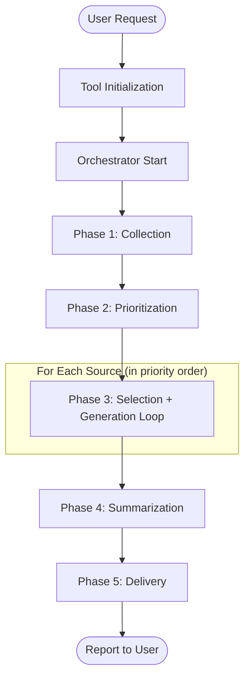
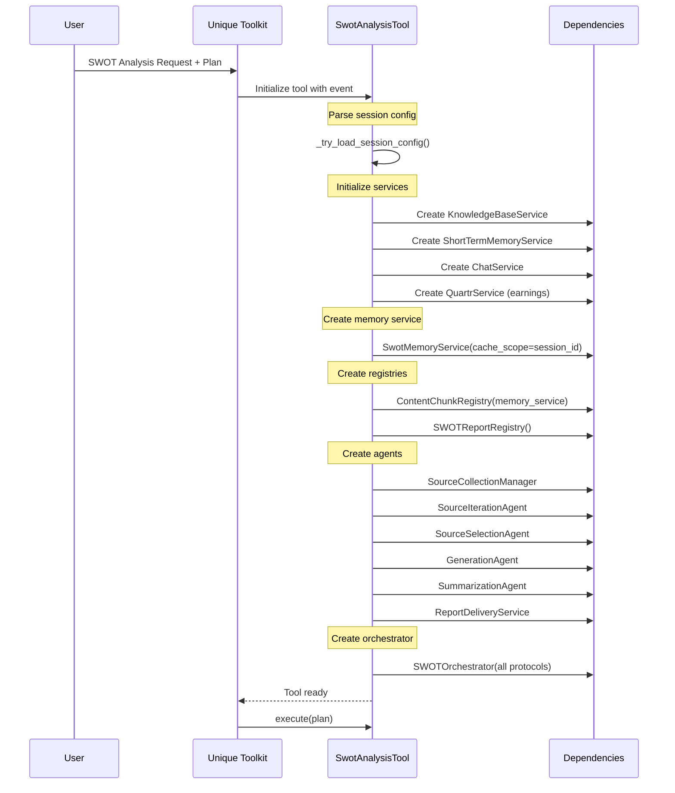
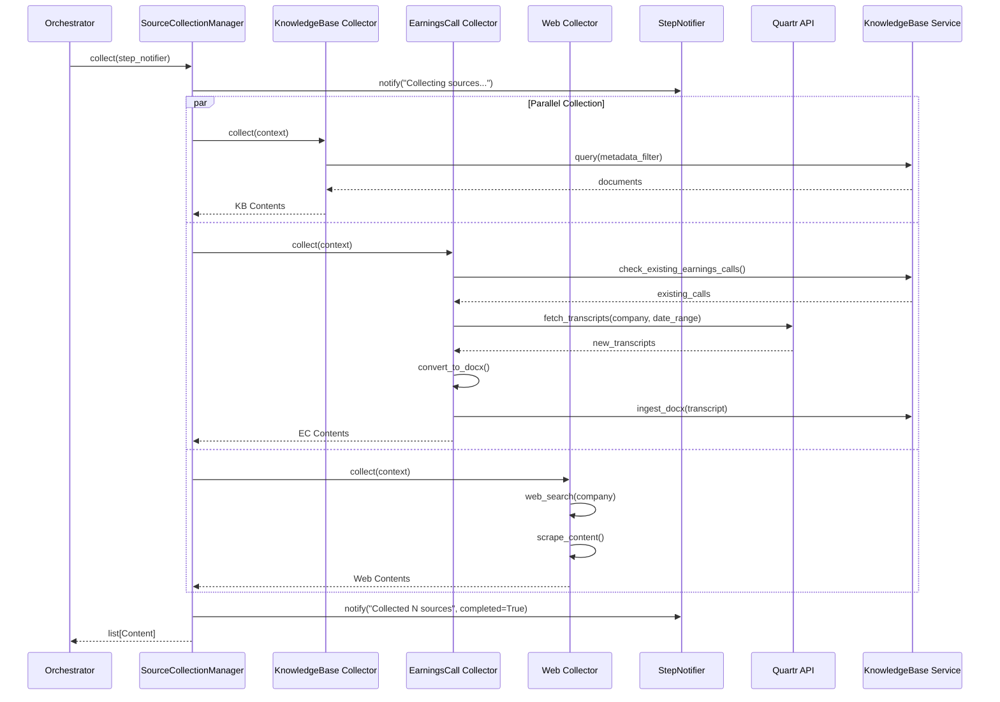
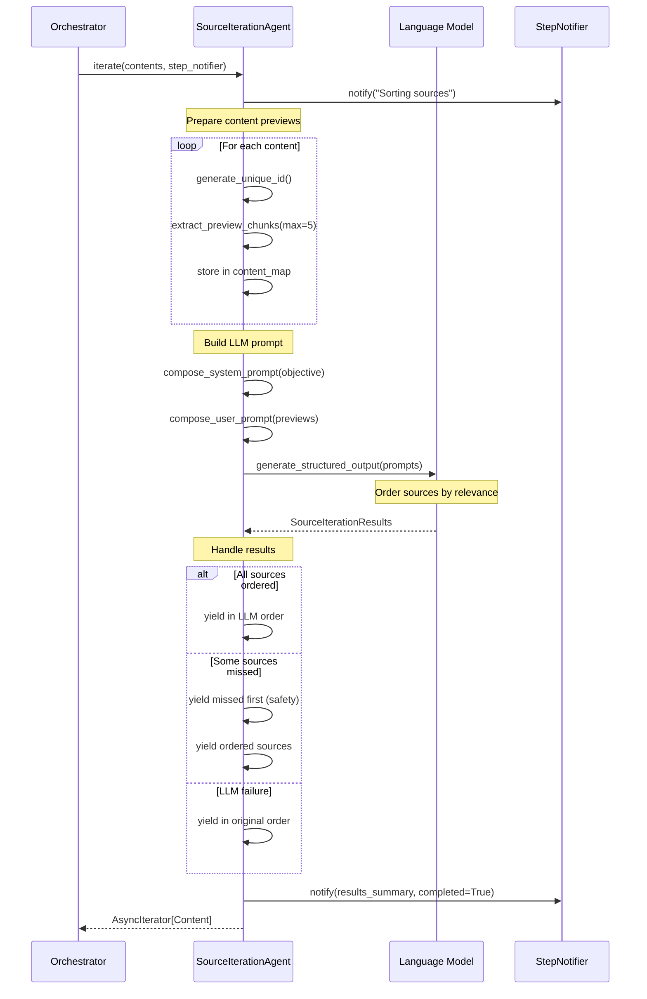
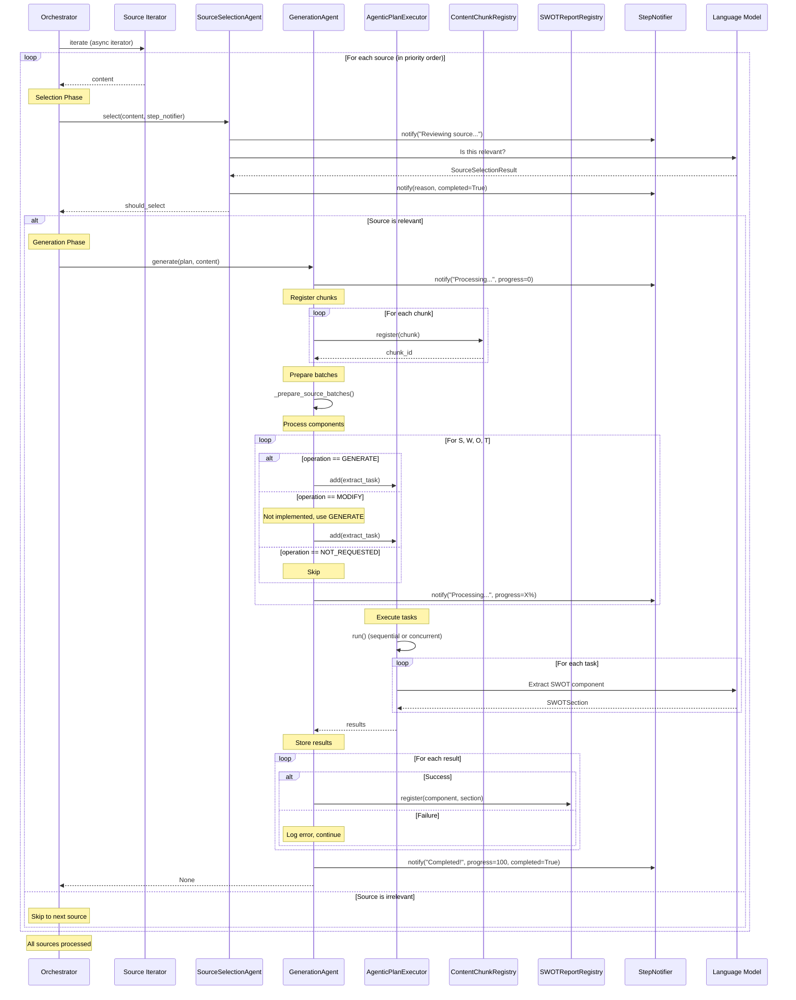
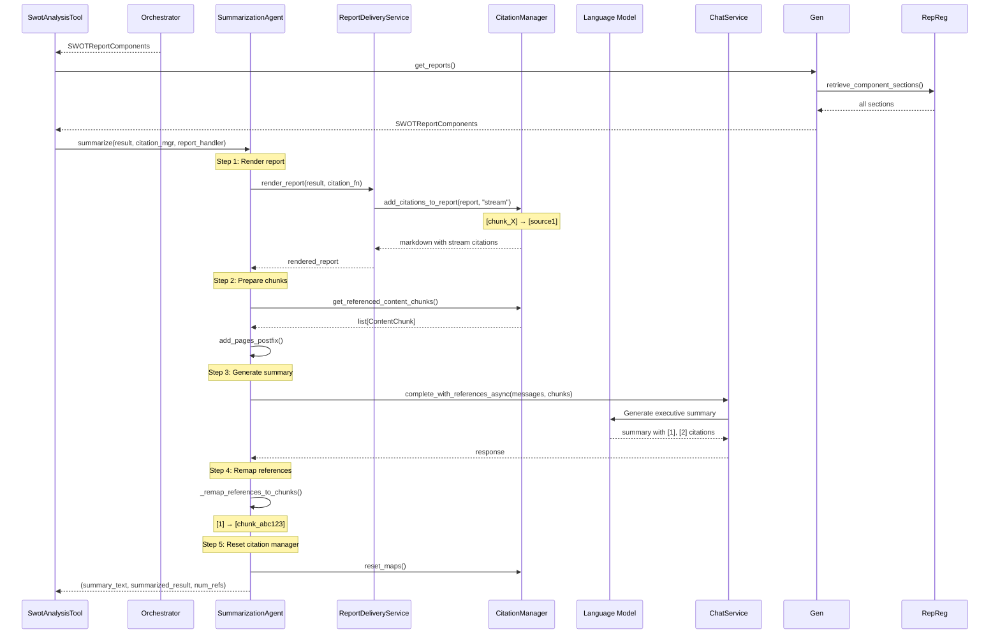
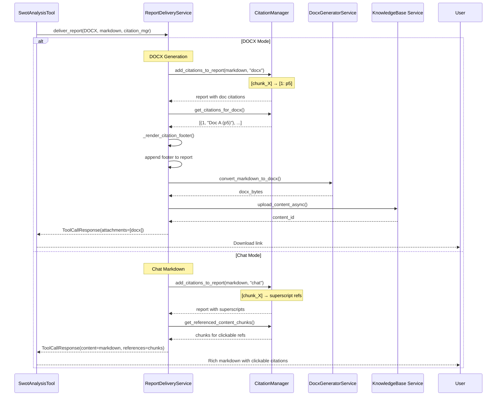
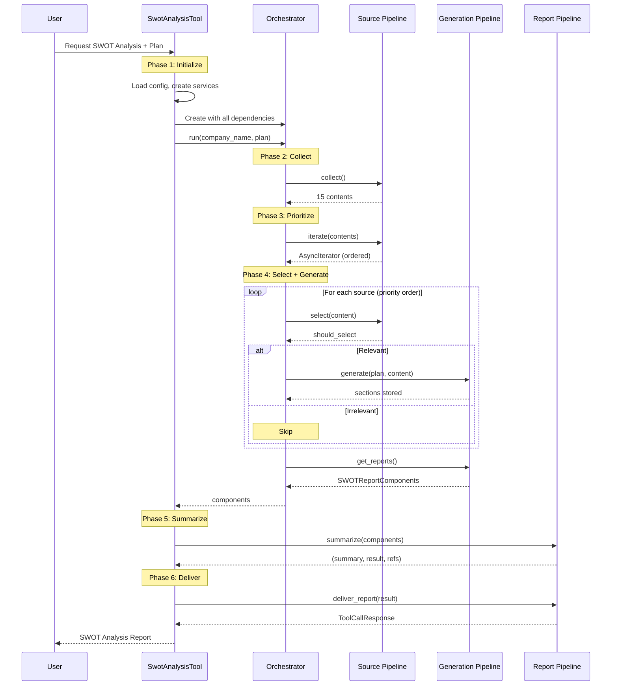

# Complete SWOT Analysis Workflow

This document provides an end-to-end view of the SWOT analysis workflow, from user request to final report delivery, with detailed sequence diagrams for each phase.

## Overview

The SWOT analysis workflow consists of six main phases executed sequentially by the `SWOTOrchestrator`:

1. **Initialization**: Tool setup and dependency injection
2. **Collection**: Gather sources from multiple data sources
3. **Prioritization**: LLM-based source ordering by relevance
4. **Selection & Generation**: Per-source filtering and SWOT component generation
5. **Summarization**: Executive summary generation with citation remapping
6. **Delivery**: Multi-format report rendering and delivery

## High-Level Flow



## Phase 1: Initialization

### Tool Setup



### Configuration Loading

The tool loads configuration from multiple sources:

1. **Tool Config**: Default settings from `SwotAnalysisToolConfig`
2. **Session Config**: Company and analysis metadata from event payload
3. **Runtime Config**: Dynamic settings based on user request

```python
# Session config
session_config = SessionConfig.model_validate(event.payload.session_config)

# Collection context
collection_context = CollectionContext(
    company_name=session_config.company.display_name,
    company_tickers=session_config.company.tickers,
    start_date=datetime.now() - timedelta(days=365),
    end_date=datetime.now(),
    metadata_filter=metadata_filter,
)

# Memory service
memory_service = SwotMemoryService(
    short_term_memory_service=stm_service,
    cache_scope=f"swot_{session_config.session_id}",
)
```

## Phase 2: Source Collection



### Collection Details

**Knowledge Base**:
- Filters by metadata (document type, date range, tags)
- Returns structured `Content` objects with chunks
- Average: 5-10 documents

**Earnings Calls**:
- Checks cache to avoid re-ingestion
- Fetches from Quartr API if not cached
- Converts transcripts to DOCX
- Ingests to Knowledge Base for future use
- Average: 4-8 earnings calls

**Web Sources**:
- Performs web search for company
- Scrapes and processes content
- Structures into `Content` objects
- Average: 3-5 web articles

## Phase 3: Source Prioritization



### Prioritization Logic

**LLM Objective**: Order sources from most to least relevant for SWOT analysis

**Criteria**:
1. **Relevance**: Direct SWOT information vs. tangential content
2. **Recency**: Newer information prioritized
3. **Quality**: Comprehensive analysis vs. brief mentions
4. **Document Type**: Financial reports > News articles > General content

**Output**: Async iterator yielding sources in priority order

## Phase 4: Selection & Generation Loop



### Selection Criteria

The LLM evaluates each source for:
1. **Direct SWOT Content**: Does it discuss strengths, weaknesses, opportunities, or threats?
2. **Company Relevance**: Is it about the target company (not competitors)?
3. **Information Quality**: Does it provide substantive analysis (not just mentions)?
4. **Recency**: Is the information current and actionable?

### Generation Per Source

For each relevant source:
1. **Chunk Registration**: Register all chunks with unique IDs
2. **Batch Preparation**: Create citable batches with IDs
3. **Component Processing**: Generate S/W/O/T sections based on plan
4. **Task Execution**: Execute via `AgenticPlanExecutor` (sequential or concurrent)
5. **Result Storage**: Store sections in `SWOTReportRegistry`

## Phase 5: Summarization



### Summarization Purpose

The summarization phase:
1. **Condenses**: Reduces full analysis to 2-3 paragraph executive summary
2. **Highlights**: Emphasizes key insights from each SWOT component
3. **Maintains Citations**: Preserves all references to source documents
4. **Provides Context**: Gives overview without requiring full report read

## Phase 6: Delivery



### Delivery Modes

**DOCX Mode**:
- Professional Word document
- Document-level citations: `[1: p5]`, `[2: p10-12]`
- Citation footer with full source list
- Uploaded to Knowledge Base
- Downloadable attachment

**Chat Mode**:
- Rich markdown formatting
- Superscript citations that are clickable
- References panel in chat interface
- Immediate display, no download

## Complete End-to-End Sequence



## Error Handling Strategy

### Source Collection Errors
- **Error**: Source collector fails (e.g., API timeout)
- **Handling**: Log error, continue with other sources
- **Impact**: Partial collection, analysis proceeds

### LLM Failures

#### Prioritization Failure
- **Error**: LLM fails to order sources
- **Handling**: Return sources in original order
- **Impact**: Suboptimal processing order, no data loss

#### Selection Failure
- **Error**: LLM fails to evaluate relevance
- **Handling**: Default to including source (safety)
- **Impact**: Potentially irrelevant source processed

#### Generation Failure
- **Error**: LLM fails to extract SWOT component
- **Handling**: Exception captured, other components proceed
- **Impact**: Missing one component section, analysis continues

### Memory Persistence Errors
- **Error**: Failed to save/load from memory
- **Handling**: Continue with in-memory state, log error
- **Impact**: No cached state, analysis proceeds from scratch

### Delivery Errors
- **Error**: DOCX generation or upload fails
- **Handling**: Fallback to chat mode or return error message
- **Impact**: User receives report in alternative format

## Performance Characteristics

### Typical Execution Times

| Phase | Time Range | Notes |
|-------|-----------|-------|
| Initialization | 1-2s | Service setup |
| Collection | 10-30s | Depends on source count |
| Prioritization | 5-10s | Single LLM call |
| Selection (per source) | 2-5s | LLM evaluation |
| Generation (per source) | 10-20s | 4 LLM calls (S/W/O/T) |
| Summarization | 5-10s | Single LLM call |
| Delivery | 2-5s | Document generation |
| **Total** | **2-5 minutes** | For 10-15 sources |

### Optimization Opportunities

1. **Concurrent Generation**: Use `ExecutionMode.CONCURRENT` for faster SWOT extraction
2. **Parallel Selection**: Future enhancement to evaluate multiple sources simultaneously
3. **Caching**: Memory service reduces re-computation in iterative workflows
4. **Chunk Limiting**: Reduce `max_number_of_selected_chunks` for faster LLM calls

## Workflow Variations

### Partial SWOT Analysis

User requests only Strengths and Weaknesses:

```python
plan = SWOTPlan(
    objective="Focus on internal factors",
    strengths=SWOTStep(operation=SWOTOperation.GENERATE),
    weaknesses=SWOTStep(operation=SWOTOperation.GENERATE),
    opportunities=SWOTStep(operation=SWOTOperation.NOT_REQUESTED),
    threats=SWOTStep(operation=SWOTOperation.NOT_REQUESTED),
)
```

**Impact**: Only S and W components generated, faster execution

### Modification Workflow

User wants to modify existing analysis:

```python
plan = SWOTPlan(
    objective="Update with new earnings data",
    strengths=SWOTStep(operation=SWOTOperation.MODIFY),
    # ... other components
)
```

**Note**: MODIFY not yet fully implemented, currently falls back to GENERATE

### Different Source Configurations

**Knowledge Base Only**:
```python
collection_config = SourceCollectionConfig(
    knowledge_base=KnowledgeBaseSourceConfig(enabled=True),
    earnings_calls=EarningsCallSourceConfig(enabled=False),
    web=WebSourceConfig(enabled=False),
)
```

**Earnings Calls Only**:
```python
collection_config = SourceCollectionConfig(
    knowledge_base=KnowledgeBaseSourceConfig(enabled=False),
    earnings_calls=EarningsCallSourceConfig(enabled=True),
    web=WebSourceConfig(enabled=False),
)
```

## Testing the Complete Workflow

End-to-end tests verify the entire workflow:

```python
@pytest.mark.asyncio
async def test_complete_workflow():
    # Setup mocks for all services
    mock_kb_service = MockKnowledgeBaseService()
    mock_llm_service = MockLanguageModelService()
    mock_chat_service = MockChatService()
    
    # Create tool
    tool = SwotAnalysisTool(config=test_config)
    
    # Execute
    result = await tool.execute(plan=test_plan)
    
    # Verify
    assert result.strengths is not None
    assert result.weaknesses is not None
    assert len(result.strengths) > 0
```

See `tests/services/test_orchestrator.py` for comprehensive workflow tests.

## Next Steps

For detailed information about specific components:
- [Architecture Overview](./architecture.md) - Protocol-based design and orchestrator
- [Source Management](./source_management.md) - Collection, iteration, selection, registry
- [Generation Services](./generation.md) - Agentic generation and execution
- [Reporting Services](./reporting.md) - Summarization and delivery
- [Supporting Services](./supporting_services.md) - Notification, memory, session

