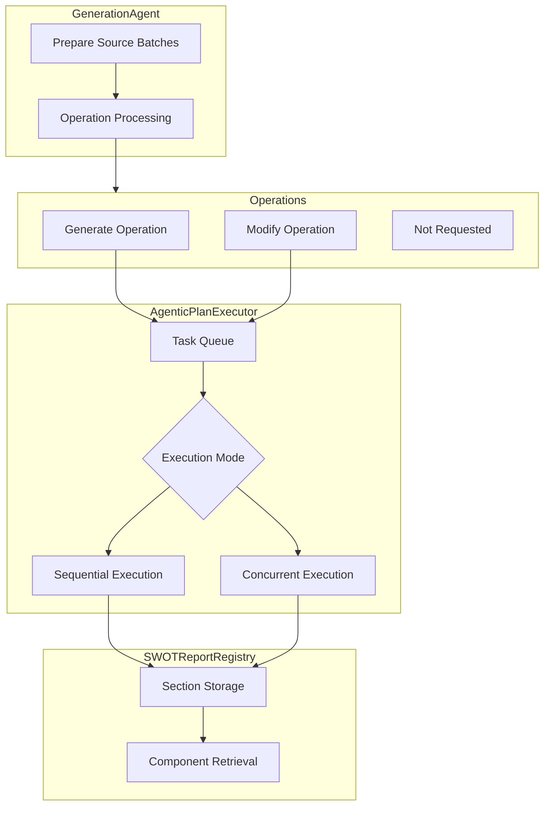
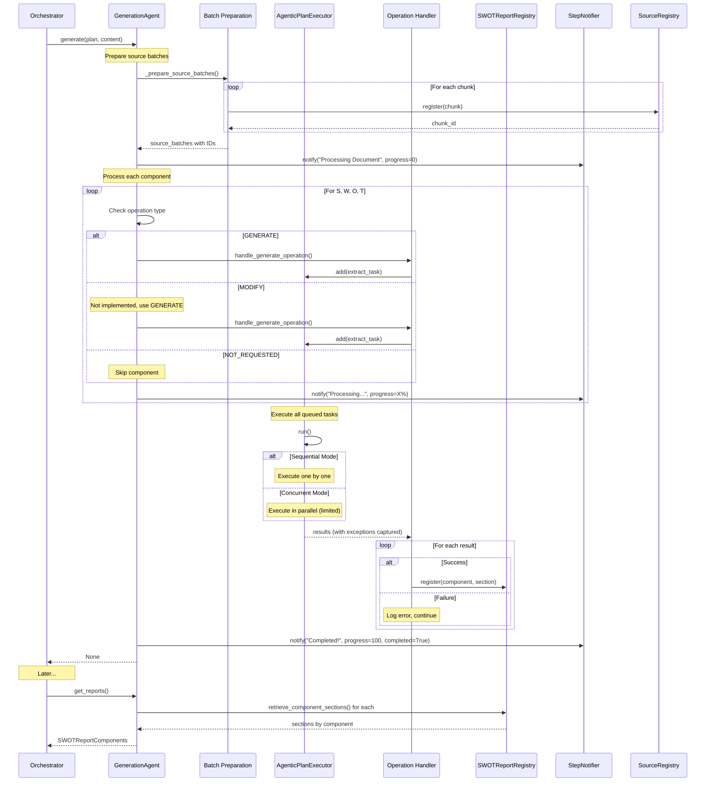

# Generation Services

The generation services are responsible for transforming relevant sources into structured SWOT analysis components. This layer implements an agentic approach with flexible execution strategies and organized report storage.

## Overview



## GenerationAgent

### Purpose

The `GenerationAgent` processes each relevant source document-by-document, generating SWOT component sections with proper citation tracking and progress notifications.

### Key Responsibilities

1. **Source Batch Preparation**: Convert content chunks into citable batches with unique IDs
2. **Operation Processing**: Handle GENERATE, MODIFY, and NOT_REQUESTED operations
3. **Progress Tracking**: Notify users of processing status per document
4. **Registry Integration**: Store generated sections in organized registry

### Workflow

#### 1. Initialization

```python
class GenerationAgent:
    def __init__(
        self,
        *,
        company_name: str,
        llm: LMI,
        llm_service: LanguageModelService,
        registry: SWOTReportRegistry,
        executor: AgenticPlanExecutor,
        prompts_config: AgenticPromptsConfig,
    ):
        self._company_name = company_name
        self._llm = llm
        self._llm_service = llm_service
        self._swot_report_registry = registry
        self._executor = executor
        self._prompts_config = prompts_config
```

#### 2. Source Batch Preparation

```python
def _prepare_source_batches(
    self, *, content: Content, source_registry: SourceRegistry
) -> list[dict[str, str]]:
    """
    Prepare source chunks for prompting with chunk IDs for citation.
    """
    chunk_ids: list[str] = []
    ordered_chunks = sorted(content.chunks, key=lambda x: x.order)
    
    # Register each chunk and get unique ID
    for chunk in ordered_chunks:
        chunk_id = source_registry.register(chunk=chunk)
        chunk_ids.append(chunk_id)
    
    # Return batch format for prompts
    return [
        {"id": chunk_id, "text": chunk.text}
        for chunk_id, chunk in zip(chunk_ids, ordered_chunks)
    ]
```

**Purpose**: Creates a list of chunks with IDs that LLMs can use for citations like `[chunk_abc123]`.

#### 3. Generate Method

```python
async def generate(
    self,
    *,
    content: Content,
    source_registry: SourceRegistry,
    plan: SWOTPlan,
    step_notifier: StepNotifier,
):
    # Convert plan to list of (component, step) tuples
    components_step = plan.convert_plan_to_list_of_steps()
    
    # Prepare batches with chunk IDs
    source_batches = self._prepare_source_batches(
        content=content, 
        source_registry=source_registry
    )
    
    # Get document info for notifications
    document_title = get_content_chunk_title(content)
    document_reference = convert_content_chunk_to_reference(content)
    
    # Initial notification
    await step_notifier.notify(
        title=f"Processing `{document_title}`",
        sources=[document_reference],
        progress=0,
    )
    
    # Process each component
    for index, (component, step) in enumerate(components_step):
        progress = int(index / len(components_step) * 100)
        await step_notifier.notify(
            title=f"Processing `{document_title}`",
            progress=progress,
            description=f"Processing {component.value}...",
        )
        
        match step.operation:
            case SWOTOperation.GENERATE:
                await handle_generate_operation(
                    component=component,
                    source_batches=source_batches,
                    # ... other params
                )
            case SWOTOperation.MODIFY:
                # Not yet implemented, falls back to GENERATE
                logger.warning("MODIFY not supported, using GENERATE")
                await handle_generate_operation(...)
            case SWOTOperation.NOT_REQUESTED:
                continue
    
    # Completion notification
    await step_notifier.notify(
        title=f"Processing `{document_title}`",
        progress=100,
        description=f"Completed processing {document_title}!",
        completed=True,
    )
```

#### 4. Operation Handling

The `handle_generate_operation` function (in `operations.py`) executes the actual generation:

```python
async def handle_generate_operation(
    component: SWOTComponent,
    source_batches: list[dict[str, str]],
    company_name: str,
    llm: LMI,
    llm_service: LanguageModelService,
    swot_report_registry: SWOTReportRegistry,
    executor: AgenticPlanExecutor,
    prompts_config: AgenticPromptsConfig,
    **kwargs
):
    # Generate extraction prompt
    system_prompt = render_extraction_prompt(component, company_name)
    user_prompt = render_user_prompt(source_batches)
    
    # Add task to executor
    executor.add(
        extract_swot_component,
        component=component,
        system_prompt=system_prompt,
        user_prompt=user_prompt,
        llm=llm,
        llm_service=llm_service,
    )
    
    # Execute all tasks
    results = await executor.run()
    
    # Register sections in registry
    for result in results:
        if not isinstance(result, Exception):
            swot_report_registry.register(
                component=component,
                section=result,
            )
```

#### 5. Report Retrieval

```python
def get_reports(self) -> SWOTReportComponents:
    return SWOTReportComponents(
        strengths=self._swot_report_registry.retrieve_component_sections(
            component=SWOTComponent.STRENGTHS
        ),
        weaknesses=self._swot_report_registry.retrieve_component_sections(
            component=SWOTComponent.WEAKNESSES
        ),
        opportunities=self._swot_report_registry.retrieve_component_sections(
            component=SWOTComponent.OPPORTUNITIES
        ),
        threats=self._swot_report_registry.retrieve_component_sections(
            component=SWOTComponent.THREATS
        ),
    )
```

### Progress Tracking

The agent calculates and reports progress:

```python
progress = int(current_component_index / total_components * 100)
```

Example notifications:
- "**Processing `Q3 2024 Earnings Call`**" (0%)
- "**Processing `Q3 2024 Earnings Call`** - Processing Strengths..." (25%)
- "**Processing `Q3 2024 Earnings Call`** - Processing Weaknesses..." (50%)
- "**Processing `Q3 2024 Earnings Call`** - Completed!" (100%)

### Integration with Registry

All generated sections are stored in the `SWOTReportRegistry`:

```python
swot_report_registry.register(
    component=SWOTComponent.STRENGTHS,
    section=SWOTSection(
        id="unique_section_id",
        content="Generated analysis...",
        citations=["chunk_abc", "chunk_def"],
    ),
)
```

## AgenticPlanExecutor

### Purpose

The `AgenticPlanExecutor` provides flexible task execution orchestration with support for sequential and concurrent execution modes, exception capture, and automatic queue management.

### Execution Modes

```python
class ExecutionMode(StrEnum):
    SEQUENTIAL = "Sequential"
    CONCURRENT = "Concurrent"
```

#### Sequential Mode

**Use Case**: Predictable ordering, debugging, or when tasks must run in specific order

**Behavior**:
- Tasks execute one at a time
- Order is guaranteed
- Exceptions don't stop subsequent tasks

```python
async def _run_sequential(self) -> Sequence[Exception | Any]:
    results: list[Exception | None] = []
    for fn, args, kwargs in self._queue:
        try:
            result = await fn(*args, **kwargs)
            results.append(result)
        except Exception as exc:
            results.append(exc)  # Capture, don't raise
    return results
```

#### Concurrent Mode

**Use Case**: Performance optimization, independent tasks

**Behavior**:
- Tasks execute in parallel
- Respects `max_concurrent_tasks` limit via semaphore
- Exceptions captured per-task
- Faster processing for multiple independent operations

```python
async def _run_concurrent(self) -> Sequence[Exception | Any]:
    semaphore = asyncio.Semaphore(self._max_concurrent_tasks)
    
    async def _runner(fn, args, kwargs):
        async with semaphore:
            try:
                result = await fn(*args, **kwargs)
                return result
            except Exception as exc:
                return exc  # Capture, don't raise
    
    tasks = [
        asyncio.create_task(_runner(fn, args, kwargs))
        for fn, args, kwargs in self._queue
    ]
    return await asyncio.gather(*tasks)
```

### Usage Pattern

#### 1. Initialization

```python
executor = AgenticPlanExecutor(
    execution_mode=ExecutionMode.CONCURRENT,
    max_concurrent_tasks=5,  # Max 5 parallel tasks
)
```

#### 2. Task Registration

```python
# Add tasks to queue
executor.add(extract_strengths, content=content, llm=llm)
executor.add(extract_weaknesses, content=content, llm=llm)
executor.add(extract_opportunities, content=content, llm=llm)
executor.add(extract_threats, content=content, llm=llm)
```

#### 3. Execution

```python
# Execute all tasks
results = await executor.run()

# Results align with task order
for i, result in enumerate(results):
    if isinstance(result, Exception):
        logger.error(f"Task {i} failed: {result}")
    else:
        logger.info(f"Task {i} succeeded")
```

#### 4. Queue Management

The queue is automatically cleared after execution:

```python
async def run(self) -> Sequence[Exception | Any]:
    try:
        # Execute based on mode
        return await self._run_sequential() or self._run_concurrent()
    finally:
        # Always clear queue to prevent:
        # 1. Memory leaks
        # 2. Duplicate execution
        self._queue.clear()
```

### Configuration

```python
generation_config = GenerationConfig(
    execution_mode=ExecutionMode.CONCURRENT,  # or SEQUENTIAL
    max_concurrent_tasks=5,  # Only for CONCURRENT mode
)
```

**Considerations**:
- **Sequential**: Use for debugging or when order matters
- **Concurrent (Low Limit)**: Balance between speed and resource usage (3-5 tasks)
- **Concurrent (High Limit)**: Maximum speed for independent tasks (10+ tasks)

### Error Handling

The executor never raises exceptions from tasks:

```python
results = await executor.run()

# Check for failures
failures = [r for r in results if isinstance(r, Exception)]
successes = [r for r in results if not isinstance(r, Exception)]

logger.info(f"Completed: {len(successes)} success, {len(failures)} failure")
```

This enables:
- Partial success scenarios
- Graceful degradation
- Detailed error reporting without workflow interruption

## SWOTReportRegistry

### Purpose

The `SWOTReportRegistry` provides organized storage for generated SWOT sections, enabling retrieval by component and ensuring section uniqueness.

### Data Structure

```python
class SWOTReportRegistry:
    def __init__(self):
        self._sections_by_component: dict[SWOTComponent, list[SWOTSection]] = {
            SWOTComponent.STRENGTHS: [],
            SWOTComponent.WEAKNESSES: [],
            SWOTComponent.OPPORTUNITIES: [],
            SWOTComponent.THREATS: [],
        }
        self._registered_ids: set[str] = set()
```

### Operations

#### 1. Section Registration

```python
def register(self, *, component: SWOTComponent, section: SWOTSection) -> None:
    # Ensure ID uniqueness
    if section.id in self._registered_ids:
        raise ValueError(f"Section ID {section.id} already registered")
    
    # Store section
    self._sections_by_component[component].append(section)
    self._registered_ids.add(section.id)
```

**ID Uniqueness**: Prevents duplicate sections from being registered.

#### 2. Component Retrieval

```python
def retrieve_component_sections(
    self, *, component: SWOTComponent
) -> list[SWOTSection]:
    return self._sections_by_component[component]
```

**Usage**:
```python
strengths = registry.retrieve_component_sections(
    component=SWOTComponent.STRENGTHS
)
# Returns all strength sections from all sources
```

#### 3. Full Report Retrieval

```python
def get_all_sections(self) -> dict[SWOTComponent, list[SWOTSection]]:
    return self._sections_by_component.copy()
```

### Section Model

```python
class SWOTSection(BaseModel):
    id: str  # Unique identifier
    content: str  # Markdown content
    citations: list[str]  # Chunk IDs referenced
    source_id: str  # Source document ID
    metadata: dict[str, Any] = {}  # Additional info
```

### Multi-Source Aggregation

The registry naturally aggregates sections from multiple sources:

```python
# Source 1 generates sections
registry.register(
    component=SWOTComponent.STRENGTHS,
    section=SWOTSection(id="s1_strength1", content="..."),
)

# Source 2 generates more sections
registry.register(
    component=SWOTComponent.STRENGTHS,
    section=SWOTSection(id="s2_strength1", content="..."),
)

# Retrieve all strengths from all sources
all_strengths = registry.retrieve_component_sections(
    component=SWOTComponent.STRENGTHS
)
# Returns: [s1_strength1, s2_strength1]
```

## Generation Pipeline Flow



## Configuration Example

Complete generation configuration:

```python
generation_config = GenerationConfig(
    # Executor settings
    execution_mode=ExecutionMode.CONCURRENT,
    max_concurrent_tasks=5,
    
    # Agentic prompts
    prompts_config=AgenticPromptsConfig(
        extraction=ExtractionPromptsConfig(
            strengths=ComponentPromptConfig(
                system_prompt="...",
                user_prompt="...",
            ),
            weaknesses=ComponentPromptConfig(...),
            opportunities=ComponentPromptConfig(...),
            threats=ComponentPromptConfig(...),
        ),
    ),
    
    # LLM settings
    llm=LMI(
        name="gpt-4",
        provider="openai",
    ),
)
```

## Testing

All generation services are thoroughly tested:

- `tests/services/generation/test_generation_agent.py` - Agent workflow
- `tests/services/generation/test_plan_executor.py` - Execution modes
- `tests/services/generation/test_report_registry.py` - Registry operations

Example test patterns:

```python
@pytest.mark.asyncio
async def test_concurrent_execution():
    executor = AgenticPlanExecutor(
        execution_mode=ExecutionMode.CONCURRENT,
        max_concurrent_tasks=3,
    )
    
    # Add mock tasks
    for i in range(10):
        executor.add(mock_async_task, value=i)
    
    # Execute
    results = await executor.run()
    
    # Verify all completed
    assert len(results) == 10
    assert all(not isinstance(r, Exception) for r in results)
```

## Design Decisions

### Why Operation-Based Processing?

**Decision**: Use GENERATE/MODIFY/NOT_REQUESTED operations

**Rationale**:
- Clear intent from user's plan
- Easy to extend with new operation types
- Enables partial SWOT generation
- Supports iterative refinement (MODIFY)

### Why Capture Exceptions Instead of Raising?

**Decision**: Executor captures exceptions and returns them in results

**Rationale**:
- Partial success is valuable (some components generated)
- Better error reporting (know which tasks failed)
- Graceful degradation
- Workflow continues despite failures

**Trade-off**: Caller must check results for exceptions.

### Why Separate Registry from Agent?

**Decision**: `SWOTReportRegistry` is separate from `GenerationAgent`

**Rationale**:
- Single Responsibility Principle
- Registry can be tested independently
- Registry can be persisted to memory
- Multiple agents could share registry (future)

**Trade-off**: Slightly more complex initialization.


