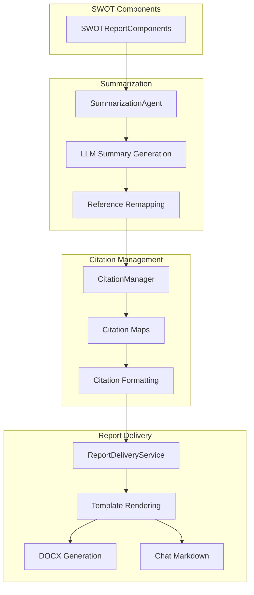
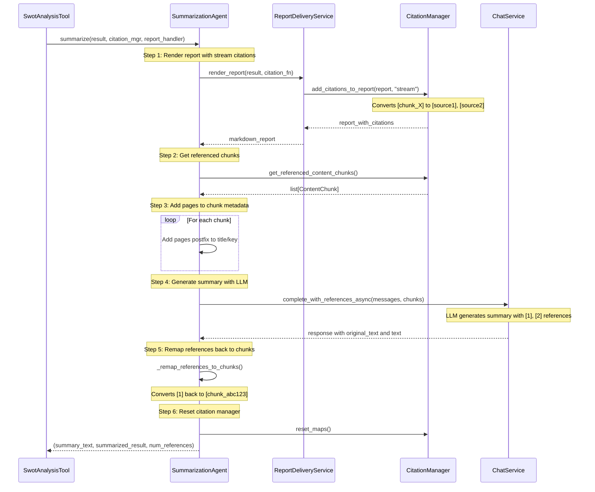
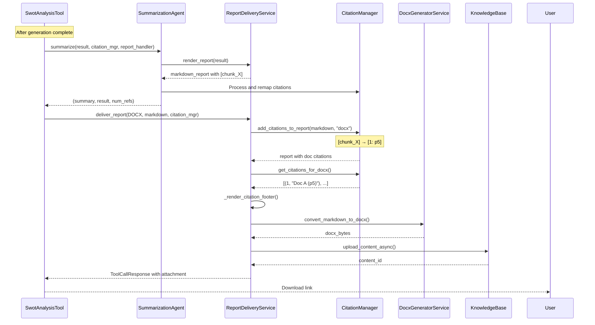

# Report Services

The report services transform generated SWOT components into polished, well-cited reports delivered in multiple formats. This layer handles summarization, citation management, and final report rendering.

## Overview



## SummarizationAgent

### Purpose

The `SummarizationAgent` generates an executive summary of the SWOT analysis while maintaining citation integrity throughout the summarization process.

### Workflow



### Implementation Details

#### 1. Render Report with Stream Citations

```python
# Render the report with compatible citations for streaming
markdown_report = report_handler.render_report(
    result=result,
    citation_fn=lambda report: citation_manager.add_citations_to_report(
        report,
        "stream",  # Uses [source1], [source2] format
    ),
)
```

**Stream Format**: Uses numbered references like `[source1]`, `[source2]` that the chat service can process.

#### 2. Prepare Content Chunks

```python
# Get chunks referenced in report
chunks = deepcopy(citation_manager.get_referenced_content_chunks())

# Add pages postfix for display
for chunk in chunks:
    pages_postfix = _generate_pages_postfix([chunk])
    chunk.key = chunk.key + pages_postfix if chunk.key else chunk.key
    chunk.title = chunk.title + pages_postfix if chunk.title else chunk.title
```

**Example**: "Q3 Earnings Call" → "Q3 Earnings Call (p5-7)"

#### 3. Generate Summary via LLM

```python
user_prompt = Template(prompts.user_prompt).render(
    company_name=company_name,
    report=markdown_report,
    chunks=chunks,
)

system_prompt = Template(prompts.system_prompt).render()

messages = (
    MessagesBuilder()
    .system_message_append(system_prompt)
    .user_message_append(user_prompt)
    .build()
)

response = await self._chat_service.complete_with_references_async(
    model_name=self._llm.name,
    messages=messages,
    content_chunks=chunks,
)
```

**Prompt Context**:
- Full SWOT report with citations
- All referenced chunks with page numbers
- Company name for context

**LLM Task**: Generate concise executive summary maintaining key insights and citations.

#### 4. Reference Remapping

```python
def _remap_references_to_chunks(
    self, response_content: str, citation_manager: CitationManager
) -> str:
    citations_map = citation_manager.get_citations_map()
    # citations_map = {"abc123": "[source1]", "def456": "[source2]", ...}
    
    for chunk_id, source_id in citations_map.items():
        # Convert [source1] back to [chunk_abc123]
        response_content = response_content.replace(
            source_id, f"[chunk_{chunk_id}]"
        )
    return response_content
```

**Purpose**: Maintains internal citation format for downstream processing.

#### 5. Citation Manager Reset

```python
citation_manager.reset_maps()
```

**Purpose**: Clears citation maps to prepare for next report rendering with fresh reference numbering.

### Prompt Configuration

```python
summarization_config = SummarizationConfig(
    prompt_config=SummarizationPromptConfig(
        system_prompt="""
You are an expert business analyst creating executive summaries.

Generate a concise summary of the SWOT analysis that:
- Highlights key insights from each component
- Maintains all citation references
- Uses clear, professional language
- Focuses on actionable insights
        """,
        user_prompt="""
Company: {{ company_name }}

Full SWOT Analysis:
{{ report }}

Referenced Sources:

- {{ chunk.title }}


Generate an executive summary (2-3 paragraphs) that captures the most important findings.
        """,
    ),
)
```

### Return Values

```python
async def summarize(...) -> tuple[str, str, int]:
    # Returns:
    # 1. summary_text: Formatted text with [1], [2] references
    # 2. summarized_result: Internal format with [chunk_X] references
    # 3. num_references: Count of unique citations
    return (response.message.text, summarization_result, num_references)
```

## ReportDeliveryService

### Purpose

The `ReportDeliveryService` renders SWOT reports in multiple formats (DOCX, Chat) with proper citation formatting and template-based customization.

### Renderer Types

```python
class DocxRendererType(StrEnum):
    DOCX = "docx"  # Professional Word document
    CHAT = "chat"  # Rich markdown for chat interface
```

### Core Methods

#### 1. Render Report

```python
def render_report(
    self,
    *,
    result: SWOTReportComponents,
    citation_fn: Callable[[str], str] | None = None,
) -> str:
    """
    Render SWOT components into markdown using Jinja2 template.
    """
    # Render with template
    markdown_report = self._template.render(
        strengths=result.strengths,
        weaknesses=result.weaknesses,
        opportunities=result.opportunities,
        threats=result.threats,
    )
    
    # Apply citations if provided
    if citation_fn:
        markdown_report = citation_fn(markdown_report)
    
    return markdown_report
```

**Template** (`report_template.j2`):
```jinja2
# SWOT Analysis

## Strengths

{{ section.content }}


## Weaknesses

{{ section.content }}


## Opportunities

{{ section.content }}


## Threats

{{ section.content }}

```

#### 2. Deliver Report

```python
async def deliver_report(
    self,
    *,
    renderer_type: DocxRendererType,
    markdown_report: str,
    citation_manager: CitationManager,
    company_name: str,
    session_id: str,
) -> ToolCallResponse:
    """
    Deliver report in specified format.
    """
    match renderer_type:
        case DocxRendererType.DOCX:
            return await self._deliver_docx_report(
                markdown_report=markdown_report,
                citation_manager=citation_manager,
                company_name=company_name,
                session_id=session_id,
            )
        case DocxRendererType.CHAT:
            return self._deliver_chat_report(
                markdown_report=markdown_report,
                citation_manager=citation_manager,
                company_name=company_name,
            )
```

### DOCX Mode

**Purpose**: Generate professional Word document with citation footer

```python
async def _deliver_docx_report(
    self,
    *,
    markdown_report: str,
    citation_manager: CitationManager,
    company_name: str,
    session_id: str,
) -> ToolCallResponse:
    # Step 1: Replace citations with document-level references
    report_with_citations = citation_manager.add_citations_to_report(
        markdown_report,
        mode="docx",  # Format: [1: p5], [2: p10-12]
    )
    
    # Step 2: Generate citation footer
    citations_for_docx = citation_manager.get_citations_for_docx()
    citation_footer = self._render_citation_footer(citations_for_docx)
    
    # Step 3: Append footer to report
    full_report = f"{report_with_citations}\n\n{citation_footer}"
    
    # Step 4: Convert markdown to DOCX
    docx_bytes = convert_markdown_to_docx(
        markdown_content=full_report,
        company_name=company_name,
    )
    
    # Step 5: Upload to Knowledge Base
    file_name = f"SWOT_Analysis_{company_name}_{session_id}.docx"
    content_id = await self._kb_service.upload_content_async(
        file_name=file_name,
        file_bytes=docx_bytes,
        content_type="application/vnd.openxmlformats-officedocument.wordprocessingml.document",
    )
    
    # Step 6: Return download response
    return ToolCallResponse(
        content=f"✅ SWOT Analysis complete for {company_name}!",
        attachments=[{
            "id": content_id,
            "name": file_name,
            "type": "document",
        }],
    )
```

**Citation Footer Example**:
```markdown
## References

1. Q3 2024 Earnings Call (p5-7)
2. Annual Report 2023 (p12)
3. Market Analysis Report (p3-5)
```

### Chat Mode

**Purpose**: Display rich markdown with clickable references

```python
def _deliver_chat_report(
    self,
    *,
    markdown_report: str,
    citation_manager: CitationManager,
    company_name: str,
) -> ToolCallResponse:
    # Step 1: Replace citations with superscripts
    report_with_citations = citation_manager.add_citations_to_report(
        markdown_report,
        mode="chat",  # Format: superscript references
    )
    
    # Step 2: Get referenced chunks for clickable links
    referenced_chunks = citation_manager.get_referenced_content_chunks()
    
    # Step 3: Return markdown response
    return ToolCallResponse(
        content=f"# SWOT Analysis: {company_name}\n\n{report_with_citations}",
        references=referenced_chunks,  # Enable clickable citations
    )
```

**Superscript Format**: Text with references^[1]^ that are clickable in the chat interface.

### Template Configuration

```python
report_config = ReportDeliveryConfig(
    renderer_type=DocxRendererType.DOCX,
    template_path="report_template.j2",
    citation_footer_template="citation_footer.j2",
)
```

### DOCX Conversion

The service uses `convert_markdown_to_docx()` from `report/docx.py`:

```python
def convert_markdown_to_docx(
    *,
    markdown_content: str,
    company_name: str,
    template_docx: bytes | None = None,
) -> bytes:
    """
    Convert markdown to DOCX with proper formatting.
    """
    doc = Document(template_docx) if template_docx else Document()
    
    # Add title
    doc.add_heading(f"SWOT Analysis: {company_name}", level=0)
    
    # Parse and add markdown content
    for line in markdown_content.split('\n'):
        if line.startswith('# '):
            doc.add_heading(line[2:], level=1)
        elif line.startswith('## '):
            doc.add_heading(line[3:], level=2)
        elif line.strip():
            doc.add_paragraph(line)
    
    # Convert to bytes
    buffer = BytesIO()
    doc.save(buffer)
    return buffer.getvalue()
```

## CitationManager

### Purpose

The `CitationManager` handles citation tracking, formatting, and deduplication throughout the analysis pipeline.

### Core Functionality

#### 1. Citation Registration

```python
def register_citation(self, chunk_id: str, chunk: ContentChunk):
    """Register a chunk for citation."""
    self._citations[chunk_id] = chunk
```

Called during generation when chunks are referenced.

#### 2. Citation Maps

The manager maintains multiple maps for different citation formats:

```python
class CitationManager:
    def __init__(self):
        self._citations: dict[str, ContentChunk] = {}
        self._citation_to_doc_map: dict[str, str] = {}  # chunk_id -> doc_ref
        self._doc_citations: list[tuple[str, ContentChunk]] = []  # Ordered list
```

#### 3. Add Citations to Report

```python
def add_citations_to_report(
    self, report: str, mode: str
) -> str:
    """
    Replace [chunk_X] references with formatted citations.
    
    Modes:
    - "docx": [1: p5-7] format
    - "chat": Superscript format
    - "stream": [source1] format
    """
    match mode:
        case "docx":
            return self._format_docx_citations(report)
        case "chat":
            return self._format_chat_citations(report)
        case "stream":
            return self._format_stream_citations(report)
```

**DOCX Format**:
```python
def _format_docx_citations(self, report: str) -> str:
    # Find all [chunk_X] references
    chunk_refs = re.findall(r'\[chunk_([a-zA-Z0-9]+)\]', report)
    
    # Build doc-level citation map
    doc_map = {}
    for i, chunk_id in enumerate(chunk_refs, start=1):
        if chunk_id not in doc_map:
            chunk = self._citations[chunk_id]
            doc_map[chunk_id] = f"[{i}: p{chunk.start_page}]"
    
    # Replace in report
    for chunk_id, citation in doc_map.items():
        report = report.replace(f"[chunk_{chunk_id}]", citation)
    
    return report
```

**Chat Format**:
```python
def _format_chat_citations(self, report: str) -> str:
    # Similar logic but with superscript format
    # [chunk_X] → ^[1]^
    pass
```

**Stream Format**:
```python
def _format_stream_citations(self, report: str) -> str:
    # [chunk_X] → [source1], [source2], etc.
    # Used for chat service compatibility
    pass
```

#### 4. Get Citations for DOCX

```python
def get_citations_for_docx(self) -> list[tuple[int, str]]:
    """
    Return ordered list of citations for footer.
    
    Returns: [(1, "Doc A (p5)"), (2, "Doc B (p10-12)"), ...]
    """
    citations = []
    for i, (chunk_id, chunk) in enumerate(self._doc_citations, start=1):
        title = chunk.title or chunk.key
        pages = f"p{chunk.start_page}"
        if chunk.end_page and chunk.end_page != chunk.start_page:
            pages += f"-{chunk.end_page}"
        citations.append((i, f"{title} ({pages})"))
    return citations
```

#### 5. Get Referenced Chunks

```python
def get_referenced_content_chunks(self) -> list[ContentChunk]:
    """Return all chunks referenced in the report."""
    return [chunk for chunk_id, chunk in self._doc_citations]
```

Used for:
- Chat mode clickable references
- Summarization context
- Citation footer generation

#### 6. Reset Maps

```python
def reset_maps(self):
    """Clear citation maps for next report."""
    self._citation_to_doc_map.clear()
    self._doc_citations.clear()
```

Called after summarization to prepare for final report rendering.

### Citation Deduplication

The manager automatically deduplicates citations:

```python
# Same chunk referenced multiple times
report = "Point A [chunk_abc]. Point B [chunk_abc]."

# Both get same document-level reference
result = "[1: p5]. Point B [1: p5]."
```

### Example Flow

```python
# During generation
citation_mgr.register_citation("abc123", chunk_a)
citation_mgr.register_citation("def456", chunk_b)

# Generated report
report = "Strength: Revenue growth [chunk_abc123]. Weakness: Margins [chunk_def456]."

# Format for DOCX
docx_report = citation_mgr.add_citations_to_report(report, "docx")
# Result: "Strength: Revenue growth [1: p5]. Weakness: Margins [2: p10]."

# Get footer citations
citations = citation_mgr.get_citations_for_docx()
# Result: [(1, "Earnings Call (p5)"), (2, "Annual Report (p10)")]

# Reset for next use
citation_mgr.reset_maps()
```

## Integration Flow



## Configuration Example

```python
reporting_config = ReportingConfig(
    summarization=SummarizationConfig(
        llm=LMI(name="gpt-4", provider="openai"),
        prompt_config=SummarizationPromptConfig(...),
    ),
    delivery=ReportDeliveryConfig(
        renderer_type=DocxRendererType.DOCX,
        template_path="report_template.j2",
        citation_footer_template="citation_footer.j2",
    ),
)
```

## Testing

All report services are thoroughly tested:

- `tests/services/test_summarization.py` - Summarization workflow
- `tests/services/report/test_delivery.py` - Report rendering and delivery
- `tests/services/report/test_docx_conversion.py` - DOCX conversion
- `tests/services/test_citations.py` - Citation management

Example test:

```python
@pytest.mark.asyncio
async def test_docx_delivery():
    citation_mgr = CitationManager()
    delivery_service = ReportDeliveryService(...)
    
    report = "Strength [chunk_abc]"
    citation_mgr.register_citation("abc", chunk)
    
    response = await delivery_service.deliver_report(
        renderer_type=DocxRendererType.DOCX,
        markdown_report=report,
        citation_manager=citation_mgr,
        company_name="TestCo",
        session_id="123",
    )
    
    assert response.attachments[0]["type"] == "document"
    assert "SWOT_Analysis" in response.attachments[0]["name"]
```

## Design Decisions

### Why Separate Summarization from Delivery?

**Decision**: Split summarization and delivery into separate services

**Rationale**:
- **Summarization**: Complex LLM workflow with citation remapping
- **Delivery**: Template rendering and format conversion
- Clear separation of concerns
- Easier to test independently
- Can skip summarization if not needed

### Why Multiple Citation Formats?

**Decision**: Support DOCX, Chat, and Stream formats

**Rationale**:
- **DOCX**: Professional documents need `[1: p5]` format
- **Chat**: Interactive UI needs clickable superscript references
- **Stream**: Chat service expects `[source1]` format

**Trade-off**: More complexity in `CitationManager`, but better UX.

### Why Reset Citation Manager?

**Decision**: Reset citation maps after summarization

**Rationale**:
- Fresh numbering for final report (1, 2, 3, ...)
- Avoid confusion from summary citations
- Clean state for next phase

**Trade-off**: Requires careful sequencing of summarization and delivery.


