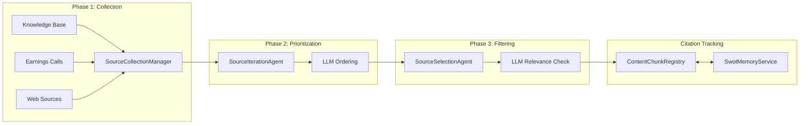
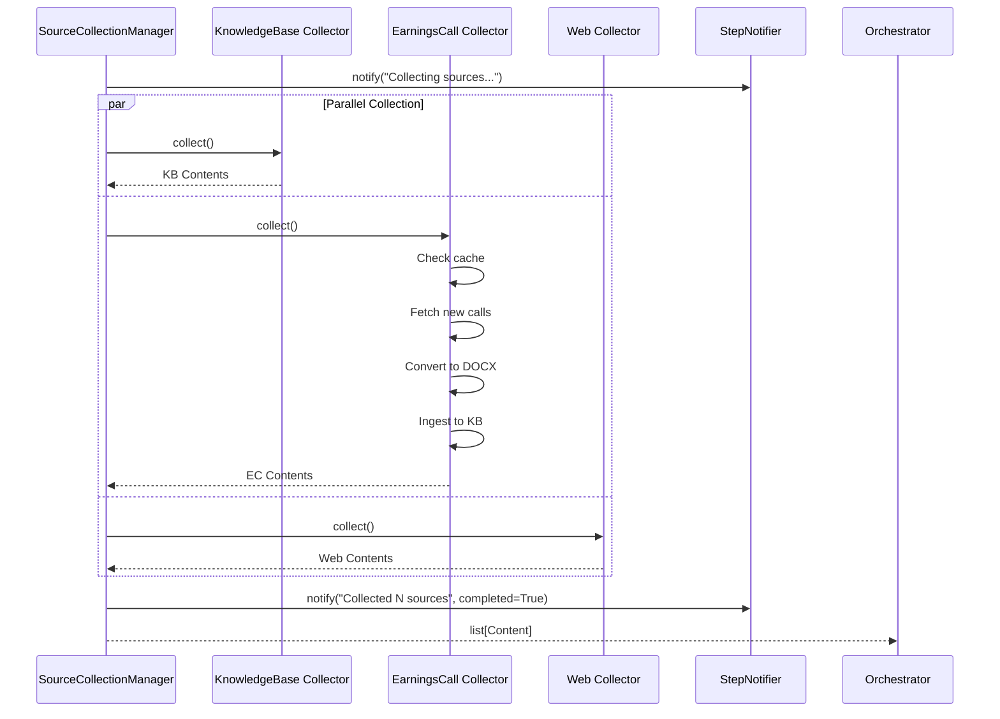
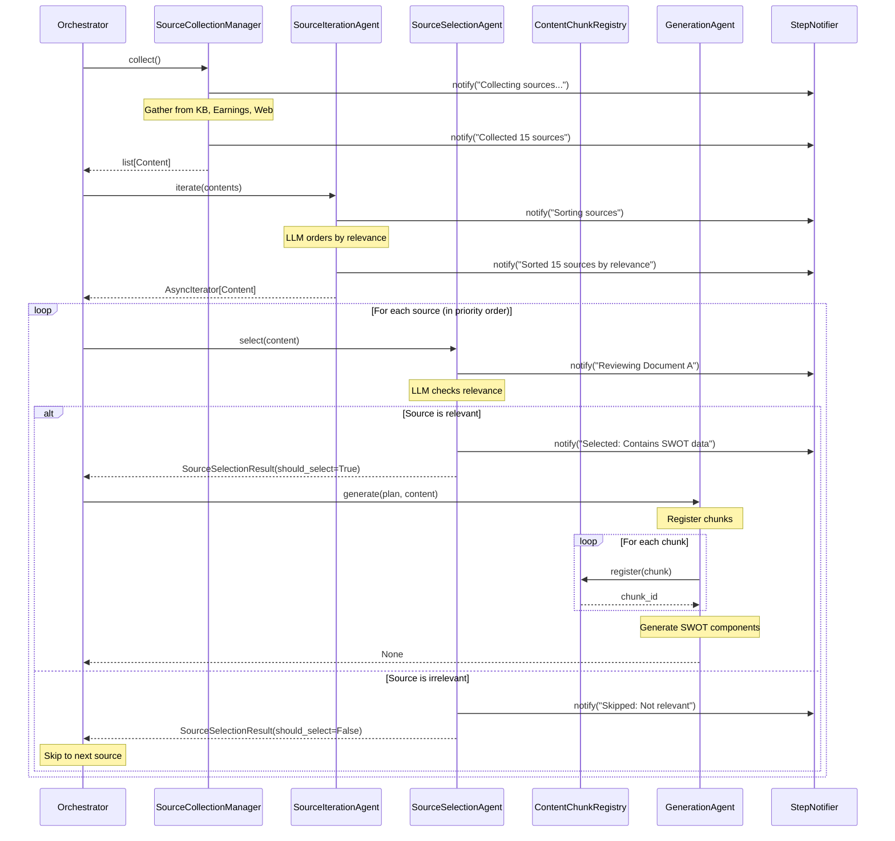

# Source Management Pipeline

The source management pipeline is responsible for collecting, prioritizing, filtering, and tracking all data sources used in the SWOT analysis. It consists of four main components that work together to ensure only the most relevant and high-quality sources are processed.

## Overview



## SourceCollectionManager

### Purpose

The `SourceCollectionManager` is responsible for gathering content from multiple data sources and consolidating them into a unified list for downstream processing.

### Data Sources

#### 1. Knowledge Base Documents

**Implementation**: `KnowledgeBaseSourceCollector`

- Queries the Knowledge Base with metadata filters
- Applies user-specified filters (document type, date range, etc.)
- Returns structured `Content` objects with chunks

**Configuration**:
```python
knowledge_base_config = KnowledgeBaseSourceConfig(
    enabled=True,
    filters={"document_type": ["report", "presentation"]},
)
```

#### 2. Earnings Calls

**Implementation**: `EarningsCallSourceCollector`

- Fetches transcripts from Quartr API
- Converts transcripts to DOCX format
- Ingests into Knowledge Base for persistence
- Implements intelligent caching to avoid re-ingestion

**Caching Strategy**:
- Checks if earnings call already exists in Knowledge Base
- Uses document metadata to identify duplicates
- Only fetches and ingests new earnings calls

**Configuration**:
```python
earnings_call_config = EarningsCallSourceConfig(
    enabled=True,
    start_date=datetime.now() - timedelta(days=365),
    end_date=datetime.now(),
    ingest_to_kb=True,
)
```

#### 3. Web Sources

**Implementation**: `WebSourceCollector`

- Performs web searches for relevant articles
- Scrapes and processes web content
- Structures into `Content` objects

**Configuration**:
```python
web_source_config = WebSourceConfig(
    enabled=True,
    max_results=10,
    search_query=f"{company_name} market analysis",
)
```

### Workflow



### Notification Integration

The manager sends notifications at key points:
- **Start**: "Collecting sources from [sources]..."
- **Progress**: "Collected N documents from Knowledge Base"
- **Progress**: "Fetched M earnings calls"
- **Progress**: "Retrieved P web articles"
- **Complete**: "Collection complete: N total sources"

### Error Handling

- Source collection errors are logged but don't halt the workflow
- Failed sources are skipped, others proceed
- Empty collections (zero sources) are allowed but logged as warnings

## SourceIterationAgent

### Purpose

The `SourceIterationAgent` uses an LLM to intelligently prioritize sources by relevance, returning them in optimal processing order.

### How It Works

#### 1. Preparation

The agent prepares a list of sources with limited preview content:

```python
for content in contents:
    unique_id = generate_unique_id(prefix="content")
    self._content_map[unique_id] = content
    
    # Take first N chunks as preview
    selected_chunks = content.chunks[:max_number_of_selected_chunks]
    
    yield {
        "id": unique_id,
        "document_title": get_content_chunk_title(content),
        "chunks": "\n".join([chunk.text for chunk in selected_chunks]),
    }
```

#### 2. LLM Prompt

The agent constructs a prompt asking the LLM to order sources:

**System Prompt Template**:
```jinja2
You are an expert analyst tasked with ordering sources for a SWOT analysis.

Objective: {{ objective }}

Order the sources based on:
- Relevance to the objective
- Recency of information
- Quality of content
- Comprehensiveness
```

**User Prompt Template**:
```jinja2
Please analyze and order the following sources:


---
Source ID: {{ content.id }}
Document Title: {{ content.document_title }}

Content Preview:
{{ content.chunks }}
---


Return your analysis in structured format with ordered_sources list.
```

#### 3. Structured Output

The LLM returns a `SourceIterationResults` object:

```python
class SourceIterationResults(BaseModel):
    ordered_sources: list[SourceIterationResult]
    results_summary: str
    
class SourceIterationResult(BaseModel):
    id: str  # The unique ID from the prompt
    order: int  # Priority order (1 = highest)
```

#### 4. Result Handling

The agent handles three scenarios:

**Scenario A: Full Success**
```python
# LLM successfully ordered all sources
for result in results.ordered_sources:
    content = self._content_map[result.id]
    yield content  # In LLM-specified order
```

**Scenario B: Partial Ordering**
```python
# LLM only ordered some sources
ordered_ids = {result.id for result in results.ordered_sources}
missed_contents = [
    content for id, content in self._content_map.items()
    if id not in ordered_ids
]

# Yield missed documents first (safety)
for content in missed_contents:
    yield content

# Then yield ordered documents
for result in results.ordered_sources:
    yield self._content_map[result.id]
```

**Scenario C: LLM Failure**
```python
# LLM failed to respond
for content in self._content_map.values():
    yield content  # Original order
```

### Notification Integration

- **Start**: "Sorting sources"
- **Complete**: "[LLM's results_summary]" or fallback message

### Configuration

```python
source_iteration_config = SourceIterationConfig(
    max_number_of_selected_chunks=5,  # Chunks to include in preview
    prompt_config=SourceIterationPromptConfig(
        system_prompt="...",
        user_prompt="...",
        objective="Prioritize by recency and relevance to SWOT analysis",
    ),
)
```

### Why Async Iterator?

The agent returns an `AsyncIterator[Content]` to enable:
- **Streaming**: Start processing before all sources are ordered
- **Memory Efficiency**: Don't hold all sources in memory
- **Cancellation**: Support workflow interruption
- **Progress Tracking**: Process sources as they become available

## SourceSelectionAgent

### Purpose

The `SourceSelectionAgent` uses an LLM to determine if each individual source is relevant to the SWOT analysis, enabling intelligent filtering.

### How It Works

#### 1. Content Preview

For each source, the agent prepares a preview:

```python
selected_chunks = content.chunks[:max_number_of_selected_chunks]
selected_chunks_texts = [chunk.text for chunk in selected_chunks]
```

#### 2. LLM Prompt

**System Prompt Template**:
```jinja2
You are an expert analyst reviewing sources for a SWOT analysis of {{ company_name }}.

Determine if this source contains relevant information for analyzing:
- Strengths
- Weaknesses  
- Opportunities
- Threats
```

**User Prompt Template**:
```jinja2
Company: {{ company_name }}

Source Content:

{{ chunk }}
---


Does this source contain relevant information for the SWOT analysis?
Provide reasoning and a clear yes/no decision.
```

#### 3. Structured Output

The LLM returns a `SourceSelectionResult`:

```python
class SourceSelectionResult(BaseModel):
    should_select: bool
    reason: str
    notification_message: str
```

#### 4. Selection Logic

```python
if not source_selection_result.should_select:
    # Skip this source
    logger.info(f"Skipping source: {reason}")
    continue
else:
    # Process this source
    logger.info(f"Selected source: {reason}")
    await generate(...)
```

### Safety Fallback

If the LLM fails to respond or returns an error:

```python
if response is None:
    # Default to INCLUDING the source (safety measure)
    return SourceSelectionResult(
        should_select=True,
        reason="Error occurred during selection",
        notification_message="Source will be considered as safety measure",
    )
```

**Rationale**: Better to process an irrelevant source than to miss a relevant one.

### Notification Integration

- **Start**: "Reviewing `[Document Title]`"
- **Complete**: "[LLM's notification_message]"

Examples:
- "Selected: Contains financial performance data relevant to strengths/weaknesses"
- "Skipped: Content is about a different company"
- "Selected: Discusses market trends relevant to opportunities/threats"

### Configuration

```python
source_selection_config = SourceSelectionConfig(
    max_number_of_selected_chunks=3,  # Fewer chunks for faster filtering
    prompt_config=SourceSelectionPromptConfig(
        system_prompt="...",
        user_prompt="...",
    ),
)
```

### Performance Considerations

- **Chunk Limit**: Use fewer chunks than iteration (3 vs 5) for faster filtering
- **Parallel Processing**: Could potentially run selections in parallel in future
- **LLM Model**: Can use faster/cheaper model than generation phase

## ContentChunkRegistry

### Purpose

The `ContentChunkRegistry` tracks all content chunks processed in the analysis, generating unique IDs for citation references and persisting to memory for cross-component access.

### Key Features

#### 1. Unique ID Generation

```python
def register(self, *, chunk: ContentChunk) -> str:
    id = self._generate_unique_id()  # e.g., "chunk_a7b3f9"
    self._store.items[id] = chunk
    return id

def _generate_unique_id(self) -> str:
    for _ in range(_MAX_RETRIES):  # 100 attempts
        id = generate_unique_id(prefix="chunk")
        if id not in self._store.items:
            return id
        logger.warning(f"Collision detected for {id}, retrying...")
    raise ValueError("Failed to generate unique ID")
```

**Collision Detection**: If a generated ID already exists, retry with a new one.

#### 2. Chunk Retrieval

```python
def retrieve(self, id: str) -> ContentChunk | None:
    return self._store.items.get(id)
```

Used by the `CitationManager` to look up chunk details for citation formatting.

#### 3. Memory Persistence

The registry uses `SwotMemoryService` for state persistence:

```python
class ContentChunkRegistry:
    def __init__(self, memory_service: SwotMemoryService[RegistryStore]):
        # Try to load existing registry from memory
        store = self._memory_service.get(RegistryStore)
        
        if store is not None:
            logger.info("Initializing registry from cached state")
            self._store = store
        else:
            logger.info("Initializing new registry")
            self._store = RegistryStore(items={})
    
    def save(self):
        self._memory_service.set(self._store)
```

**Benefits**:
- Supports iterative workflows (MODIFY operations)
- Citations remain consistent across multiple analysis runs
- Enables chunk reuse and deduplication

#### 4. Store Model

```python
class RegistryStore(BaseModel):
    items: dict[str, ContentChunk] = Field(default_factory=dict)
```

Uses Pydantic for automatic serialization/deserialization.

### Usage in Generation

```python
# In GenerationAgent.generate()
for chunk in content.chunks:
    chunk_id = source_registry.register(chunk=chunk)
    chunk_ids.append(chunk_id)

# Prepare batches with IDs
source_batches = [
    {"id": chunk_id, "text": chunk.text}
    for chunk_id, chunk in zip(chunk_ids, chunks)
]

# LLM can now cite using [chunk_abc123]
```

### Usage in Citation Management

```python
# In CitationManager
chunk = registry.retrieve(id="chunk_abc123")
if chunk:
    citation = f"[{chunk.title}: p{chunk.start_page}]"
```

## Pipeline Integration

### Complete Source Management Flow



## Configuration Example

Complete source management configuration:

```python
source_management_config = SourceManagementConfig(
    collection=SourceCollectionConfig(
        knowledge_base=KnowledgeBaseSourceConfig(enabled=True),
        earnings_calls=EarningsCallSourceConfig(
            enabled=True,
            start_date=datetime.now() - timedelta(days=365),
        ),
        web=WebSourceConfig(enabled=False),
    ),
    iteration=SourceIterationConfig(
        max_number_of_selected_chunks=5,
        prompt_config=SourceIterationPromptConfig(
            objective="Prioritize by recency and SWOT relevance",
        ),
    ),
    selection=SourceSelectionConfig(
        max_number_of_selected_chunks=3,
    ),
)
```

## Testing

All source management components are thoroughly tested:

- `tests/services/source_management/test_collection.py` - Collection workflow
- `tests/services/source_management/test_iteration.py` - Prioritization logic
- `tests/services/source_management/test_selection.py` - Filtering logic
- `tests/services/test_registry.py` - Registry operations

See the test files for examples of mocking LLM responses and testing edge cases.


