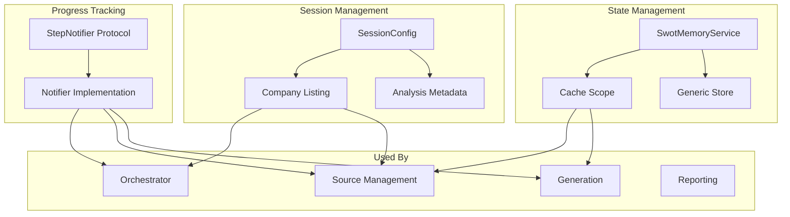
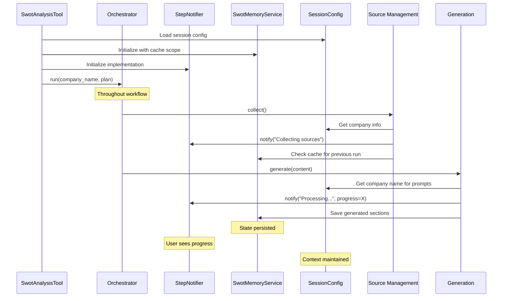

# Supporting Services

Supporting services provide essential infrastructure for progress tracking, state management, and session configuration across the SWOT analysis pipeline.

## Overview



## StepNotifier Protocol

### Purpose

The `StepNotifier` protocol defines a standard interface for real-time progress notifications throughout the SWOT analysis pipeline. It enables decoupled progress tracking with flexible implementations.

### Protocol Definition

```python
class StepNotifier(Protocol):
    """Protocol for notifying users of analysis progress."""
    
    async def notify(
        self,
        title: str,
        description: str = "",
        sources: list[ContentReference] = [],
        progress: int | None = None,
        completed: bool = False,
    ): ...
```

### Parameters

#### `title` (required)
The main notification title describing the current step.

**Examples**:
- "Collecting sources"
- "Sorting sources"
- "**Processing `Q3 2024 Earnings Call`**"
- "Reviewing `Annual Report 2023`"

#### `description` (optional)
Additional context about the current step.

**Examples**:
- "Collected 15 sources"
- "Sorted by relevance and recency"
- "Selected: Contains relevant SWOT data"
- "Processing Strengths..."

#### `sources` (optional)
List of `ContentReference` objects for clickable source links.

```python
sources=[
    ContentReference(
        id="doc_123",
        title="Q3 2024 Earnings Call",
        key="earnings_q3_2024.pdf",
    )
]
```

#### `progress` (optional)
Integer from 0-100 indicating completion percentage.

**Usage**:
- `None` - No progress bar
- `0` - Starting
- `50` - Halfway complete
- `100` - Completed

#### `completed` (optional)
Boolean flag indicating if this step is complete.

**Purpose**:
- Enables visual indicators (✅ checkmark)
- Helps track overall workflow progress
- Can trigger step collapse in UI

### Implementation Example

The actual implementation uses the Unique Toolkit's message logging:

```python
class NotifierService:
    def __init__(self, chat_service: ChatService, message_id: str):
        self._chat_service = chat_service
        self._message_id = message_id
        self._log_registry = MessageLogRegistry()
    
    async def notify(
        self,
        title: str,
        description: str = "",
        sources: list[ContentReference] = [],
        progress: int | None = None,
        completed: bool = False,
    ):
        # Create or update message log
        log = self._log_registry.get_or_create(title)
        log.description = description
        log.sources = sources
        log.progress = progress
        log.completed = completed
        
        # Send to chat service
        await self._chat_service.create_message_log_async(
            message_id=self._message_id,
            log=log,
        )
```

### Usage Throughout Pipeline

#### Source Collection

```python
await step_notifier.notify(
    title="Collecting sources",
)
# ... collection logic ...
await step_notifier.notify(
    title="Collecting sources",
    description="Collected 15 sources from Knowledge Base, Earnings Calls, and Web",
    completed=True,
    progress=100,
)
```

#### Source Iteration

```python
await step_notifier.notify(
    title="Sorting sources",
)
# ... iteration logic ...
await step_notifier.notify(
    title="Sorting sources",
    description="Sorted 15 sources by relevance and recency",
    completed=True,
    progress=100,
)
```

#### Source Selection

```python
await step_notifier.notify(
    title="Reviewing `Annual Report 2023`",
)
# ... selection logic ...
await step_notifier.notify(
    title="Reviewing `Annual Report 2023`",
    description="Selected: Contains financial performance data",
    completed=True,
    progress=100,
)
```

#### Generation

```python
document_title = "Q3 2024 Earnings Call"
document_reference = convert_content_chunk_to_reference(content)

await step_notifier.notify(
    title=f"**Processing `{document_title}`**",
    sources=[document_reference],
    progress=0,
)

# For each component
for i, component in enumerate(components):
    progress = int(i / len(components) * 100)
    await step_notifier.notify(
        title=f"**Processing `{document_title}`**",
        description=f"Processing {component.value}...",
        progress=progress,
    )

await step_notifier.notify(
    title=f"**Processing `{document_title}`**",
    description=f"Completed processing {document_title}!",
    progress=100,
    completed=True,
)
```

### Benefits of Protocol-Based Design

1. **Testability**: Easy to create mock notifiers for testing
```python
class MockNotifier:
    async def notify(self, **kwargs):
        self.calls.append(kwargs)
```

2. **Flexibility**: Can implement different notification strategies
   - Console logging for debugging
   - UI progress bars for production
   - Silent mode for batch processing

3. **Decoupling**: Components don't depend on specific notification implementation

## SwotMemoryService

### Purpose

The `SwotMemoryService` provides persistent state management across components with cache scope isolation for multi-user scenarios.

### Key Features

#### 1. Generic Type Support

The service is generic over the store model type:

```python
class SwotMemoryService(Generic[T]):
    def __init__(
        self,
        *,
        short_term_memory_service: ShortTermMemoryService,
        cache_scope: str,
    ):
        self._stm_service = short_term_memory_service
        self._cache_scope = cache_scope
```

**Benefit**: Type safety for different store models.

#### 2. Get Operation

```python
def get(self, model: Type[T]) -> T | None:
    """
    Retrieve stored model from memory.
    
    Returns None if not found or deserialization fails.
    """
    try:
        data = self._stm_service.get(
            key=self._cache_scope,
            model=model,
        )
        return data
    except Exception as e:
        logger.error(f"Failed to retrieve from memory: {e}")
        return None
```

**Usage**:
```python
store = memory_service.get(RegistryStore)
if store is not None:
    # Use cached data
else:
    # Initialize from scratch
```

#### 3. Set Operation

```python
def set(self, data: T) -> None:
    """
    Store model to memory.
    
    Automatically serializes using Pydantic.
    """
    try:
        self._stm_service.set(
            key=self._cache_scope,
            value=data,
        )
    except Exception as e:
        logger.error(f"Failed to store to memory: {e}")
```

**Usage**:
```python
store = RegistryStore(items={"chunk_abc": chunk})
memory_service.set(store)
```

### Cache Scope Isolation

The `cache_scope` parameter isolates data between different analysis sessions:

```python
# Session 1
memory_service_1 = SwotMemoryService(
    short_term_memory_service=stm,
    cache_scope="swot_analysis_session_123",
)

# Session 2
memory_service_2 = SwotMemoryService(
    short_term_memory_service=stm,
    cache_scope="swot_analysis_session_456",
)
```

**Benefit**: Multi-user support without data contamination.

### Usage in ContentChunkRegistry

```python
class ContentChunkRegistry:
    def __init__(self, memory_service: SwotMemoryService[RegistryStore]):
        self._memory_service = memory_service
        
        # Try to load existing registry
        store = self._memory_service.get(RegistryStore)
        
        if store is not None:
            logger.info("Initializing from cached state")
            self._store = store
        else:
            logger.info("Initializing new registry")
            self._store = RegistryStore(items={})
    
    def save(self):
        """Persist current state to memory."""
        self._memory_service.set(self._store)
```

**Benefit**: Supports iterative workflows where previous analysis state is reused.

### Usage in SWOTReportRegistry

```python
class SWOTReportRegistry:
    def __init__(self, memory_service: SwotMemoryService[ReportStore] | None = None):
        self._memory_service = memory_service
        
        if memory_service:
            store = memory_service.get(ReportStore)
            if store:
                self._sections_by_component = store.sections
                return
        
        # Initialize new registry
        self._sections_by_component = {
            SWOTComponent.STRENGTHS: [],
            SWOTComponent.WEAKNESSES: [],
            SWOTComponent.OPPORTUNITIES: [],
            SWOTComponent.THREATS: [],
        }
```

### Store Model Requirements

Store models must be Pydantic models for automatic serialization:

```python
class RegistryStore(BaseModel):
    items: dict[str, ContentChunk] = Field(default_factory=dict)

class ReportStore(BaseModel):
    sections: dict[SWOTComponent, list[SWOTSection]]
```

### Error Handling

The service handles errors gracefully:

- **Get Failure**: Returns `None`, allowing initialization from scratch
- **Set Failure**: Logs error but doesn't crash workflow
- **Serialization Errors**: Caught and logged

**Rationale**: Memory persistence is helpful but not critical - analysis can proceed without it.

## SessionConfig

### Purpose

The `SessionConfig` provides company information and analysis metadata used throughout the pipeline for context and customization.

### Schema Definition

```python
class SessionConfig(BaseModel):
    """Configuration for a SWOT analysis session."""
    
    company: UniqueCompanyListing
    analysis_date: datetime = Field(default_factory=datetime.now)
    session_id: str = Field(default_factory=lambda: generate_unique_id("session"))
    metadata: dict[str, Any] = Field(default_factory=dict)
```

### UniqueCompanyListing

```python
class UniqueCompanyListing(BaseModel):
    """Company information from Unique's company database."""
    
    id: str  # Unique company ID
    name: str  # Official company name
    display_name: str  # Display name
    country: str  # Country code
    tickers: list[str] = []  # Stock tickers
    source_url: str | None = None  # Company website
    source: str | None = None  # Data source
```

**Example**:
```python
company = UniqueCompanyListing(
    id="apple_inc",
    name="Apple Inc.",
    display_name="Apple",
    country="US",
    tickers=["AAPL"],
    source_url="https://www.apple.com",
)
```

### Usage in Collection

The session config provides company context for source collection:

```python
def _create_collection_context(
    self, session_config: SessionConfig
) -> CollectionContext:
    return CollectionContext(
        company_name=session_config.company.display_name,
        company_tickers=session_config.company.tickers,
        start_date=datetime.now() - timedelta(days=365),
        end_date=datetime.now(),
        metadata_filter=self._metadata_filter,
    )
```

### Usage in Source Selection

The company name is used in prompts:

```python
system_prompt = Template(prompts.system_prompt).render(
    company_name=session_config.company.display_name
)

user_prompt = Template(prompts.user_prompt).render(
    company_name=session_config.company.display_name,
    content=content_preview,
)
```

### Usage in Generation

```python
generation_agent = GenerationAgent(
    company_name=session_config.company.display_name,
    # ... other params
)
```

### Usage in Report Delivery

```python
response = await report_delivery_service.deliver_report(
    company_name=session_config.company.display_name,
    session_id=session_config.session_id,
    # ... other params
)

# File name: "SWOT_Analysis_Apple_session_abc123.docx"
```

### Session Initialization

The tool initializes session config from event payload:

```python
def _try_load_session_config(self) -> SessionConfig | None:
    try:
        return SessionConfig.model_validate(
            self._event.payload.session_config,
            by_name=True,
        )
    except Exception as e:
        logger.error(f"Error validating session config: {e}")
        return None
```

### Configuration Example

```python
session_config = SessionConfig(
    company=UniqueCompanyListing(
        id="microsoft_corp",
        name="Microsoft Corporation",
        display_name="Microsoft",
        country="US",
        tickers=["MSFT"],
    ),
    analysis_date=datetime.now(),
    session_id="session_xyz789",
    metadata={
        "analyst": "John Doe",
        "department": "Strategy",
        "priority": "high",
    },
)
```

## Service Integration



## Testing

All supporting services are thoroughly tested:

- `tests/services/test_notification.py` - StepNotifier implementation
- `tests/services/memory/test_memory_service.py` - Memory operations
- Tests use mock implementations extensively

### Example Mock Notifier

```python
class MockStepNotifier:
    def __init__(self):
        self.calls = []
    
    async def notify(
        self,
        title: str,
        description: str = "",
        sources: list[ContentReference] = [],
        progress: int | None = None,
        completed: bool = False,
    ):
        self.calls.append({
            "title": title,
            "description": description,
            "sources": sources,
            "progress": progress,
            "completed": completed,
        })
```

**Usage in Tests**:
```python
@pytest.mark.asyncio
async def test_orchestrator_notifies():
    mock_notifier = MockStepNotifier()
    orchestrator = SWOTOrchestrator(
        step_notifier=mock_notifier,
        # ... other deps
    )
    
    await orchestrator.run(company_name="TestCo", plan=plan)
    
    # Verify notifications
    assert len(mock_notifier.calls) > 0
    assert mock_notifier.calls[0]["title"] == "Collecting sources"
```

### Example Memory Mock

```python
class MockMemoryService:
    def __init__(self):
        self.storage = {}
    
    def get(self, model: Type[T]) -> T | None:
        return self.storage.get(model.__name__)
    
    def set(self, data: T) -> None:
        self.storage[type(data).__name__] = data
```

## Configuration

Complete supporting services configuration:

```python
supporting_config = SupportingServicesConfig(
    # Session
    session=SessionConfig(
        company=UniqueCompanyListing(
            name="Example Corp",
            display_name="Example",
            tickers=["EX"],
        ),
    ),
    
    # Memory
    cache_scope="swot_analysis_session_123",
    
    # Notification (implementation-specific)
    notification=NotificationConfig(
        enabled=True,
        update_frequency_ms=500,
    ),
)
```

## Design Decisions

### Why Protocol for StepNotifier?

**Decision**: Define `StepNotifier` as a protocol, not a base class

**Rationale**:
- No inheritance required for implementations
- Easier to create test mocks
- More Pythonic (duck typing with type safety)
- Allows existing classes to conform without modification

### Why Generic SwotMemoryService?

**Decision**: Make memory service generic over store type

**Rationale**:
- Type safety for different store models
- Single service for all memory needs
- Automatic serialization via Pydantic
- Clean API with `get(Model)` and `set(data)`

**Trade-off**: Slightly more complex initialization, but better type safety.

### Why Cache Scope Isolation?

**Decision**: Isolate memory by session-specific cache scope

**Rationale**:
- Multi-user support without conflicts
- Parallel analyses don't interfere
- Clear data ownership per session
- Easy cleanup (delete by scope)

### Why Optional Memory Persistence?

**Decision**: Memory operations never crash the workflow

**Rationale**:
- Memory is helpful but not critical
- Analysis can proceed without cached state
- Graceful degradation on storage failures
- Logging provides visibility

**Trade-off**: Silent failures possible, but workflow reliability is prioritized.

