# Unique Web Search

Configurable web search tool for Unique assistants: search the web, read pages, and return citation-ready content chunks.

## Search Proxy (recommended)

Outbound web access should go through **Unique Search Proxy** (`connectors/unique_search_proxy/`). When `SEARCH_PROXY_BASE_URL` is set, search and crawl calls use `unique-search-proxy-sdk`; credentials and provider egress stay on the proxy pod.

| Mode | When | Behaviour |
|------|------|-----------|
| **Proxy (recommended)** | `SEARCH_PROXY_BASE_URL` set | `_proxy_search` / `_proxy_crawl` via the SDK |
| **Legacy** | URL unset | Direct provider calls from this process (`_legacy_search` / `_legacy_crawl`) |

- **New standard engines (Brave, Perplexity) are proxy-only** — legacy raises.
- **Custom API** always runs locally (never routed through the proxy).
- Future provider work targets Search Proxy only; legacy is preserved for migrated engines.

Packages involved: [`unique-search-proxy-core`](../../connectors/unique_search_proxy/unique_search_proxy_core/README.md) (schemas), [`unique-search-proxy-sdk`](../../connectors/unique_search_proxy/unique_search_proxy_sdk/README.md) (HTTP), [`unique-search-proxy`](../../connectors/unique_search_proxy/unique_search_proxy_client/README.md) (server). System overview: [`connectors/unique_search_proxy/README.md`](../../connectors/unique_search_proxy/README.md).

## Architecture



## Search engine kinds

### Standard search

Query → normalised results (URL / title / snippet / optional content). Optional page crawl via the configured crawler.

| Engine | Proxy | Notes |
|--------|-------|-------|
| Google | legacy + proxy | Requires scraping by default |
| Brave | **proxy-only** | Rich snippets; `ExposableParam` knobs |
| Perplexity | **proxy-only** | Content extraction knobs; `ExposableParam` |
| Custom API | always local | Your REST endpoint |

Standard engines that live in proxy-core use **`ExposableParam`** (`expose` + `value`) for optional provider knobs. See [Search Engines README](./src/unique_web_search/services/search_engine/README.md).

### Agent search (grounding)

An upstream AI agent / grounded model searches and returns opaque text that this tool parses into `WebSearchResult`s.

| Engine | Proxy | Notes |
|--------|-------|-------|
| Bing (Azure AI Foundry grounding) | legacy + proxy | Configurable `requires_scraping` |
| VertexAI (Gemini grounding) | legacy + proxy | Configurable `requires_scraping` |

Agent engines do **not** use `ExposableParam`.

## Web crawlers (page readers)

| Crawler | Auth | Notes |
|---------|------|-------|
| Basic | none | HTTP + content-type toggles; tool-local `url_blocked_patterns` (legacy) |
| Tavily | `TAVILY_API_KEY` | Extract API |
| Jina | `JINA_API_KEY` | Reader API |
| Firecrawl | `FIRECRAWL_API_KEY` | Batch scrape |

No Crawl4AI. Crawler configs have **no exposable LLM knobs**.

## Execution modes

| Mode | Status | Behaviour |
|------|--------|-----------|
| **V1** | Stable | Refine query → search → crawl → process |
| **V2** | Stable | Parallel plan steps (search / read URL) |
| **V3** | Experimental | Agent loop: snippet `search` vs on-demand `read_urls` |

Proxy vs legacy is transparent to executors.

## Detailed subsystem docs

- [Search Engines](./src/unique_web_search/services/search_engine/README.md)
- [Crawlers](./src/unique_web_search/services/crawlers/README.md)
- [Executors](./src/unique_web_search/services/executors/README.md)

## Configuration

- `SEARCH_PROXY_BASE_URL` — enables the Search Proxy client
- Provider API keys (on the proxy pod when proxy is enabled; otherwise on assistants-core for legacy)
- Search / crawler / content-processing settings via `WebSearchConfig`

## Dependency management (uv.lock + min/latest testing)

This package is a **library** and uses `uv` for dependency management.

We run tests additionally with minimal dependencies to ensure that the listed ranges are valid. NOTE: We use lowest-direct, not lowest.
Lowest attempts to use the lowest possible dependency versions _transitively_ causing issues if a dependency has incorrect metadata. Example:
- google-cloud-aiplatform says it works with shapely<3.0.0.
- The lowest resolver assumes 1.0 which needs python 2 -> breaks
Therefore we use lowest-direct which only sets our direct dependencies to lowest. However, this only correctly verifies our min dependencies
if our code correctly lists all the required dependencies and never imports a transitive dependency. We therefore use deptry to ensure we
don't use transitive dependencies and that we have no unused dependencies.

### Test locally

- **Latest deps and deptry**:

```bash
cd tool_packages/unique_web_search
uv sync
uv run pytest
uv run deptry
```

- **Min deps**:

```bash
cd tool_packages/unique_web_search
uv venv
uv pip install -e . --resolution=lowest-direct
uv export --only-group dev --no-hashes | uv pip install -r -
uv run --no-sync pytest
```
