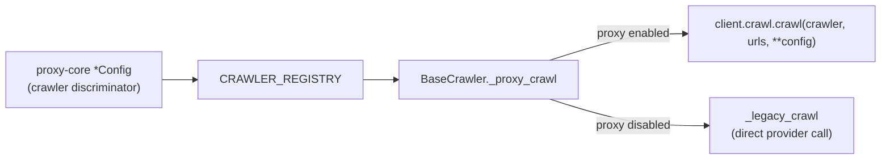

# Crawlers

Web-page readers used by Unique Web Search to fetch and convert URLs into readable text.

## Architecture

Crawler configuration lives in **proxy-core** (`unique_search_proxy_core.crawlers`). The tool consumes those configs, registers implementations via `CRAWLER_REGISTRY`, and centralizes proxy dispatch in `BaseCrawler` — the same pattern as search engines.



### Key invariants

- **No exposable params.** Crawlers receive URLs only; deployment defaults come from the config. There is no LLM override surface.
- **Proxy request = config fields + urls.** `BaseCrawler._proxy_crawl` dumps `config.model_dump(exclude={"crawler"})` into the generic SDK call. No merge helper.
- **Legacy fallback retained.** When the search proxy is disabled, each crawler implements `_legacy_crawl` against the provider SDK / HTTP client.

## Available crawlers

| Name | Config | Auth | Notes |
|------|--------|------|-------|
| Basic | tool-local `BasicConfig` (extends proxy-core) | None | HTTP fetch + markdownify; content-type toggles; `url_blocked_patterns` (to be decommissioned) |
| Tavily | `TavilyConfig` | `TAVILY_API_KEY` | Extract API; `extract_depth`, `format`, … |
| Jina | `JinaConfig` | `JINA_API_KEY` | Reader API; typed `return_format` / `engine` / `do_not_track` |
| Firecrawl | `FirecrawlConfig` | `FIRECRAWL_API_KEY` | Batch scrape; `only_main_content`, … |

## Configuration

`WebSearchConfig.crawler_config` is a discriminated union on `crawler` (`"Basic"` / `"Tavily"` / `"Jina"` / `"Firecrawl"`). Active crawlers are selected via `active_inhouse_crawlers` plus API-key auto-append in settings.

### Example

```python
from unique_search_proxy_core.crawlers import CrawlerType
from unique_web_search.services.crawlers import BasicConfig, get_crawler_service

config = BasicConfig(crawler=CrawlerType.BASIC, timeout=30)
crawler = get_crawler_service(config)
markdowns = await crawler.crawl(["https://example.com"])
```

## Adding a crawler

1. Define the deployment config + request model in proxy-core (`unique_search_proxy_core.crawlers.<name>`).
2. Add a tool module under `services/crawlers/` that `@register_crawler(...)`s an implementation with `_legacy_crawl` only.
3. Modules are auto-discovered — no `__init__.py` factory edit needed.
4. Add the config/impl types to the static unions in `__init__.py` (for pyright) and cover them in `tests/test_crawler_registry.py`.
