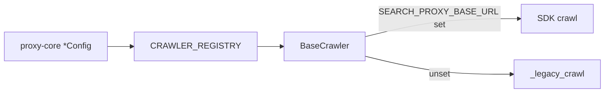

# Crawlers

Web-page readers used by Unique Web Search to fetch URLs and convert them to text.

## Architecture

Crawler configuration lives in **`unique_search_proxy_core.crawlers`**. The tool registers implementations via `CRAWLER_REGISTRY` and dispatches through `BaseCrawler`.



### Key invariants

- **No exposable params.** Crawlers have no LLM override surface — only deployment defaults + `urls`.
- **Proxy body = config fields + urls.** `BaseCrawler._proxy_crawl` dumps `config.model_dump(exclude={"crawler", ...})` into the SDK call.
- **Legacy retained** when the search proxy is disabled.

## Available crawlers

| Name | Config source | Auth | Notes |
|------|---------------|------|-------|
| Basic | tool-local `BasicConfig` extends proxy-core | none | HTTP fetch + processors; `content_types` toggles; `url_blocked_patterns` (tool-local, stripped before proxy) |
| Tavily | `TavilyConfig` | `TAVILY_API_KEY` | Extract API |
| Jina | `JinaConfig` | `JINA_API_KEY` | Reader API |
| Firecrawl | `FirecrawlConfig` | `FIRECRAWL_API_KEY` | Batch scrape |

There is **no Crawl4AI** crawler.

`WebSearchConfig.crawler_config` is a discriminated union on `crawler` (`Basic` / `Tavily` / `Jina` / `Firecrawl`).

---

## Basic

| Field | Default | Notes |
|-------|---------|-------|
| `timeout` | from base | Per-request timeout (seconds) |
| `content_types` | html/xhtml/plain/markdown on; pdf off | Which MIME types to process |
| `max_concurrent_requests` | `10` | Parallelism |
| `url_blocked_patterns` | tool-local | Regex URL blocklist; **not** sent to the proxy |

```python
from unique_search_proxy_core.crawlers import CrawlerType
from unique_web_search.services.crawlers import BasicConfig, get_crawler_service

config = BasicConfig(crawler=CrawlerType.BASIC, timeout=30)
markdowns = await get_crawler_service(config).crawl(["https://example.com"])
```

---

## Tavily

| Field | Default | Notes |
|-------|---------|-------|
| `extract_depth` | `advanced` | `basic` / `advanced` |
| `format` | `markdown` | `markdown` / `text` |
| `query` | unset | Optional rerank intent |
| `chunks_per_source` | unset | Requires `query` |
| `include_images` / `include_favicon` / `include_usage` | `false` | Response extras |

---

## Jina

| Field | Default | Notes |
|-------|---------|-------|
| `return_format` | `markdown` | `markdown` / `html` / `text` / … |
| `engine` | `browser` | `auto` / `browser` / `direct` / `cf-browser-rendering` |
| `page_timeout` | unset | Seconds; falls back to crawl `timeout` |
| `max_concurrent_requests` | `10` | |
| `no_cache` | `false` | |
| `do_not_track` | `true` | |
| selectors / summaries | unset / false | `target_selector`, `wait_for_selector`, `remove_selector`, image/link options, `locale`, `referer`, `proxy_url` |

---

## Firecrawl

| Field | Default | Notes |
|-------|---------|-------|
| `only_main_content` | `true` | Strip chrome before markdown |
| `only_clean_content` | `false` | Extra LLM clean pass |
| `max_concurrency` | unset | Batch parallelism |
| `ignore_invalid_urls` | `true` | |
| `wait_for` | `0` | ms delay before fetch |
| `mobile` | `false` | |
| `block_ads` | `true` | |
| `remove_base64_images` | `true` | |
| `proxy` | `auto` | Firecrawl proxy tier |
| `include_tags` / `exclude_tags` / `scrape_headers` / `max_age` | unset | Optional |

---

## Adding a crawler

1. Define config (+ request model) in `unique_search_proxy_core.crawlers.<name>`.
2. Add a tool module with `@register_crawler(...)` implementing `_legacy_crawl`.
3. Modules are auto-discovered; keep static unions in `__init__.py` and cover with `tests/test_crawler_registry.py`.
