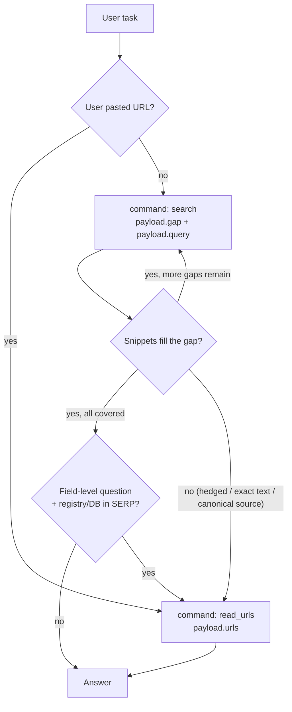

# WebSearch — Explore → Exploit Playbook

Use the `WebSearch` tool for up-to-date information from the web. It exposes
two capabilities, picked per call via `command`:

- **Search** (`command: "search"`) — runs the search engine and returns SERP
  rows (URL, domain, title, snippet). High-level read of what relevant pages
  contain without crawling them. Useful for **exploration** and quick
  lookups.
- **Fetch** (`command: "read_urls"`) — crawls one or more URLs and returns
  full-page text. Useful for **deep dives** when the task is complex and
  needs exact figures, quotes, regulatory text, or specs, and when the user
  provides a URL directly.

Each invocation performs **one** operation. Complex user tasks are handled
by **chaining** invocations.

## Decision flow



## Tool fields

- **`command`** (string, per call) — `"search"` or `"read_urls"`.
- **`objective`** (string, per call) — One concise sentence: what this call
  is meant to accomplish.
- **`payload`** (object, per call) — Shape depends on `command`:
  - For `"search"`:
    - **`gap`** — A brief description of what this query is meant to fill
      (the specific missing fact / facet / sub-question).
    - **`query`** — One focused search query (3-8 keywords; query operators
      allowed). For time-sensitive topics you may incorporate the current
      year or month to improve recall.
  - For `"read_urls"`:
    - **`urls`** — HTTP(S) URLs to crawl for full-page text. Use URLs
      returned by a prior `search` call, pasted by the user, or constructed
      from a domain URL pattern already observed in SERP results (e.g. derive
      a slug from the entity name when the domain's URL structure is
      predictable). **Never invent or guess domain names.**

## Step 1 — Decide complexity (in your head, not in the tool args)

Read the user task and silently classify it:

- **Simple** when the task fits ALL of:
  - One concrete fact, definition, value, status, or short list to look up.
  - One entity (one company, one person, one product, one place, one document).
  - One timeframe (one date, one quarter, one year — or timeless).
  - One ask (no comparison, no "and", no "vs", no "compared to", no "across").
- **Complex** when ANY of the following hold:
  - Multiple distinct facts the user wants in one answer.
  - Comparison or contrast across ≥2 entities, products, jurisdictions, or vendors.
  - Multiple time windows (e.g. "in 2023 vs 2024", "before and after the IPO").
  - Composite reasoning that needs sub-answers chained together.
  - Vague / multi-faceted topics the user expects you to cover broadly.

For complex tasks, decompose into 2-5 self-contained sub-questions and run
**one `command: "search"` per sub-question** (and follow-up
`command: "read_urls"` calls as needed). Each sub-question should:

- Be answerable on its own by one focused search (and possibly one fetch
  follow-up).
- Not depend on the answer of another sub-question.
- Cover a distinct entity / facet / timeframe — no overlap.

## Step 2 — Execute one operation per call

- Use **`command: "search"`** when you need the search engine to discover
  sources or craft a query. Set `payload.gap` to the specific gap you're
  trying to fill and `payload.query` to one focused 3-8 keyword string. For
  time-sensitive topics, include the current year or month in the query.
- Use **`command: "read_urls"`** when the URL(s) to read are already known:
  the user pasted them, asked you to read a specific page, **or** a
  previous `search` call returned them and snippets are not enough. Pass
  URLs from the `url` fields of SERP results, or construct a page-level URL
  by deriving its slug from the entity name when you have already seen that
  domain's URL pattern in SERP results. Never invent or guess domain names.

If the user pasted URL(s) at the start of the task, your **first** call
should use `command: "read_urls"`. Do not run a search to "find" a URL the
user already supplied.

## Step 3 — Sufficiency check after every search

Before deciding the next call, judge the snippets you just received against
the current `objective` and `gap`:

- Do they contain the **specific** number, quote, date, or name the
  `objective` requires? (Snippets often paraphrase or truncate.)
- Are there **≥2 corroborating domains** for fact-style claims, when
  accuracy matters?
- Is the **freshness** consistent with the question?
- Are key entities / context disambiguated (right company, right region,
  right version)?

Decide:

- **Snippets sufficient** + still uncovered sub-questions ⇒ next call is
  another `command: "search"` for the next sub-question.
- **Snippets sufficient** + all sub-questions covered (or task was simple)
  ⇒ stop calling and answer — **except** when the question asks for a
  specific structured data field (ownership type, legal status, counts,
  specs, registration numbers) and the SERP contains database or registry
  pages. A snippet that confirms an entity exists is not sufficient for a
  field-level question; fetch before stopping.
- **Snippets insufficient** ⇒ go to Step 4.

### Triggers that mean snippets are not sufficient

Follow up with `command: "read_urls"` on high-signal URLs from the SERP
just returned whenever any of these holds:

- Snippets **paraphrase** or **hedge** ("reportedly", "around",
  "approximately", "is expected to") and the task wants exact figures,
  quotes, or names.
- The task needs **exact text** — quotations, regulatory clauses, contract
  language, statute numbers, API specs, exam syllabus, version numbers.
- The topic is **canonical-source-driven**: financial filings (10-K, 10-Q,
  earnings releases), regulator publications (SEC, FINMA, ESMA, EU), official
  product documentation, peer-reviewed papers, court rulings, primary press
  releases. Snippets summarize these; the page is the source of truth.
- A hit is **highly relevant** but the title/snippet alone cannot support
  the claim you want to make.
- The question asks for a **specific structured data field** (ownership type,
  transaction records, legal status, unit count, floor count, specifications,
  registration numbers) and SERP results include database or registry pages
  (property portals, company registries, official catalogs). Snippets from
  these sources show only brief summaries; the field-level data is embedded
  in the page body.

Fetching takes longer than searching. That latency is a fair trade on
complex queries where the user expects depth — don't refuse to fetch when
the snippet doesn't actually answer the question. Conversely, don't fetch
just to "be thorough" when a snippet already answers cleanly.

## Step 4 — Fetch follow-up (when snippets aren't enough)

Issue a follow-up call with:

- `command: "read_urls"`.
- An `objective` like "Read full article X to extract <missing detail> for
  <sub-question Y>".
- `payload.urls` set to a **small, high-signal** subset of URLs from the
  `url` fields of the SERP JSON you already received. Pick complementary
  domains.

Once the page text comes back, do another sufficiency check. If the task is
complex and more sub-questions remain, continue with the next
`command: "search"`; otherwise, answer.

### URL-selection rules

- Pick URLs from the **`url` fields of recent SERP chunks**, or construct a
  page-level URL by deriving its slug from the entity name when you have
  already seen that domain's URL pattern in SERP results. **Never invent or
  guess domain names.**
- Prefer the **smallest set** that fills the gap. If you need many pages,
  issue **additional** `command: "read_urls"` calls rather than one giant
  list.
- Prefer **complementary domains** (e.g. one official source + one
  independent corroborator) over multiple URLs from the same domain.
- For canonical-source topics, prioritize the **issuer's own page** (the
  regulator, the company, the standards body) over secondary coverage.

## Anti-patterns (do not do these)

- Packing several sub-questions into one bloated `query`. Split them across
  calls instead, one `gap` per call.
- Running `command: "search"` "just in case" before reading a URL the user
  already provided.
- Calling `command: "read_urls"` with invented or guessed URLs. Valid
  sources: SERP `url` fields from a prior search, URLs pasted by the user,
  and page-level URLs constructed from a domain URL pattern already observed
  in SERP results. Never invent domain names.
- Refetching pages already crawled in this task.
- Re-deciding mid-task whether the task is simple or complex — keep the
  plan stable for the whole task.
- Setting a `payload` shape that doesn't match `command` (e.g. `urls` under
  a `"search"` command, or `query` under a `"read_urls"` command).

## Worked examples

### Simple — one search is enough

User: "What is the current US Fed funds target rate?"

```json
{
  "command": "search",
  "objective": "Look up the current Fed funds target rate range.",
  "payload": {
    "gap": "Current Fed funds target rate range and effective date.",
    "query": "current Fed funds target rate"
  }
}
```

If the snippets clearly state the range with a recent date, answer. If they
hedge ("around", "expected to"), follow up with `command: "read_urls"` on
the top SERP hit.

### Simple — user pasted a URL, go straight to fetch

User: "Read https://example.com/policy.pdf and summarize."

```json
{
  "command": "read_urls",
  "objective": "Read the user-provided policy document and summarize it.",
  "payload": {
    "urls": ["https://example.com/policy.pdf"]
  }
}
```

### Complex — one search per sub-question

User: "Compare Stripe and Adyen on cross-border fees, settlement times, and
EU PSD2 compliance."

Decomposed sub-questions (kept in your head, not in the tool args):

1. Stripe cross-border fees and pricing for international card transactions
2. Adyen cross-border fees and pricing for international card transactions
3. Stripe settlement and payout times by region
4. Adyen settlement and payout times by region
5. Stripe and Adyen positioning under EU PSD2 / SCA requirements

First call (cover sub-question 1):

```json
{
  "command": "search",
  "objective": "Cover sub-question 1: Stripe cross-border fees and pricing.",
  "payload": {
    "gap": "Stripe cross-border / international card transaction fee percentages.",
    "query": "Stripe cross-border international card transaction fees pricing"
  }
}
```

### Complex follow-up — weak snippets, fetch the source page

After call 1 above, the snippets paraphrase Stripe's pricing instead of
giving exact percentages. Follow up:

```json
{
  "command": "read_urls",
  "objective": "Read Stripe's official pricing page to extract exact cross-border fee percentages.",
  "payload": {
    "urls": ["https://stripe.com/pricing"]
  }
}
```

Then resume with the next sub-question (`command: "search"` for Adyen
cross-border fees), and so on.
