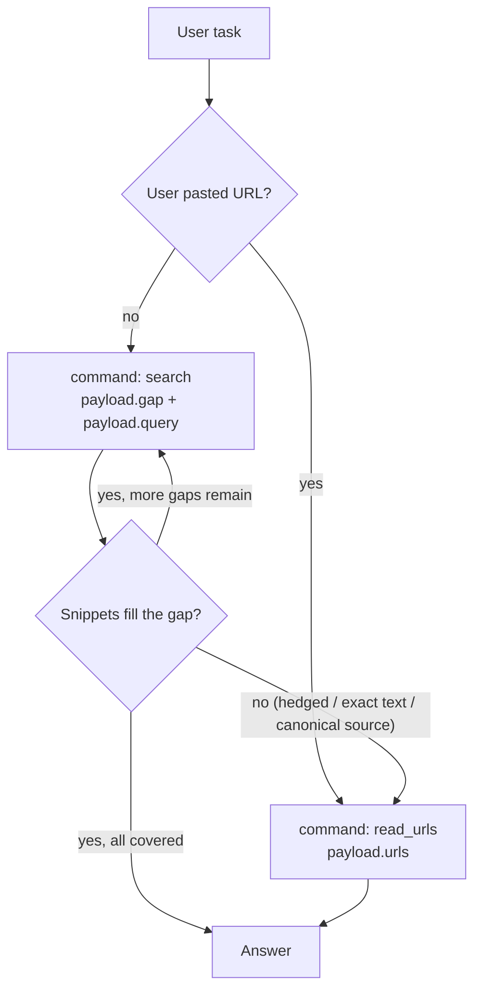

# WebSearch — Explore → Exploit Playbook

Use the `WebSearch` tool for up-to-date information from the web. It exposes
two capabilities, picked per call via `command`:

- **Search** (`command: "search"`) — runs the search engine and returns SERP
  rows (URL, domain, title, snippet). High-level read of what relevant pages
  contain without crawling them. Useful for **exploration** and quick
  lookups.
- **Fetch** (`command: "read_urls"`) — crawls one or more URLs and returns
  full-page text. Useful for **deep dives** when the task is complex and
  needs exact figures, quotes, regulatory text, or specs, and when the user
  provides a URL directly.

Each invocation performs **one** operation. Complex user tasks are handled
by **chaining** invocations.

## Decision flow



## Tool fields

- **`command`** (string, per call) — `"search"` or `"read_urls"`.
- **`phase`** (string, per call) — `exploratory` | `target` | `redirect` (see
  system prompt). Replaces legacy `objective`.
- **`payload`** (object, per call) — Shape depends on `command`:
  - For `"search"`:
    - **`gap`** — One atomic, verifiable facet (not the whole user question).
    - **`query`** — Short keyword line (~3-8 words). One facet per call—use
      parallel `search` calls instead of one long query.
  - For `"read_urls"`:
    - **`urls`** — HTTP(S) URLs to crawl for full-page text. Use only URLs
      returned by a prior `search` call or pasted by the user — **never
      invent URLs**.

## Step 1 — Decide complexity (in your head, not in the tool args)

Read the user task and silently classify it:

- **Simple** when the task fits ALL of:
  - One concrete fact, definition, value, status, or short list to look up.
  - One entity (one company, one person, one product, one place, one document).
  - One timeframe (one date, one quarter, one year — or timeless).
  - One ask (no comparison, no "and", no "vs", no "compared to", no "across").
- **Complex** when ANY of the following hold:
  - Multiple distinct facts the user wants in one answer.
  - Comparison or contrast across ≥2 entities, products, jurisdictions, or vendors.
  - Multiple time windows (e.g. "in 2023 vs 2024", "before and after the IPO").
  - Composite reasoning that needs sub-answers chained together.
  - Vague / multi-faceted topics the user expects you to cover broadly.

For complex tasks (including Source of Wealth / KYC-style profiles),
decompose into **5–10 atomic gaps** (one verifiable facet each) and run
**one `command: "search"` per gap** (and follow-up `command: "read_urls"`
calls as needed). Each gap should:

- Be answerable on its own by one focused search (and possibly one fetch
  follow-up).
- Not depend on the answer of another sub-question.
- Cover a distinct entity / facet / timeframe — no overlap.

## Step 2 — Execute one operation per call

- Use **`command: "search"`** when you need the search engine to discover
  sources or craft a query. Set `payload.gap` to the specific gap you're
  trying to fill and `payload.query` to one focused 3-8 keyword string. For
  time-sensitive topics, include the current year or month in the query.
- Use **`command: "read_urls"`** when the URL(s) to read are already known:
  the user pasted them, asked you to read a specific page, **or** a
  previous `search` call returned them and snippets are not enough. Pass
  the URL(s) from the `url` fields of those snippet chunks — do not invent
  or paraphrase URLs.

If the user pasted URL(s) at the start of the task, your **first** call
should use `command: "read_urls"`. Do not run a search to "find" a URL the
user already supplied.

## Step 3 — Sufficiency check after every search

Before deciding the next call, judge the snippets you just received against
the current `phase`, `gap`, and `query`:

- Do they contain the **specific** number, quote, date, or name the
  the `gap` requires? (Snippets often paraphrase or truncate.)
- Are there **≥2 corroborating domains** for fact-style claims, when
  accuracy matters?
- Is the **freshness** consistent with the question?
- Are key entities / context disambiguated (right company, right region,
  right version)?

Decide:

- **Snippets sufficient** + still uncovered gaps ⇒ next call is another
  `command: "search"` for the next gap.
- **Snippets sufficient** + all gaps covered (or task was simple) ⇒ stop
  calling and go to Step 5 (synthesize), then answer.
- **Snippets insufficient** ⇒ go to Step 4.
- **Gap not filled but snippets are adjacent** (sector context, related
  company, news mentioning the entity without the exact fact) ⇒ record the
  facet as **Related** in your evidence ledger, refine once if worthwhile,
  then continue with the next gap—do not treat "no exact hit" as "nothing
  useful."

### Triggers that mean snippets are not sufficient

Follow up with `command: "read_urls"` (1-3 high-signal URLs from the SERP
just returned) whenever any of these holds:

- Snippets **paraphrase** or **hedge** ("reportedly", "around",
  "approximately", "is expected to") and the task wants exact figures,
  quotes, or names.
- The task needs **exact text** — quotations, regulatory clauses, contract
  language, statute numbers, API specs, exam syllabus, version numbers.
- The topic is **canonical-source-driven**: financial filings (10-K, 10-Q,
  earnings releases), regulator publications (SEC, FINMA, ESMA, EU), official
  product documentation, peer-reviewed papers, court rulings, primary press
  releases. Snippets summarize these; the page is the source of truth.
- A hit is **highly relevant** but the title/snippet alone cannot support
  the claim you want to make.

Fetching takes longer than searching. That latency is a fair trade on
complex queries where the user expects depth — don't refuse to fetch when
the snippet doesn't actually answer the question. Conversely, don't fetch
just to "be thorough" when a snippet already answers cleanly.

## Step 4 — Fetch follow-up (when snippets aren't enough)

Issue a follow-up call with:

- `command: "read_urls"`.
- `phase: "target"` and a `gap` naming the missing detail you need from the page.
- `payload.urls` set to a **small, high-signal** subset (typically 1-3
  URLs; pick complementary domains) of URLs from the `url` fields of the
  SERP JSON you already received.

Once the page text comes back, do another sufficiency check. If the task is
complex and more gaps remain, continue with the next `command: "search"`;
otherwise, go to Step 5.

### URL-selection rules

- Pick URLs from the **`url` fields of recent SERP chunks** only — never
  type, paraphrase, or guess a URL.
- Prefer the **smallest set** that fills the gap (1-3 URLs is usually
  enough). If you need many pages, issue **additional**
  `command: "read_urls"` calls rather than one giant list.
- Prefer **complementary domains** (e.g. one official source + one
  independent corroborator) over multiple URLs from the same domain.
- For canonical-source topics, prioritize the **issuer's own page** (the
  regulator, the company, the standards body) over secondary coverage.

## Step 5 — Synthesize, then answer

Merge your **evidence ledger** across all gaps before writing to the user.

**Confidence labels:** **Confirmed** (cited exact fact), **Partial** (cited
fragment), **Not found** (reasonable search/refinement tried), **Related**
(cited but does not answer the exact ask—say so explicitly).

**Answer structure for complex tasks:**

1. Direct answer (what citations support).
2. Evidence by facet (facet → finding → confidence → [sourceX]).
3. Gaps and limitations (what public web did not reveal; what you tried).
4. Related leads (indirect but useful, all cited).
5. Suggested next steps (optional: registry, paid DB, user documents).

**Partial / missing evidence:**

- Never answer with only "I couldn't find X" when tool results contain
  related material—surface **Related leads** with citations.
- Never invent figures, ownership, or UBO claims.
- For simple single-fact tasks, a short cited answer is enough.

## Anti-patterns (do not do these)

- Packing several sub-questions into one bloated `query`. Split them across
  calls instead, one `gap` per call.
- Running `command: "search"` "just in case" before reading a URL the user
  already provided.
- Calling `command: "read_urls"` with paraphrased or invented URLs — only
  URLs surfaced by a prior search (or pasted by the user) are valid.
- Refetching pages already crawled in this task.
- Re-deciding mid-task whether the task is simple or complex — keep the
  plan stable for the whole task.
- Setting a `payload` shape that doesn't match `command` (e.g. `urls` under
  a `"search"` command, or `query` under a `"read_urls"` command).
- Stopping research after one weak SERP on a diligence facet without
  refinement or recording **Related** context.
- Dumping raw tool output without synthesis on multi-facet tasks.

## Worked examples

### Simple — one search is enough

User: "What is the current US Fed funds target rate?"

```json
{
  "command": "search",
  "phase": "target",
  "payload": {
    "gap": "Current Fed funds target rate range and effective date.",
    "query": "current Fed funds target rate"
  }
}
```

If the snippets clearly state the range with a recent date, answer. If they
hedge ("around", "expected to"), follow up with `command: "read_urls"` on
the top SERP hit.

### Simple — user pasted a URL, go straight to fetch

User: "Read https://example.com/policy.pdf and summarize."

```json
{
  "command": "read_urls",
  "phase": "target",
  "payload": {
    "urls": ["https://example.com/policy.pdf"]
  }
}
```

### Complex — one search per sub-question

User: "Compare Stripe and Adyen on cross-border fees, settlement times, and
EU PSD2 compliance."

Decomposed sub-questions (kept in your head, not in the tool args):

1. Stripe cross-border fees and pricing for international card transactions
2. Adyen cross-border fees and pricing for international card transactions
3. Stripe settlement and payout times by region
4. Adyen settlement and payout times by region
5. Stripe and Adyen positioning under EU PSD2 / SCA requirements

First call (cover sub-question 1):

```json
{
  "command": "search",
  "phase": "target",
  "payload": {
    "gap": "Stripe cross-border / international card transaction fee percentages.",
    "query": "Stripe cross-border international card transaction fees pricing"
  }
}
```

### Complex follow-up — weak snippets, fetch the source page

After call 1 above, the snippets paraphrase Stripe's pricing instead of
giving exact percentages. Follow up:

```json
{
  "command": "read_urls",
  "phase": "target",
  "payload": {
    "urls": ["https://stripe.com/pricing"]
  }
}
```

Then resume with the next sub-question (`command: "search"` for Adyen
cross-border fees), and so on.

### Complex — Source of Wealth / private company profile

User: "I need a Source of Wealth picture for Acme Holding AG (Switzerland)—
revenues, ownership, and who runs it. It's not a listed company."

**Decomposed gaps (in reasoning):**

1. Legal identity and jurisdiction (Acme Holding AG, CH)
2. Revenue scale or turnover signals (public estimates, filings, press)
3. Ownership structure / shareholders / UBO signals
4. Key executives and board
5. Recent registry or filing references (if any public)
6. Adverse media or sanctions mentions
7. Industry / peer context if direct financials are sparse

**Call 1 — identity:**

```json
{
  "command": "search",
  "phase": "exploratory",
  "payload": {
    "gap": "Legal name, registered office, and jurisdiction for Acme Holding AG Switzerland.",
    "query": "Acme Holding AG Switzerland company"
  }
}
```

**Call 2 — revenue (after identity gap partially filled):**

```json
{
  "command": "search",
  "phase": "target",
  "payload": {
    "gap": "Revenue scale or turnover band for Acme Holding AG (latest available).",
    "query": "Acme Holding AG Umsatz revenue turnover"
  }
}
```

If snippets hedge or omit figures, follow with `read_urls` on the best SERP
(registry excerpt, annual report PDF, credible press).

**Call 3 — ownership:**

```json
{
  "command": "search",
  "phase": "target",
  "payload": {
    "gap": "Ownership structure or named shareholders for Acme Holding AG.",
    "query": "Acme Holding AG shareholders ownership"
  }
}
```

Continue gaps 4–7 similarly. After each round, update the ledger
(Confirmed / Partial / Not found / Related).

**Final answer outline (Step 5):**

- **Direct answer:** Summarize only **Confirmed** items with [sourceX].
- **Evidence by facet:** Table or bullets per gap above.
- **Gaps and limitations:** e.g. "No public UBO disclosure found after …
  searches."
- **Related leads:** e.g. parent group mentioned in press [source3]—labeled
  **related, not confirmed** as UBO.
- **Next steps (optional):** Swiss commercial register extract, user-provided
  financials.
