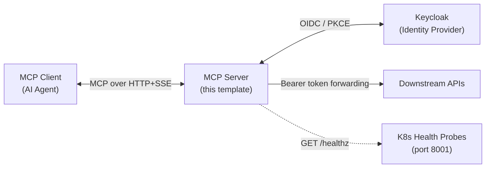

# Production MCP Server Template

## 📌 Overview

Building a production-ready MCP server requires more than just defining tools — it needs authentication, configuration management, health checks, SSL/TLS handling, and deployment infrastructure. The **MCP Server Template** provides all of this out-of-the-box so you can focus on writing tools rather than re-solving auth plumbing.

This tutorial walks through the template's architecture and explains how to use it as a starting point for building MCP servers that integrate with Unique AI.

**What the template provides:**

- OIDC authentication via **OIDCProxy** (FastMCP 3.x built-in)
- Public Keycloak client with PKCE — no client secret required
- Type-safe configuration with `pydantic-settings` (fails fast on misconfiguration)
- Health check endpoint for Kubernetes liveness/readiness probes
- SSL/CA certificate handling for internal PKI
- Docker and Kubernetes deployment ready

**Prerequisites:**

- Python 3.12+
- A Keycloak realm with a public OIDC client (PKCE enabled, Standard Flow on)
- Familiarity with [MCP Fundamentals](mcp_fundamentals.md)

## 🏗️ Architecture

The template uses **FastMCP 3.x** with the HTTP+SSE transport, which is required for network-accessible, Unique-AI-compatible MCP servers.



### Key design decisions

| Decision | Rationale |
|---|---|
| **FastMCP 3.x** (not 2.x) | Only 3.x supports public OIDC clients with PKCE. 2.x hard-fails without a client secret. |
| **Public Keycloak client (PKCE)** | No client secret to manage or rotate. PKCE provides equivalent security for user-interactive flows. |
| **HTTP+SSE transport** | Required for network-accessible servers. SSE enables streaming tool responses. |
| **OIDCProxy** | FastMCP's built-in bridge eliminates custom token exchange code entirely. |
| **pydantic-settings** | Type-safe configuration with validation at startup — misconfigured deployments fail fast with clear messages. |
| **Separate health port** | Kubernetes probes don't interfere with MCP traffic and don't require authentication. |

### Project structure

```
mcp-template/
├── .env.example               # Annotated environment variable template — copy to .env
├── Dockerfile                 # Production container image
├── requirements.txt           # Python dependencies
└── src/
    ├── server.py              # Entry point: SSL patching, logging, health server, FastMCP
    ├── auth.py                # OIDCProxy configuration (Keycloak PKCE)
    ├── utils/
    │   ├── settings.py        # pydantic-settings configuration model + singleton
    │   └── headers.py         # Token forwarding helper (get_headers)
    └── tools/
        ├── __init__.py        # Central tool registry (register_all_tools)
        └── example.py         # Example hello_world tool — replace in production
```

## 🔐 Authentication

### How OIDCProxy works

The template uses **OIDCProxy** — FastMCP's built-in OIDC-to-MCP authentication bridge. It handles the entire OAuth dance so your tool code never needs to manage tokens or implement auth logic.

The flow has five stages:

**1. Discovery** — The MCP client fetches `/.well-known/oauth-authorization-server`. OIDCProxy advertises itself as an OAuth authorization server and proxies to your Keycloak realm.

**2. Dynamic Client Registration (DCR)** — The MCP client registers itself with OIDCProxy. These registrations are persisted to disk so they survive server restarts.

**3. Authorization** — The user is redirected to Keycloak login in a browser popup. Keycloak authenticates the user via the authorization-code + PKCE flow.

**4. Token exchange** — OIDCProxy exchanges the authorization code with Keycloak, **stores the Keycloak JWT server-side**, and issues its own short-lived MCP JWT back to the client. The client never sees the Keycloak token.

**5. Tool calls (steady state)** — On each tool call, the client sends the MCP JWT. OIDCProxy validates it and makes the original Keycloak JWT available via `get_access_token().token` for forwarding to downstream APIs.

### Two JWTs — don't confuse them

| JWT | Issuer | Where it lives | Your code uses it? |
|---|---|---|---|
| **MCP JWT** | OIDCProxy (this server) | Client-side; sent with every tool call | No — OIDCProxy validates it automatically |
| **Keycloak JWT** | Keycloak | Server-side; stored by OIDCProxy | Yes — retrieve via `get_access_token().token` |

Your tools should **never** inspect or validate the MCP JWT. Use `get_access_token().token` (conveniently wrapped by `get_headers()`) to get the Keycloak JWT for forwarding to downstream APIs.

### Keycloak client requirements

When requesting a Keycloak client for your MCP server:

| Setting | Required value | Notes |
|---|---|---|
| **Client type** | `public` | No client secret |
| **Standard Flow** | Enabled | Authorization Code flow |
| **PKCE** | Required (S256) | Proof Key for Code Exchange |
| **Valid Redirect URIs** | `http://localhost:*` for dev, your production ingress URL | Must match `allowed_client_redirect_uris` in `auth.py` |

### Persistent storage

OIDCProxy stores DCR registrations, JTI mappings, and refresh token bindings on disk via `DiskStore`. In Kubernetes, the directory at `MCP_CLIENT_STORAGE_DIR` **must be on a PersistentVolume** — if it's on ephemeral storage, every pod restart will invalidate all registered clients and all issued tokens.

### Dev mode: disabling auth

For local development without a Keycloak instance:

```bash
MCP_DISABLE_AUTH=true python src/server.py
```

When auth is disabled, `get_access_token()` returns `None` and `get_headers()` returns an error string instead of a header dict. This is useful for testing tool logic in isolation — **never use this in production**.

## ⚙️ Configuration

All configuration is managed by a `pydantic-settings` model in `src/utils/settings.py`. Settings are loaded from environment variables or a `.env` file. Missing required fields produce a clear `ValidationError` at startup.

### Required variables (no defaults)

| Variable | Description |
|---|---|
| `KEYCLOAK_OIDC_CONFIG_URL` | Full URL to the Keycloak realm's `.well-known/openid-configuration` |
| `KEYCLOAK_CLIENT_ID` | Public OIDC client ID (PKCE, no client secret) |
| `MCP_JWT_SIGNING_KEY` | Secret key OIDCProxy uses to sign MCP JWTs. Generate with `python -c "import secrets; print(secrets.token_hex(32))"` — keep this secret |

### Optional variables

| Variable | Default | Description |
|---|---|---|
| `HOST` | `0.0.0.0` | Network interface to bind |
| `MCP_SERVER_PORT` | `8000` | MCP HTTP+SSE transport port |
| `HEALTH_PORT` | `8001` | Kubernetes health probe port |
| `BASE_URL` | `http://localhost:<port>` | Externally-reachable URL (used as OAuth issuer). In production, set to your ingress URL. |
| `MCP_HTTP_PATH` | `/mcp` | URL path for the MCP endpoint |
| `MCP_DISABLE_AUTH` | `false` | Disable OIDC auth — dev only |
| `MCP_CLIENT_STORAGE_DIR` | `/var/lib/mcp/oidc-proxy` | OIDCProxy persistent storage directory — must be a PersistentVolume in K8s |
| `LOG_LEVEL` | `info` | Logging level: `debug`, `info`, `warn`, `error` |
| `SSL_CERT_FILE` | auto-detected | Path to CA certificate bundle (auto-detected from RHEL/UBI paths if not set) |

### Adding a custom setting

Add a field to `Settings` in `src/utils/settings.py`:

```python
my_api_base_url: HttpUrl = Field(
    ...,                                   # ... = required (no default)
    validation_alias="MY_API_BASE_URL",    # environment variable name
    description="Base URL of My API.",
)
```

Then document it in `.env.example`. Access it anywhere as:

```python
from src.utils.settings import settings

url = settings.my_api_base_url
```

## 🛠️ Writing Tools

### Tool anatomy

An MCP tool is a typed function decorated with `@mcp.tool()`. The AI agent sees the tool's name, description, and parameter schema (auto-generated from Python type annotations) and decides which tool to call based on user intent.

```python
# src/tools/my_service.py
import json
import httpx
from fastmcp import FastMCP
from src.utils.headers import get_headers

def register_my_service_tools(mcp: FastMCP) -> None:

    @mcp.tool(
        name="get_data",
        description=(
            "Fetch records from My Service for a given record ID. "
            "Returns JSON with fields X, Y, and Z."
        ),
    )
    def get_data(record_id: str, include_details: bool = True) -> str:
        """
        Parameters
        ----------
        record_id : str
            The record identifier to look up.
        include_details : bool
            Whether to include detailed fields. Defaults to True.
        """
        # 1. Get the user's authorization headers
        headers = get_headers()
        if isinstance(headers, str):
            return headers  # Auth unavailable — return error message to agent

        # 2. Call downstream API with the user's Keycloak token
        resp = httpx.get(
            f"https://my-service.example.com/api/records/{record_id}",
            headers=headers,
            params={"details": include_details},
        )
        resp.raise_for_status()

        # 3. Return JSON string (tools must always return str)
        return json.dumps(resp.json(), default=str)
```

### Registering tools

After creating your module, call your register function from `src/tools/__init__.py`:

```python
from fastmcp import FastMCP
from src.tools.example import register_example_tools
from src.tools.my_service import register_my_service_tools  # add

def register_all_tools(mcp: FastMCP) -> None:
    register_example_tools(mcp)
    register_my_service_tools(mcp)  # add
```

### Tool design guidelines

| Practice | Guidance |
|---|---|
| **Return type** | Always `str`. Use `json.dumps()` for structured data — FastMCP doesn't support returning dicts or lists directly. |
| **Auth check** | Always check `isinstance(get_headers(), str)` before using the result as a dict. |
| **Descriptions** | Write clear, specific descriptions in `@mcp.tool(description=...)`. This is the primary signal the agent uses to select the right tool. |
| **Type annotations** | Annotate every parameter — FastMCP generates the JSON schema the agent uses from these. |
| **Error handling** | Catch exceptions and return human-readable error strings. The agent can interpret and relay these to the user. |
| **Granularity** | Prefer focused, single-purpose tools. Agents perform better with `get_positions` and `get_risk_metrics` than `get_data(type="positions|risk")`. |
| **Naming** | Use descriptive `snake_case` names. The name appears in logs and the agent's reasoning. |

### Organizing tool modules

Group tools by domain or API:

```
src/tools/
├── __init__.py       # Central registry — imports and calls all register_* functions
├── example.py        # Template demo — remove in production
├── portfolio.py      # Portfolio API tools
├── risk.py           # Risk API tools
└── market_data.py    # Market data tools
```

## 🚀 Deployment

### Local development

```bash
# 1. Create a virtualenv and install dependencies
python3.12 -m venv .venv && source .venv/bin/activate
pip install -r requirements.txt

# 2. Configure environment
cp .env.example .env
# Edit .env: set KEYCLOAK_OIDC_CONFIG_URL, KEYCLOAK_CLIENT_ID, MCP_JWT_SIGNING_KEY

# 3. Generate a JWT signing key
python -c "import secrets; print(secrets.token_hex(32))"

# 4. Run without auth for initial testing
MCP_DISABLE_AUTH=true python src/server.py

# 5. Run with full OIDC auth
python src/server.py
```

Once running, verify the server is up:

```bash
curl -s http://localhost:8001/healthz
# → {"status":"ok"}

curl -s http://localhost:8000/.well-known/oauth-authorization-server | python -m json.tool
```

### Docker

```bash
# Build
docker build -t mcp-myservice:latest .

# Run
docker run -p 8000:8000 -p 8001:8001 --env-file .env mcp-myservice:latest
```

### Kubernetes

Key requirements for K8s deployment:

| Concern | Solution |
|---|---|
| **Persistent storage** | Mount a PVC at `MCP_CLIENT_STORAGE_DIR` (`/var/lib/mcp/oidc-proxy`) — OIDCProxy state must survive pod restarts |
| **Secrets** | Store `MCP_JWT_SIGNING_KEY` and `KEYCLOAK_CLIENT_ID` in a K8s Secret |
| **BASE_URL** | Set to your external ingress URL (e.g. `https://mcp-myservice.example.com`) |
| **Health probes** | Point liveness/readiness probes at port `8001`, path `/healthz` |
| **Replicas** | Use a single replica — OIDCProxy's DiskStore is not shared across pods |

```yaml
livenessProbe:
  httpGet:
    path: /healthz
    port: 8001
  initialDelaySeconds: 10
  periodSeconds: 15
readinessProbe:
  httpGet:
    path: /healthz
    port: 8001
  initialDelaySeconds: 5
  periodSeconds: 10
```

## 🔧 Troubleshooting

| Symptom | Likely cause | Fix |
|---|---|---|
| `pydantic ValidationError` at startup | Missing required env vars | Set `KEYCLOAK_OIDC_CONFIG_URL`, `KEYCLOAK_CLIENT_ID`, `MCP_JWT_SIGNING_KEY` in `.env` |
| `ImportError: No module named 'key_value.aio.stores.disk'` | Missing pip extra | `pip install py-key-value-aio[disk]` |
| `ImportError: No module named 'fastmcp.server.auth.oidc_proxy'` | FastMCP < 3.0 | `pip install 'fastmcp>=3.0.0,<4'` |
| `ssl.SSLCertVerificationError` | Internal CA not trusted | Set `SSL_CERT_FILE` to your CA bundle path |
| `redirect_uri_mismatch` from Keycloak | Redirect URI not registered | Add the client's redirect URI to `allowed_client_redirect_uris` in `auth.py` and in the Keycloak client config |
| Tokens invalid after pod restart | Ephemeral storage | Mount a PersistentVolume at `MCP_CLIENT_STORAGE_DIR` |
| Tool not visible to agent | Not registered | Verify the register function is called in `src/tools/__init__.py` |
| `get_headers()` returns a string | Auth disabled or client not authenticated | Check `MCP_DISABLE_AUTH` is `false` and the client has completed the OIDC flow |

## ✅ New Server Checklist

Use this checklist when starting a new MCP server from the template:

- [ ] Copy the template repository and rename it for your service
- [ ] Set a descriptive server name: `FastMCP(name="My Service MCP Server")` in `src/server.py`
- [ ] Request a Keycloak client: public type, PKCE (S256), Standard Flow enabled
- [ ] Copy `.env.example` to `.env` and fill in all Keycloak values
- [ ] Generate `MCP_JWT_SIGNING_KEY`: `python -c "import secrets; print(secrets.token_hex(32))"`
- [ ] Remove `src/tools/example.py` and update `src/tools/__init__.py`
- [ ] Write domain-specific tools in `src/tools/`
- [ ] Add production redirect URIs to `allowed_client_redirect_uris` in `auth.py`
- [ ] Add domain-specific env vars to `settings.py` and `.env.example`
- [ ] Test locally: `MCP_DISABLE_AUTH=true` first, then with full auth
- [ ] Build Docker image and verify `curl http://localhost:8001/healthz`
- [ ] Deploy to K8s with a PVC mounted at `MCP_CLIENT_STORAGE_DIR`
- [ ] Set `BASE_URL` to the external ingress URL
- [ ] Connect via an MCP client and invoke a tool end-to-end

## 🔗 Additional Resources

- [MCP Fundamentals](mcp_fundamentals.md) — Core MCP concepts and authentication patterns
- [Zitadel Authentication](mcp_demo.md) — MCP server with Zitadel as the identity provider
- [Unique Credentials → Tools](mcp_search.md) — Forwarding Unique credentials to downstream tools
- [Using MCP Tools in Unique AI](mcp_unique_ai.md) — Configuring your deployed server as a connector in Unique AI Spaces
- [FastMCP documentation](https://gofastmcp.com) — Official FastMCP framework reference
- [MCP Protocol Specification](https://modelcontextprotocol.io) — Technical MCP specification
