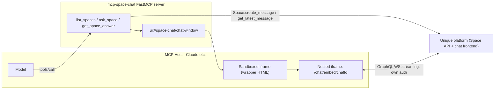

# Space Chat: Sub-Agents with a Live Chat Window (MCP Apps / MCP-UI)

This tutorial extends the ideas from [Unique credentials ↔ Tools](mcp_search.md):
instead of searching the knowledge base, the server calls **Unique spaces**
(specialized sub-agents) and renders the running conversation as a **live chat
window** inside the MCP host — using the
[MCP Apps extension](https://modelcontextprotocol.io/extensions/apps/overview)
(Claude, VS Code Copilot, …) and legacy [MCP-UI](https://mcpui.dev/)
(Goose, Postman, MCPJam, …).

Code: `tutorials/mcp/mcp_space_chat`

## What it does

1. `list_spaces` — lists the spaces (sub-agents) the logged-in user can chat
   with, via `unique_sdk.Space.get_spaces`.
2. `ask_space(space_id, prompt, chat_id?)` — creates a user message in the
   space via `Space.create_message` and returns immediately with the
   `chatId`. The platform runs the space asynchronously.
3. `get_space_answer(chat_id, max_wait?)` — polls `Space.get_latest_message`
   until the assistant stops streaming (`stoppedStreamingAt`), then returns
   the final answer text and references so the model gets the sub-agent's
   result into its own context.

While the space is answering, the user sees the **real Unique chat frontend**
(the chrome-less `/chat/embed` window that the browser extension also uses)
embedded in the conversation — with native token streaming over the chat
app's GraphQL WebSocket and its built-in auto-scrolling. Follow-up questions
can be typed directly into the embedded chat input.

## Architecture



## How the UI part works

### MCP Apps hosts (Claude, …)

- The server registers a resource `ui://space-chat/chat-window` with
  mime type `text/html;profile=mcp-app`. Its `_meta.ui.csp.frameDomains`
  declares the Unique frontend origin (from `UNIQUE_FRONTEND_BASE_URL`) so the
  host's sandbox CSP allows the nested iframe (`frame-src`).
- The `ask_space` tool carries `_meta.ui.resourceUri` pointing at that
  resource. When the tool is called, the host renders the HTML in a sandboxed
  iframe.
- The wrapper HTML (plain JS, no build step) speaks the MCP Apps JSON-RPC
  dialect over `postMessage`: it sends `ui/initialize`, receives the host
  context (theme, container dimensions), sends
  `ui/notifications/initialized`, and waits for
  `ui/notifications/tool-result`. From the result's `structuredContent` it
  reads `embedUrl` and mounts
  `<iframe src="{frontend}/chat/embed/{chatId}?spaceId=…">`.
- An "Open in Unique" button uses `ui/open-link` as a fallback/deep link.

### Legacy MCP-UI hosts (Goose, Postman, MCPJam, …)

The same `ask_space` result additionally embeds a classic MCP-UI resource
(built with the [`mcp-ui-server`](https://pypi.org/project/mcp-ui-server/)
Python package): an `externalUrl` resource (`text/uri-list`) whose content is
the embed URL. MCP-UI hosts iframe it directly.

## Platform prerequisites

The embedded window is the real chat frontend, so the target environment must
allow that framing:

- **CSP `frame-ancestors`** — the chat app must allowlist the MCP host's
  iframe origin, the same mechanism already used for the browser extension
  (`CSP_FRAME_ANCESTORS_EXTENSION` / `CONTENT_SECURITY_POLICY_VALUE` in the
  monorepo's `next/apps/chat/deploy/<env>/values.yaml`). For Claude the
  sandbox origin is host-controlled (e.g. `https://*.claudemcpcontent.com`).
  Without this the browser refuses to render the nested iframe.
- **Auth caveat** — `/chat/embed` authenticates via OIDC tokens in
  `localStorage`. In a third-party iframe that storage is partitioned, so an
  existing Unique session does not carry over automatically; the embed then
  shows its "Open Unique to sign in" state. The wrapper degrades gracefully
  and offers the "Open in Unique" deep link. A durable fix (short-lived token
  handoff to the embed) is a frontend change and out of scope here.

## Running it

```bash
cd tutorials/mcp/mcp_space_chat
uv sync
cp unique.env.example unique.env      # fill in credentials + UNIQUE_FRONTEND_BASE_URL
cp unique_mcp.env.example unique_mcp.env
cp zitadel.env.example zitadel.env
uv run mcp-space-chat
```

`UNIQUE_FRONTEND_BASE_URL` is **required** — it is the origin of the embedded
chat (e.g. `https://next.qa.unique.app`).

Identity resolution (trusted `_meta`, Zitadel JWT, `/userinfo`, env fallback)
works exactly as in the [mcp_search tutorial](mcp_search.md).

## Deploy to Azure

The package ships the same two deployment paths as `mcp_search`:

- **App Service** — `./deploy.sh` at the package root (ACR build + Linux Web App on port 8004).
- **ACI + Caddy** — `terraform/` (Key Vault secrets, Log Analytics, HTTPS).

See [`tutorials/mcp/mcp_space_chat/DEPLOYMENT.md`](../../mcp/mcp_space_chat/DEPLOYMENT.md)
for the walkthrough. Remember to set `UNIQUE_FRONTEND_BASE_URL` and register
`https://<app>/auth/callback` in Zitadel.

## Key implementation notes

- `ask_space` does **not** wait for the answer — the tool returns the
  `chatId` immediately so the host can render the chat window while the space
  streams. Waiting happens either visually (the embed) or explicitly via
  `get_space_answer` (polling, mirroring
  `unique_sdk.utils.chat_in_space.send_message_and_wait_for_completion`).
- The embed URL builder mirrors `widgetUrlFor` from the browser extension:
  `/chat/embed?spaceId=…` for a new chat, `/chat/embed/{chatId}?spaceId=…`
  for an existing one.
- The tool result separates concerns per MCP Apps best practice: `content`
  (text) is for the model, `structuredContent` (`chatId`, `embedUrl`, …) is
  for the view.
