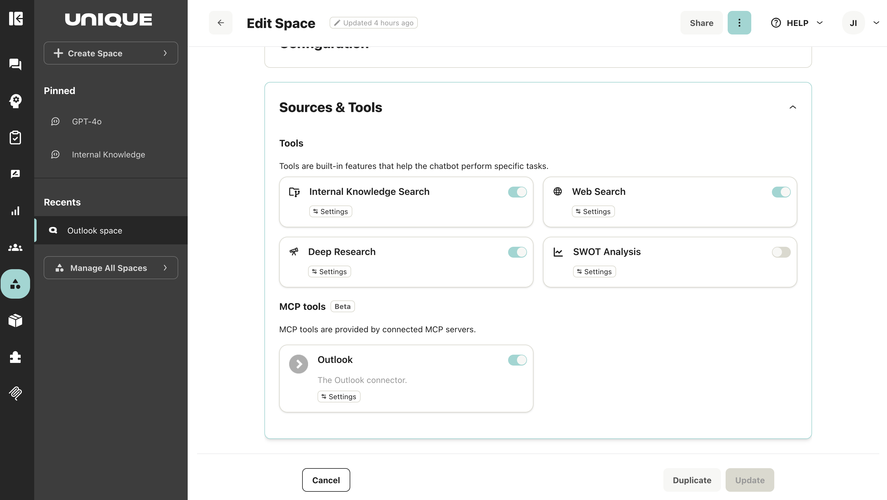

# Using MCP Tools in Unique AI

## 📌 Overview

After developing your MCP (Model Context Protocol) server and tools (as covered in [MCP Fundamentals](mcp_fundamentals.md), [MCP Demo](mcp_demo.md), and [MCP Search](mcp_search.md)), this guide explains how to configure and use those tools within Unique AI Spaces.

**MCP Tools** allow your space to connect to external services and data sources that have been configured by your organization's connector administrators. These tools extend your AI assistant's capabilities by enabling it to interact with specialized systems and APIs.

> **Note**: MCP Tools for Spaces is a feature-flagged capability and must be explicitly enabled for your organization. To activate this feature, please follow the instructions on this page [MCP Connectors for Admins](https://unique-ch.atlassian.net/wiki/x/EoD4Yg) or contact your Customer Success representative.

## 🎯 What Space Admins Can Do

As a Space Administrator, you have control over MCP tools in your space:

- **View MCP connectors** that have been enabled for your organization
- **Enable or disable connectors** for your specific space
- **Control which tools are available** to users in your space by selectively enabling or disabling individual tools within each connector

**What You'll See:**

- Connector name and description (provided by the connector admin)
- Available tools for each connector (only tools enabled at the organization level)
- Tool descriptions and capabilities

## ⚙️ Configuration

### Accessing MCP Tools

1. Navigate to your **Space Settings**
2. Go to **Sources & Tools**
3. Available MCP connectors are listed under the **MCP Tools** subsection

### Enabling an MCP Connector

#### Step 1: Browse Available Connectors

The MCP Tools section displays all connectors that have been **made available to your organization by connector administrators**.

Each connector card shows:

- Connector name
- Description of the connector

#### Step 2: Open Connector Configuration

Click on **Settings** in a connector card to open the configuration menu.

#### Step 3: Review Available Tools

The overlay displays all **tools that have been enabled for your organization.**

> **Note**: Tools disabled by the connector admin will not appear in this list

#### Step 4: Enable Tools

You have two options:

**Option A: Enable All Tools**
- Toggle the **Enable** slider to ON
- This activates all available tools for your space

**Option B: Selective Tool Enablement**
- Toggle the **Enable** slider to ON to enable all tools
- Disable specific tools that you don't want available in your space by toggling them OFF individually

#### Step 5: Save Configuration

Click **Save** to apply your changes.

#### Step 6: Tools Go Live

Once saved, the enabled tools will immediately appear in the chat interface for all users in your space. Users can now interact with these tools through the AI assistant.

### Disabling an MCP Connector

To disable a connector entirely:

1. In the Space configuration, navigate to the connector card in `Source & Tools > MCP Tools`
2. Toggle the main **Enable** slider to OFF
3. Click **Update** to save the Space settings

All tools from that connector will be removed from your space's chat interface.

### Modifying Tool Selection

To change which tools are enabled:

1. Open the connector configuration overlay
2. Toggle individual tools ON or OFF as needed
3. Click **Save**

Changes take effect immediately for all space users.

## 💡 Best Practices

### Review Tool Descriptions

Before enabling a connector, review the tool descriptions to understand what capabilities you're adding to your space. This helps ensure the tools align with your space's purpose and user needs.

### Start Selective

Consider starting with a subset of tools enabled, then expanding based on user needs and feedback. This approach allows you to:

- Monitor tool usage patterns
- Gather user feedback
- Ensure tools provide value before enabling everything

### Monitor Usage

After enabling new tools, evaluate user behavior and usage patterns to ensure the tools are providing value to your team. Look for:

- Which tools are being used most frequently
- User satisfaction with tool results
- Any confusion or support requests related to tools

### Regular Audits

Periodically review enabled connectors and tools to ensure they remain relevant to your space's needs. Consider:

- Removing unused tools to reduce clutter
- Updating tool configurations based on changing requirements
- Ensuring tools comply with your organization's policies

## 🔧 Troubleshooting

### Connector Not Appearing

**Issue:** Expected connector doesn't show in MCP Tools section

**Solution:**

- Verify with your connector admin that the connector has been enabled for the organization
- Refresh your browser
- Check that the MCP Tools feature flag is enabled for your organization

### Tools Not Visible in Chat

**Issue:** Enabled tools aren't showing up for space users

**Solution:**

1. Confirm you clicked **Save** after enabling the tools
2. Ask users to refresh their chat interface
3. Verify the tools are toggled ON in the connector configuration
4. Check that the tools are enabled at the organization level (contact your connector admin)

### Limited Tool Selection

**Issue:** Fewer tools than expected are available

**Solution:**

- Remember that only organization-enabled tools appear in your space configuration
- Contact your connector admin if you need access to additional tools from the connector
- Verify that the connector administrator has enabled the tools you need at the organization level

## 🔗 Additional Resources

- [MCP Fundamentals](mcp_fundamentals.md) - Understanding the basics of building MCP servers
- [MCP Demo](mcp_demo.md) - Building a simple MCP server example
- [MCP Search](mcp_search.md) - Building an MCP server with search functionality
- [Tools Overview](https://unique-ch.atlassian.net/wiki/spaces/PUBDOC/pages/Tools+Overview) - Understanding all tools available in Spaces
- [Create Spaces](https://unique-ch.atlassian.net/wiki/spaces/PUBDOC/pages/Create+Spaces) - Complete guide to space configuration
- [MCP Protocol Specification](https://modelcontextprotocol.io) - Technical details about the Model Context Protocol
- [User Guide: Using MCP Tools in Chat](https://unique-ch.atlassian.net/wiki/spaces/PUBDOC/pages/User+Guide+Using+MCP+Tools+in+Chat) - How end users interact with enabled tools
- [MCP Connectors for Admins](https://unique-ch.atlassian.net/wiki/x/EoD4Yg) - How to enable MCP connectors for your organization

## 📋 Summary

Configuring MCP Tools in Unique AI Spaces involves:

1. **Accessing the MCP Tools section** in Space Settings > Sources & Tools
2. **Reviewing available connectors** that have been enabled for your organization
3. **Enabling connectors** and selecting which tools to make available
4. **Saving your configuration** to activate tools for space users
5. **Monitoring usage** and adjusting tool selection based on feedback

This process allows Space Administrators to control which MCP tools are available to users, ensuring that only relevant and approved tools are accessible within each space.

