# Console Agent Architecture

This document describes the architecture of the MCP Console Agent, an interactive AI assistant with Model Context Protocol (MCP) server integration.

## Overview

The Console Agent is a terminal-based AI assistant that connects to MCP servers to extend its capabilities with external tools. It follows SOLID principles and uses a modular architecture for maintainability and testability.

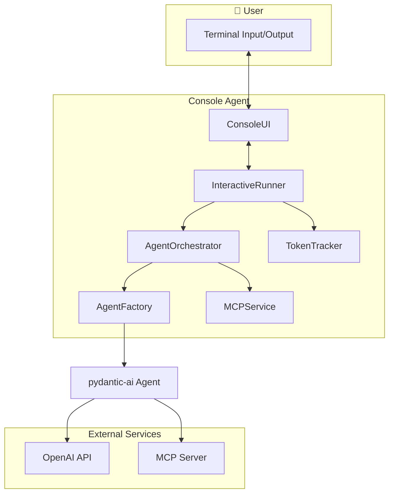

## Module Structure

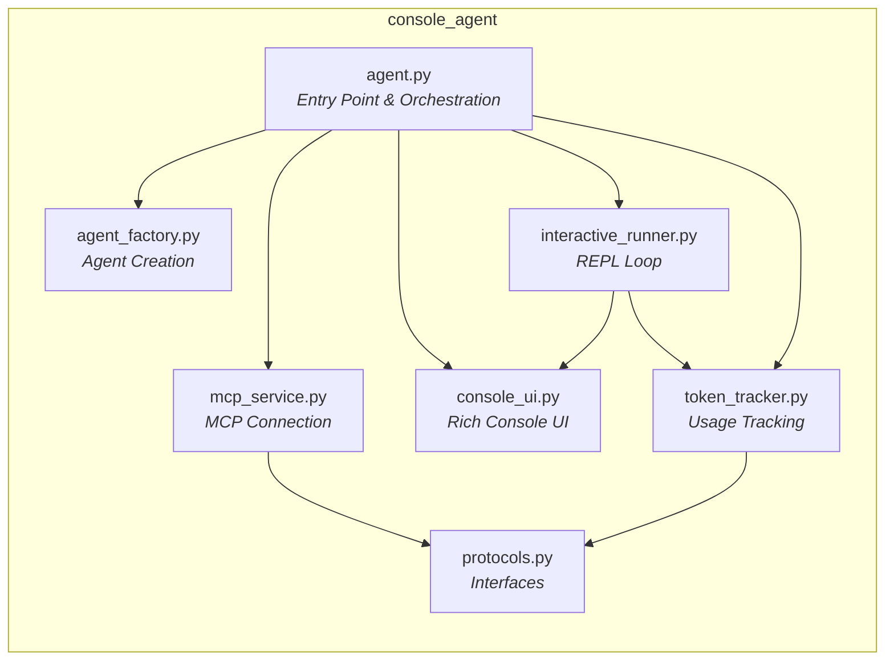

## Component Details

### 1. Agent Orchestrator (`agent.py`)

The main entry point that coordinates all components. Handles:
- MCP server availability checking
- Agent creation with proper configuration
- Token tracker initialization
- Running the interactive loop

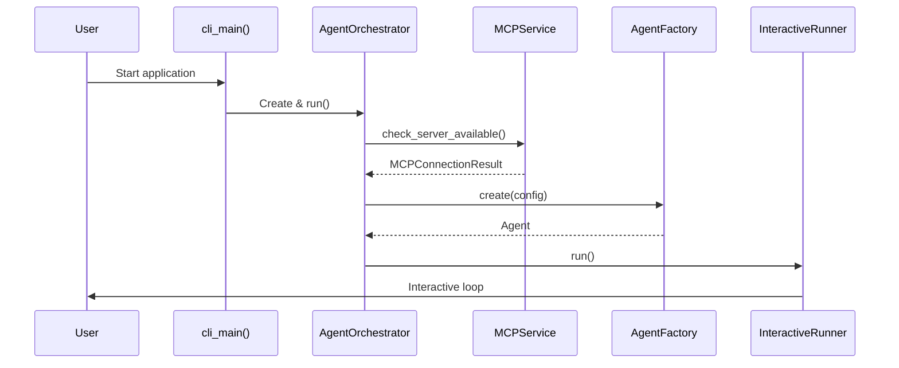

### 2. Agent Factory (`agent_factory.py`)

Factory pattern implementation for creating pydantic-ai agents. Supports:
- Configurable instructions via `InstructionProvider` protocol
- MCP toolset integration with OAuth
- Model selection

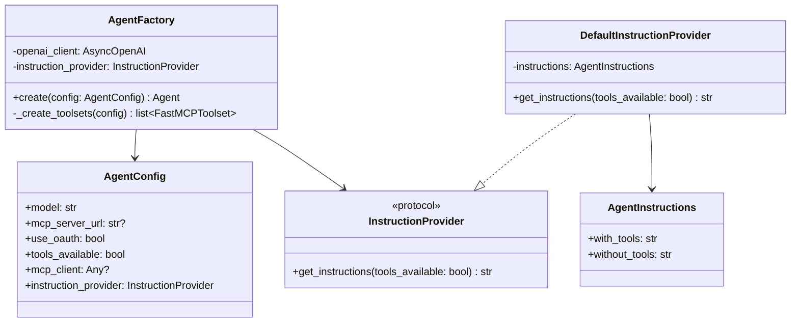

### 3. MCP Service (`mcp_service.py`)

Manages MCP server connections and client lifecycle:
- Server availability checking with timeout
- OAuth authentication handling
- Client creation and tool listing

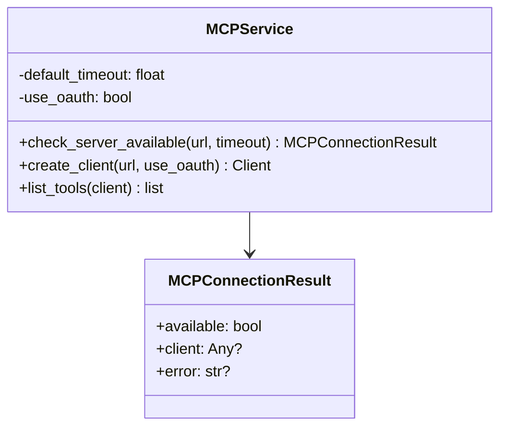

### 4. Interactive Runner (`interactive_runner.py`)

REPL (Read-Eval-Print Loop) implementation:
- User input parsing and command detection
- Conversation state management
- Agent execution with error handling

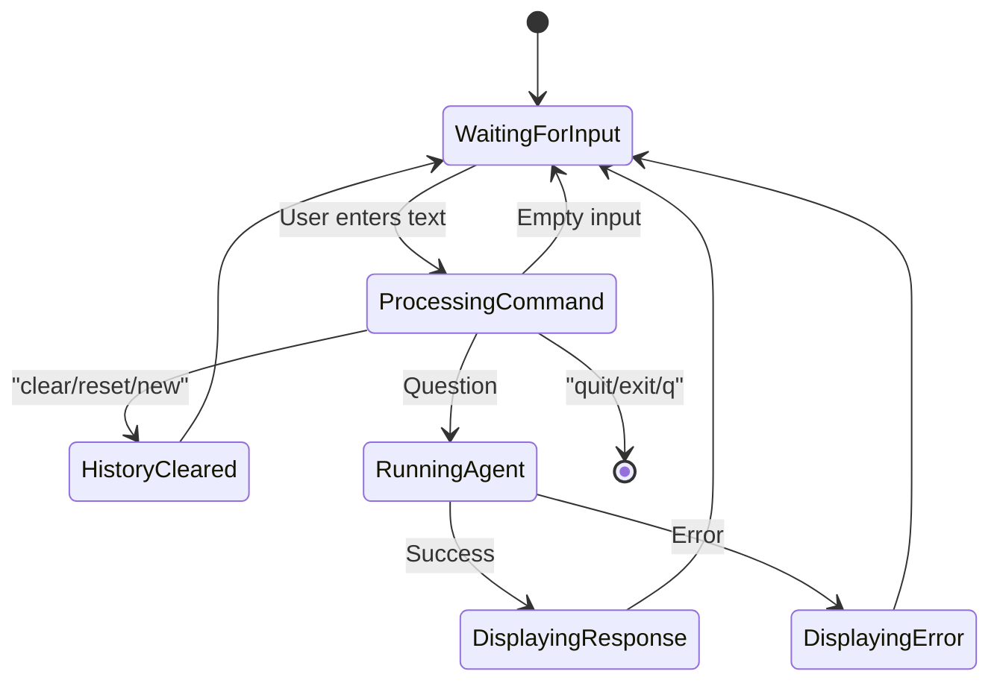

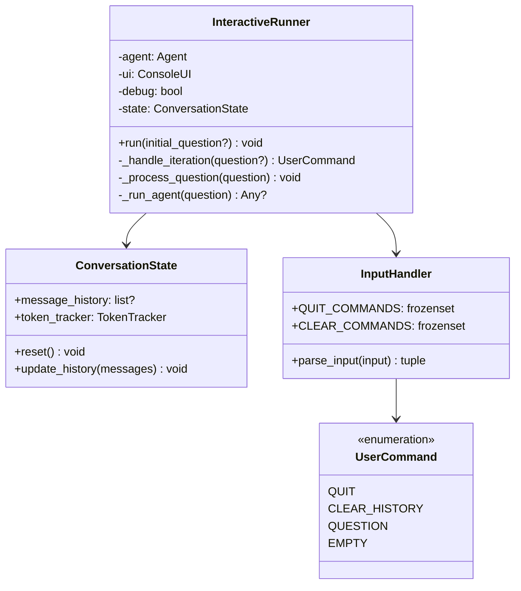

### 5. Console UI (`console_ui.py`)

Rich-based terminal UI with:
- Styled panels for user/agent messages
- Token usage progress bars
- Debug information display
- Tool usage indicators

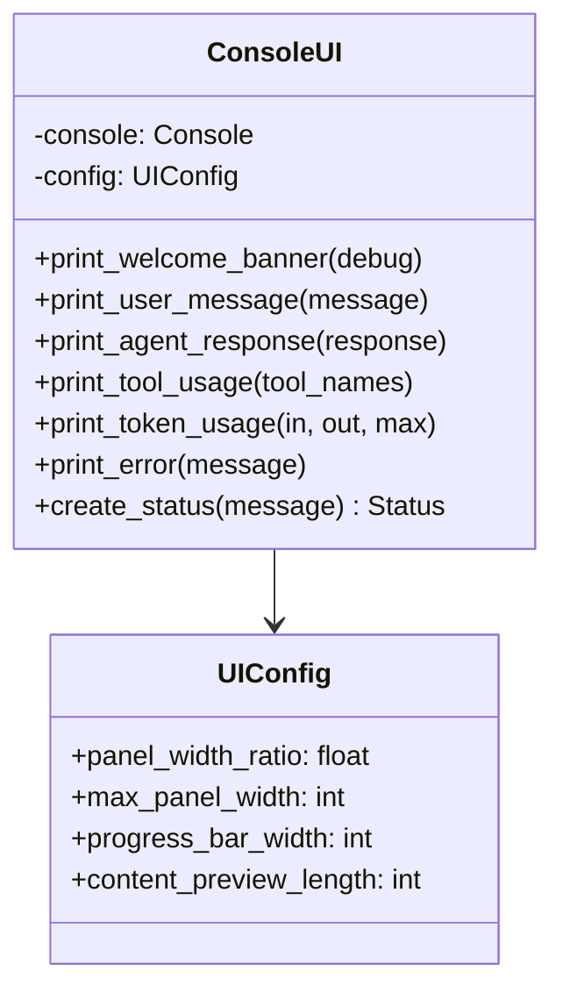

### 6. Token Tracker (`token_tracker.py`)

Tracks cumulative token usage:
- Input/output token counting
- Usage percentage calculation
- Limit warnings

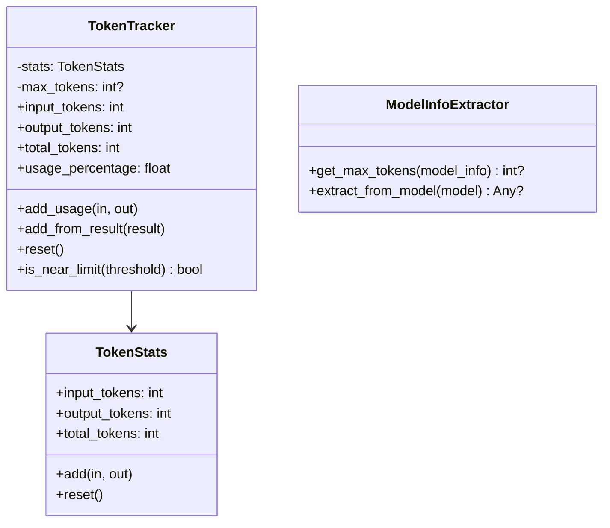

### 7. Protocols (`protocols.py`)

Interface definitions enabling dependency injection and testability:

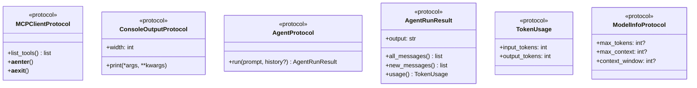

## Data Flow

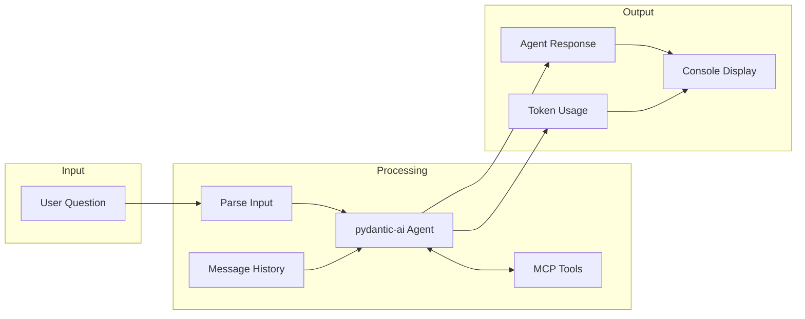

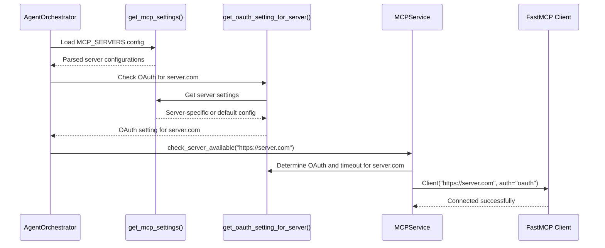

## Technology Stack

| Component | Technology | Purpose |
|-----------|------------|---------|
| AI Framework | `pydantic-ai` | Agent orchestration and tool calling |
| MCP Client | `fastmcp` | Model Context Protocol integration |
| Console UI | `rich` | Terminal styling and formatting |
| Data Models | `pydantic` | Configuration and data validation |
| Async | `asyncio` | Asynchronous I/O operations |
| LLM Client | `openai` (AsyncOpenAI) | OpenAI API communication |

## SOLID Principles Applied

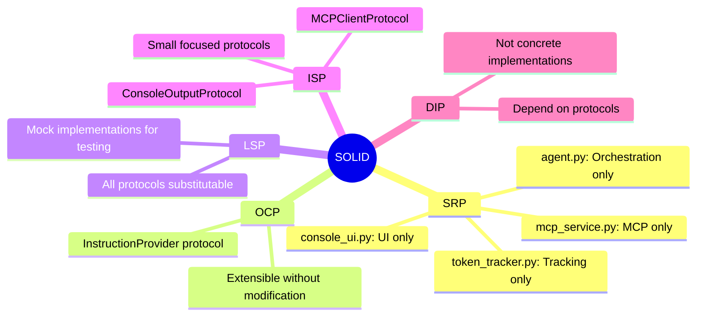

## Configuration

The agent accepts configuration through:

1. **Environment Variables**:
   - `MCP_SEARCH_DEBUG`: Enable debug mode (`true`/`1`/`yes`)
   - `MCP_SERVERS`: JSON dictionary of server configurations (see below)

2. **AgentConfig Dataclass**:
   - `model`: LLM model name
   - `mcp_server_url`: MCP server endpoint
   - `tools_available`: Enable/disable MCP tools
   - `mcp_client`: Optional pre-authenticated MCP client

3. **MCPServerSettings Model** (Pydantic BaseModel):
   - `oauth`: Whether to use OAuth authentication for this server
   - `timeout`: Connection timeout in seconds
   - `enabled`: Whether this server configuration is enabled

4. **MCPSettings Model** (Pydantic BaseSettings):
   - `servers`: Dictionary mapping server URLs to their settings
   - `default_oauth`: Default OAuth setting for unconfigured servers
   - `default_timeout`: Default timeout for unconfigured servers

**Note**: `MCPSettings` uses `pydantic_settings.BaseSettings` which automatically parses JSON from environment variables for complex types like `Dict[str, MCPServerSettings]`. This eliminates the need for manual JSON parsing.

5. **UIConfig Dataclass**:
   - `panel_width_ratio`: Response panel width
   - `max_panel_width`: Maximum panel width
   - `progress_bar_width`: Token bar width

### MCP Server Configuration

MCP servers are configured through a single `MCP_SERVERS` environment variable containing a JSON dictionary:

```bash
export MCP_SERVERS='{
  "https://secure-server.com": {
    "oauth": true,
    "timeout": 10.0,
    "enabled": true
  },
  "http://localhost:8080": {
    "oauth": false,
    "timeout": 5.0
  },
  "https://api.example.com/mcp": {
    "oauth": false,
    "enabled": false
  }
}'
```

**Configuration Options:**
- `oauth` (bool): Whether to use OAuth authentication (default: `true`)
- `timeout` (float): Connection timeout in seconds (default: `5.0`)
- `enabled` (bool): Whether this server is enabled (default: `true`)

**Additional Environment Variables:**
With `BaseSettings`, you can also override defaults directly:
- `MCP_DEFAULT_OAUTH`: Override default OAuth setting (default: `true`)
- `MCP_DEFAULT_TIMEOUT`: Override default timeout (default: `5.0`)

**Fallback Behavior:**
- Servers not in `MCP_SERVERS` use default settings:
  - `oauth`: `MCP_DEFAULT_OAUTH` or `true`
  - `timeout`: `MCP_DEFAULT_TIMEOUT` or `5.0` seconds
  - `enabled`: `true`

**Example Usage:**
```bash
# Production setup
MCP_SERVERS='{"https://mcp.prod.company.com": {"oauth": true, "timeout": 15}}' console-agent

# Development setup
MCP_SERVERS='{"http://localhost:8080": {"oauth": false, "timeout": 2}}' console-agent

# Mixed environment
MCP_SERVERS='{
  "https://mcp.prod.company.com": {"oauth": true},
  "http://localhost:8080": {"oauth": false}
}' console-agent
```

This approach provides clean, centralized configuration for all MCP server settings while maintaining backward compatibility through sensible defaults.

## Entry Points

```python
# Programmatic usage
from console_agent import main, AgentOrchestrator
await main(openai_client=client, debug=True)

# CLI usage (defined in pyproject.toml)
console-agent
```

## Error Handling

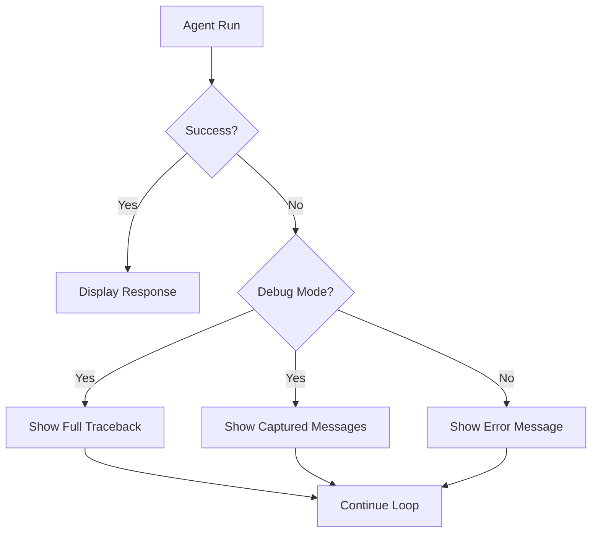

The agent gracefully handles:
- MCP server unavailability (runs without tools)
- Network timeouts
- Authentication failures
- Agent execution errors

Debug mode provides detailed error information including captured messages before failure.

