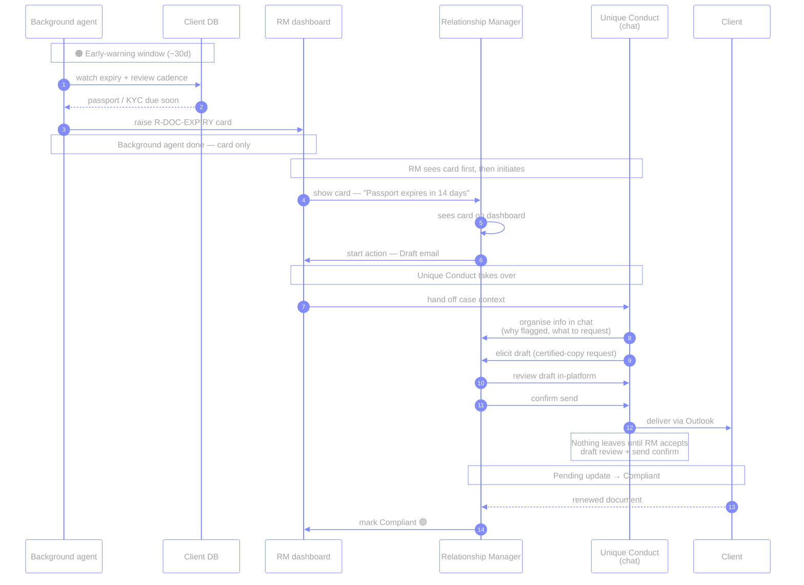

# `R-DOC-EXPIRY` — Document / KYC refresh

🟠 → 🔴 · **Live demo anchor** (in-platform Outlook send)

ID document or periodic KYC is about to expire. A **background agent** warns
inside the lead-time window so the RM can act *before* the file goes stale.

**Two agents:**

| Agent | Role |
| --- | --- |
| **Background agent** | Watches expiry / KYC cadence and **creates the dashboard card**. Stops there — no chat, no outbound mail. |
| **Unique Conduct** | Takes over **after the RM sees the card and initiates**. Organises client context in **chat**, drafts the email, and walks the RM through in-platform review + send. |

The RM only starts the action **after seeing the card**. Unique Conduct never
auto-sends — Outlook is the delivery channel after the RM confirms in the
platform.

```mermaid
%%{init: {'theme': 'base', 'themeVariables': { 'primaryColor': 'transparent', 'secondaryColor': 'transparent', 'tertiaryColor': 'transparent', 'mainBkg': 'transparent', 'clusterBkg': 'transparent', 'clusterBorder': '#64748b', 'primaryTextColor': '#a3a3a3', 'secondaryTextColor': '#a3a3a3', 'tertiaryTextColor': '#a3a3a3', 'textColor': '#a3a3a3', 'titleColor': '#a3a3a3', 'nodeBorder': '#818cf8', 'lineColor': '#818cf8', 'edgeLabelBackground': 'transparent', 'fontFamily': 'ui-sans-serif, system-ui'}}}%%
flowchart LR
  subgraph bg["Background agent"]
    T["Trigger<br/>expiry / KYC cadence"] --> C["Card on dashboard<br/>🟠 Passport expires…"]
  end

  C --> SEE["RM sees card"]
  SEE --> R["RM initiates<br/>Draft email"]

  subgraph uc["Unique Conduct (chat)"]
    R --> CTX["Organise case<br/>in chat"]
    CTX --> REV["Review draft<br/>in platform"]
    REV --> SEND["RM confirms send<br/>→ Outlook"]
  end

  SEND --> S["Status<br/>Pending update"]
  S --> Done["Compliant 🟢"]

  style T fill:none,stroke:#38bdf8,stroke-width:2px
  style C fill:none,stroke:#fb923c,stroke-width:2px
  style SEE fill:none,stroke:#fb923c,stroke-width:2px
  style R fill:none,stroke:#818cf8,stroke-width:2px
  style CTX fill:none,stroke:#818cf8,stroke-width:2px
  style REV fill:none,stroke:#fbbf24,stroke-width:2px
  style SEND fill:none,stroke:#fbbf24,stroke-width:2px
  style S fill:none,stroke:#fbbf24,stroke-width:2px
  style Done fill:none,stroke:#4ade80,stroke-width:2px
```

| | |
| --- | --- |
| **Source** | Client DB |
| **Card creator** | Background agent |
| **Who starts the action** | **RM** after seeing the card |
| **Chat / draft / send** | **Unique Conduct** (takes over after RM sees card & initiates) |
| **Send channel** | In-platform draft → confirm → Outlook delivery |
| **Status path** | Pending update → Compliant |
| **Code** | `cases.json` → `doc-expiry` · `send_email` audience `client` |

← [index](./README.md) · [lifecycle](./lifecycle.md) · [next →](./02-adverse-media.md)
