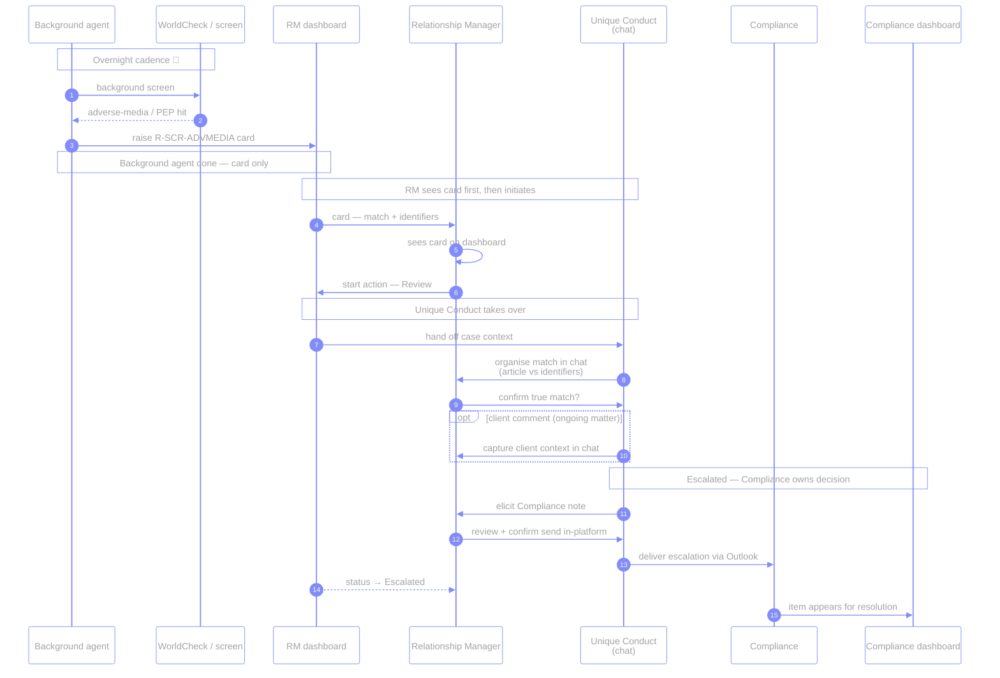
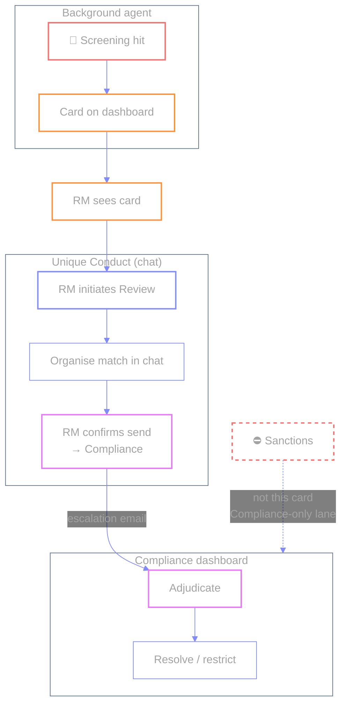

# `R-SCR-ADVMEDIA` — Adverse-media / PEP hit

🔴 · Illustrative · Also covers `R-SCR-PEP` in code

Overnight Smart KYC surfaces a news match or PEP change. The **background
agent** raises the card; the RM confirms the match and, via **Unique Conduct**,
hands the **decision** to Compliance with an in-platform escalation email.

**Two agents:**

| Agent | Role |
| --- | --- |
| **Background agent** | Screening cadence → **creates the dashboard card**. Stops there. |
| **Unique Conduct** | Takes over **after the RM sees the card and initiates**. Organises match context in **chat**, drafts the Compliance note, walks the RM through in-platform review + send. |

| | |
| --- | --- |
| **Source** | WorldCheck / Smart KYC |
| **Card creator** | Background agent |
| **Who starts the action** | **RM** after seeing the card |
| **Chat / escalate** | **Unique Conduct** (takes over after RM sees card & initiates) |
| **Send channel** | In-platform draft → confirm → Outlook to Compliance |
| **Status path** | Escalated |
| **Division of labour** | RM = client context · Compliance = decision |
| **Code** | `cases.json` → `adverse-media` · `send_email` audience `compliance` |

← [prev](./01-doc-expiry.md) · [index](./README.md) · [next →](./03-suit-alloc.md)
