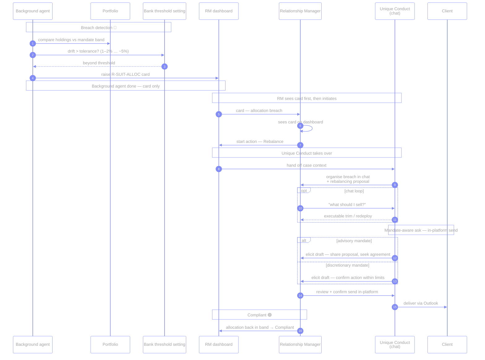
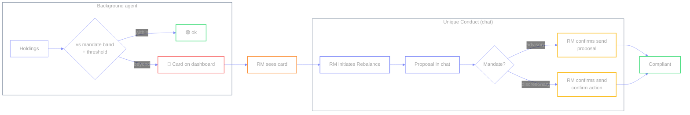

# `R-SUIT-ALLOC` — Portfolio breaches risk profile

🔴 · Illustrative · Drift threshold is **bank-configurable**

Holdings drift past the mandate’s allocation band (e.g. equities 72% vs 60%
ceiling). Continuous suitability — catch and fix, don’t wait for the annual
review. The **background agent** raises the card; **Unique Conduct** builds the
rebalance path in chat after the RM sees the card and initiates.

**Two agents:**

| Agent | Role |
| --- | --- |
| **Background agent** | Compares holdings vs mandate + threshold → **creates the dashboard card**. Stops there. |
| **Unique Conduct** | Takes over **after the RM sees the card and initiates**. Organises the breach in **chat**, sketches the rebalancing proposal, drafts the client email, walks the RM through in-platform review + send. |

| | |
| --- | --- |
| **Source** | Portfolio |
| **Card creator** | Background agent |
| **Who starts the action** | **RM** after seeing the card |
| **Chat / proposal / send** | **Unique Conduct** (takes over after RM sees card & initiates) |
| **Send channel** | In-platform draft → confirm → Outlook to client |
| **Status path** | Remediation → Compliant |
| **Open design** | Surface drift threshold in UI |
| **Code** | `cases.json` → `suit-alloc` · `send_email` audience `client` |

← [prev](./02-adverse-media.md) · [index](./README.md) · [next →](./04-suit-review.md)
