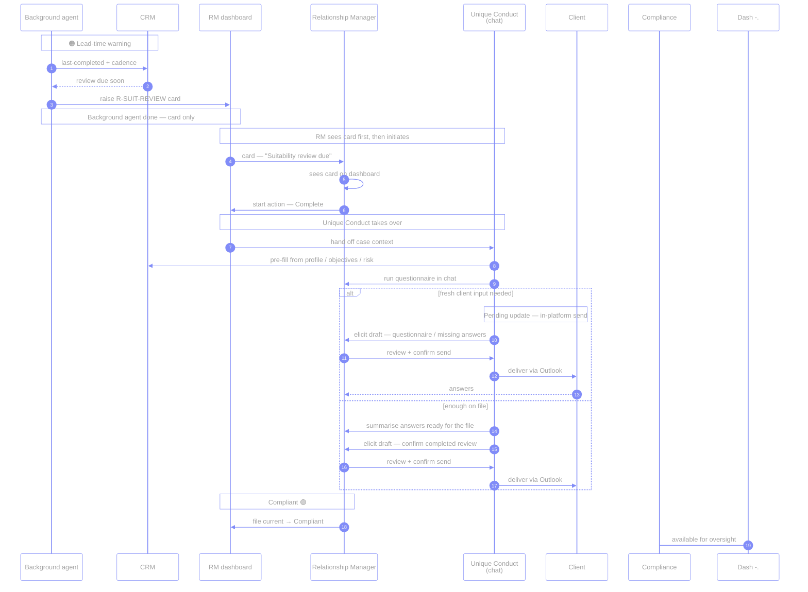
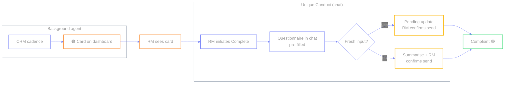

# `R-SUIT-REVIEW` — Suitability review due

🟠 → 🔴 · Illustrative · Prefer “ongoing suitability”, not strictly “annual”

Review cadence from CRM is falling due. The **background agent** raises with
enough lead time; **Unique Conduct** runs the questionnaire in chat after the RM
sees the card and initiates.

**Two agents:**

| Agent | Role |
| --- | --- |
| **Background agent** | Watches CRM last-completed + cadence → **creates the dashboard card**. Stops there. |
| **Unique Conduct** | Takes over **after the RM sees the card and initiates**. Runs the suitability questionnaire in **chat**, drafts any client ask, walks the RM through in-platform review + send. |

| | |
| --- | --- |
| **Source** | CRM |
| **Card creator** | Background agent |
| **Who starts the action** | **RM** after seeing the card |
| **Chat / questionnaire / send** | **Unique Conduct** (takes over after RM sees card & initiates) |
| **Send channel** | In-platform draft → confirm → Outlook to client |
| **Status path** | Remediation *or* Pending update → Compliant |
| **Why it matters** | Regulators → ongoing, needs-based reviews (Consumer Duty) |
| **Code** | `cases.json` → `suit-review` · `send_email` audience `client` |

← [prev](./03-suit-alloc.md) · [index](./README.md) · [next →](./05-reg-change.md)
