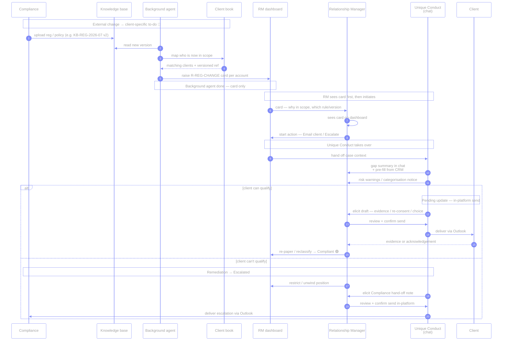
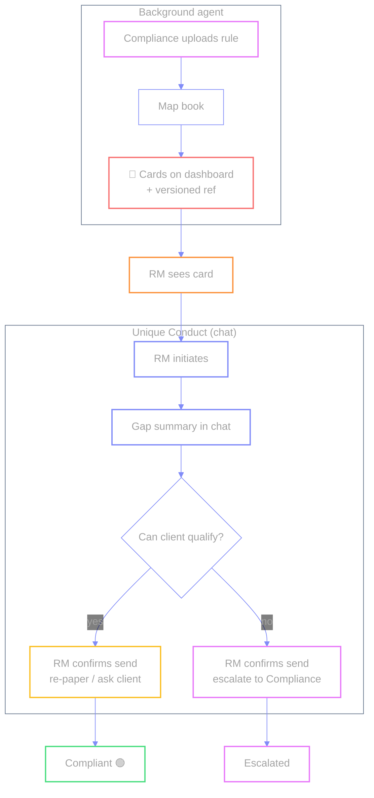

# `R-REG-CHANGE` — Regulatory change (client in scope)

🔴 · Illustrative · Code also accepts legacy `R-REG-NONDOM`

Compliance uploads a rule; the **background agent** maps the book and flags
affected accounts with a **versioned rule reference** (audit trail).
**Unique Conduct** runs the reassessment in chat after the RM sees the card and initiates.

**Two agents:**

| Agent | Role |
| --- | --- |
| **Background agent** | Reads new KB version, maps in-scope clients → **creates per-account cards**. Stops there. |
| **Unique Conduct** | Takes over **after the RM sees the card and initiates**. Organises the gap summary in **chat**, drafts client or Compliance email, walks the RM through in-platform review + send. |

| | |
| --- | --- |
| **Source** | Knowledge base (Compliance-loaded) — not live regulator feed |
| **Card creator** | Background agent |
| **Who starts the action** | **RM** after seeing the card |
| **Chat / reassess / send** | **Unique Conduct** (takes over after RM sees card & initiates) |
| **Send channel** | In-platform draft → confirm → Outlook (client or Compliance) |
| **Status path** | Remediation → Compliant, *or* → Escalated |
| **Example flavour** | Product eligibility / elective-professional (not abolished non-dom tax) |
| **Code** | `cases.json` → `reg-change` · dual action (email client / escalate) |

← [prev](./04-suit-review.md) · [index](./README.md) · [next →](./06-sow-refresh.md)
