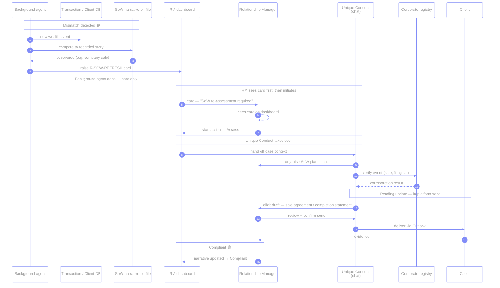
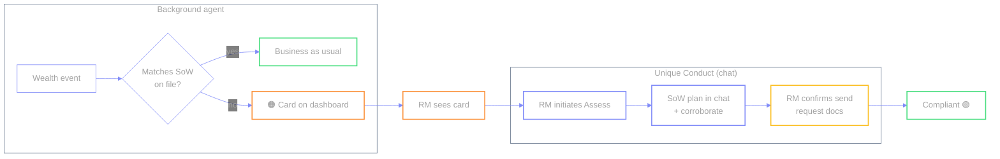

# `R-SOW-REFRESH` — Source of Wealth re-assessment

🟠 → 🔴 · Illustrative · Ties into existing SoW product

A wealth event (e.g. large inbound transfer) does not match the SoW narrative on
file → enhanced due diligence before treating money as BAU. The **background
agent** raises the card; **Unique Conduct** runs the corroboration plan in chat
after the RM sees the card and initiates.

**Two agents:**

| Agent | Role |
| --- | --- |
| **Background agent** | Compares wealth event vs SoW on file → **creates the dashboard card**. Stops there. |
| **Unique Conduct** | Takes over **after the RM sees the card and initiates**. Organises the SoW plan in **chat**, corroborates (e.g. registry), drafts the document request, walks the RM through in-platform review + send. |

| | |
| --- | --- |
| **Source** | Client DB / transactions |
| **Card creator** | Background agent |
| **Who starts the action** | **RM** after seeing the card |
| **Chat / SoW plan / send** | **Unique Conduct** (takes over after RM sees card & initiates) |
| **Send channel** | In-platform draft → confirm → Outlook to client |
| **Status path** | Remediation + Pending update → Compliant |
| **Why it matters** | KYC + SoW + ongoing remediation on one surface |
| **Code** | `cases.json` → `sow-refresh` · `send_email` audience `client` |

← [prev](./05-reg-change.md) · [index](./README.md) · [next →](./07-sof-check.md)
