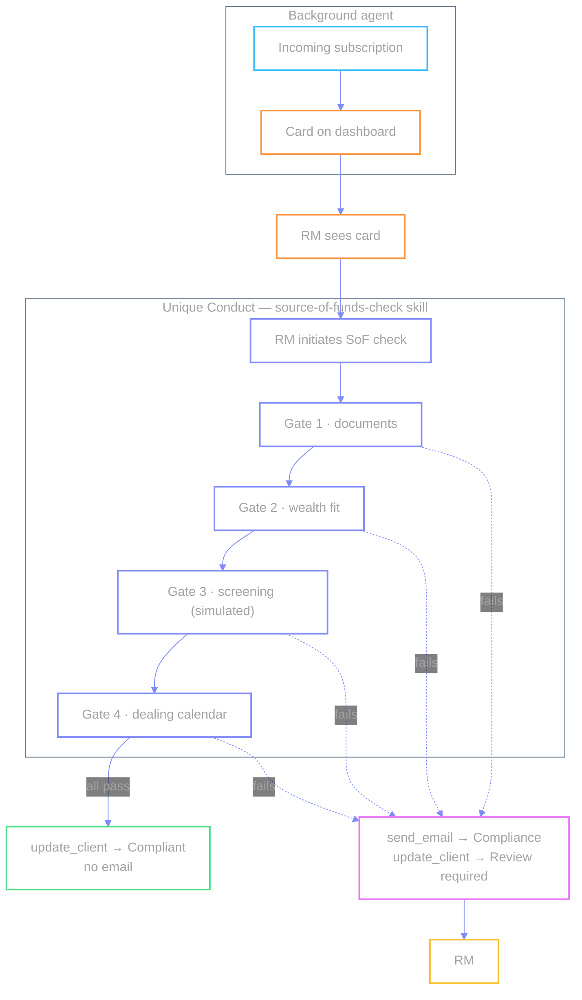

# `R-SOF-CHECK` — Source of Funds check

🧾 · Illustrative · New case type

An incoming subscription is flagged for Source of Funds review. The
**background agent** raises the card from the transaction feed; the RM sees
it and initiates. **Unique Conduct** takes over and runs the four-gate SoF
check via the `source-of-funds-check` skill — documents, wealth fit,
screening, settlement timing — then either confirms the transaction with no
email at all, or escalates to Compliance and hands the case back to the RM.

**Two agents:**

| Agent | Role |
| --- | --- |
| **Background agent** | Watches incoming subscriptions → **creates the dashboard card** when one needs SoF review. Stops there. |
| **Unique Conduct** | Takes over **after the RM sees the card and initiates**. Runs the `source-of-funds-check` skill's four gates in chat, then confirms or escalates. |

```mermaid
%%{init: {'theme': 'base', 'themeVariables': { 'actorBkg': 'transparent', 'actorBorder': '#818cf8', 'actorTextColor': '#a3a3a3', 'signalColor': '#818cf8', 'signalTextColor': '#a3a3a3', 'labelTextColor': '#a3a3a3', 'labelBoxBkgColor': 'transparent', 'noteBkgColor': 'transparent', 'noteTextColor': '#a3a3a3', 'noteBorderColor': '#818cf8', 'textColor': '#a3a3a3', 'primaryTextColor': '#a3a3a3', 'fontFamily': 'ui-sans-serif, system-ui'}}}%%
sequenceDiagram
  autonumber
  participant BG as Background agent
  participant Tx as Subscription feed
  participant Dash as RM dashboard
  participant RM as Relationship Manager
  participant UC as Unique Conduct<br/>(chat)
  participant Comp as Compliance

  Note over BG,Tx: Incoming fund subscription
  BG->>Tx: watch subscriptions
  Tx-->>BG: transaction needs SoF review
  BG->>Dash: raise R-SOF-CHECK card
  Note over BG,Dash: Background agent done — card only

  Note over Dash,UC: RM sees card first, then initiates
  Dash->>RM: card — client, amount, wealth
  RM->>RM: sees card on dashboard
  RM->>Dash: start action — Run SoF check
  Dash->>UC: hand off case context + case folder
  UC->>UC: Gate 1 — documents exist &amp; corroborate
  UC->>UC: Gate 2 — amount vs wealth (10% test)
  UC->>UC: Gate 3 — PEP / adverse media (simulated)
  UC->>UC: Gate 4 — dealing calendar document

  alt all four gates pass
    UC->>Dash: update_client → Compliant
    Note over UC,Dash: No email — nothing to send
  else any gate fails
    UC->>Comp: send_email → escalation (confirmed send)
    UC->>Dash: update_client → Review required
    Dash-->>RM: status → back to RM
  end
```



| | |
| --- | --- |
| **Source** | Incoming subscription / transaction feed |
| **Card creator** | Background agent |
| **Who starts the action** | **RM** after seeing the card |
| **Chat / skill** | **Unique Conduct**, `source-of-funds-check` skill — four gates run in one chat turn |
| **Send channel** | Confirmed `send_email` to Compliance — only on a gate failure |
| **Status path** | Compliant (pass) · Review required (fail, back to RM) |
| **Division of labour** | RM = initiates and owns the case · Compliance = notified on failure only |
| **Code** | `cases.json` → `sof-check` · skill KB folder → `source-of-funds-check` |

← [prev](./06-sow-refresh.md) · [index](./README.md) · [glossary](./glossary.md)
