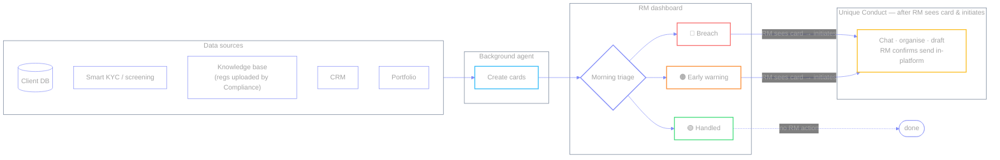

# RM Account-Remediation — process docs

Visual guide to the seven Relationship Manager (RM) use cases this dataset
implements. Source product brief:
[RM Account-Remediation Dashboard — Use Cases](https://unique-ch.atlassian.net/wiki/spaces/Product/pages/2508980226).

**Idea:** account review is not a periodic ceremony — it is the moment a client
stops being compliant. The dashboard is the morning triage tool.

**Two agents on every case:** the **background agent** creates cards from
watches / screening / KB; the **RM sees the card**, then initiates; **Unique
Conduct** takes over in chat (organise context, draft, in-platform confirm send).

Stroke colors (no fills) carry meaning on light and dark. Label text uses mid
gray `#a3a3a3` — Mermaid bakes text into the SVG, so one pure black/white color
cannot work on both backgrounds; this is the readable compromise.

| Role | Stroke |
| --- | --- |
| Breach 🔴 | `#f87171` |
| Early warning 🟠 | `#fb923c` |
| Compliant / handled 🟢 | `#4ade80` |
| Remediation / action | `#818cf8` |
| Pending update | `#fbbf24` |
| Escalated | `#e879f9` |

## Docs map

| File | Tag | Background card → RM sees → initiates → Unique Conduct |
| --- | --- | --- |
| [lifecycle.md](./lifecycle.md) | — | Traffic-lights + work statuses |
| [01-doc-expiry.md](./01-doc-expiry.md) | `R-DOC-EXPIRY` | Doc/KYC due → draft → send client (Outlook) |
| [02-adverse-media.md](./02-adverse-media.md) | `R-SCR-ADVMEDIA` | Screening hit → escalate → send Compliance |
| [03-suit-alloc.md](./03-suit-alloc.md) | `R-SUIT-ALLOC` | Allocation drift → rebalance → send client |
| [04-suit-review.md](./04-suit-review.md) | `R-SUIT-REVIEW` | Review due → questionnaire → send client |
| [05-reg-change.md](./05-reg-change.md) | `R-REG-CHANGE` | In-scope rule → reassess → send client or Compliance |
| [06-sow-refresh.md](./06-sow-refresh.md) | `R-SOW-REFRESH` | Wealth mismatch → SoW plan → send client |
| [07-sof-check.md](./07-sof-check.md) | `R-SOF-CHECK` | Subscription flagged → 4-gate skill → escalate Compliance, or confirm with no email |
| [glossary.md](./glossary.md) | — | Acronyms + two agents |

Every smart action is **RM-started after they see the card**. Six of the seven
end with an in-platform `send_email` confirm to the client or Compliance —
analysis alone is not enough; nothing leaves until the RM accepts. `R-SOF-CHECK`
is the exception: it only emails Compliance on a gate failure, and sends
nothing at all when the check passes clean.

## Code wiring

| Concern | Where |
| --- | --- |
| Case registry (tags, banners, prompts) | `astro/src/data/cases.json` |
| Domain model (`case_action`, rule codes) | `contract/main.tsp` |
| UI selection by `rule_code` | `CaseActionBar.astro` / `CaseFigure.astro` |
