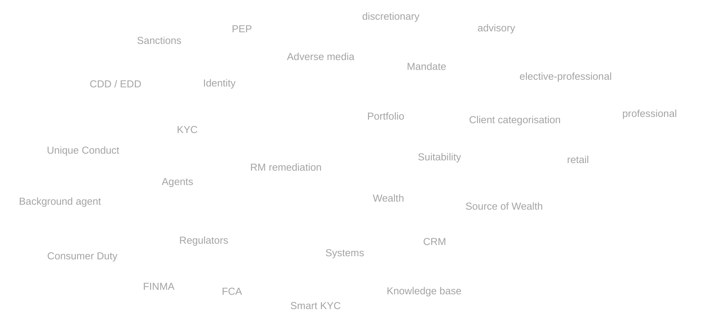
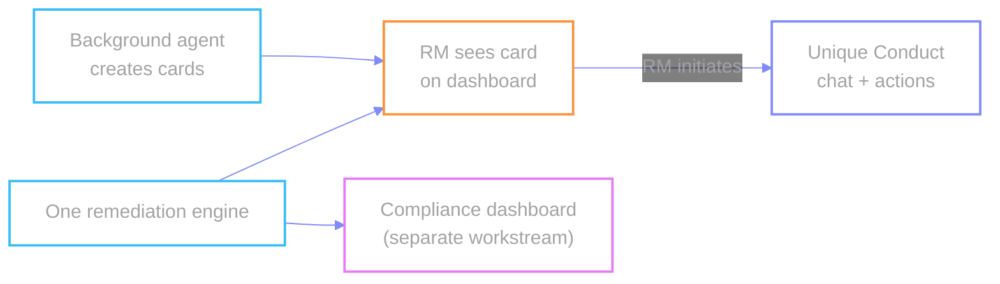

# Glossary

| Term | Meaning |
| --- | --- |
| **Background agent** | Raises remediation cards on the RM dashboard from watches / screening / KB — no chat, no outbound mail |
| **Unique Conduct** | Chat agent that takes over after the RM **sees the card** and initiates a smart action — organises context, drafts, confirms send |
| **KYC** | Know Your Customer — verify who the client is |
| **CDD / EDD** | Customer / Enhanced Due Diligence — standard vs deeper checks |
| **PEP** | Politically Exposed Person — higher scrutiny |
| **Adverse media** | Negative news from screening |
| **Sanctions** | Government lists — Compliance/FC only (not RM-adjudicated) |
| **Suitability** | Advice & investments fit needs, objectives, risk appetite |
| **Source of Wealth** | How overall wealth was generated |
| **Mandate** | Advisory = client approves moves · Discretionary = act within limits |
| **Client categorisation** | Retail / professional / elective-professional → products & protections |
| **FCA / FINMA** | UK / Swiss financial regulators |
| **Consumer Duty** | FCA good-outcomes duty → continuous, needs-based reviews |
| **CRM** | Customer relationship system |
| **Smart KYC** | Perpetual background screening / monitoring |

## Architecture note

Demo data honesty: screening is background cadence; regs are Compliance-uploaded
into the knowledge base — not live regulator feeds.

← [index](./README.md)
