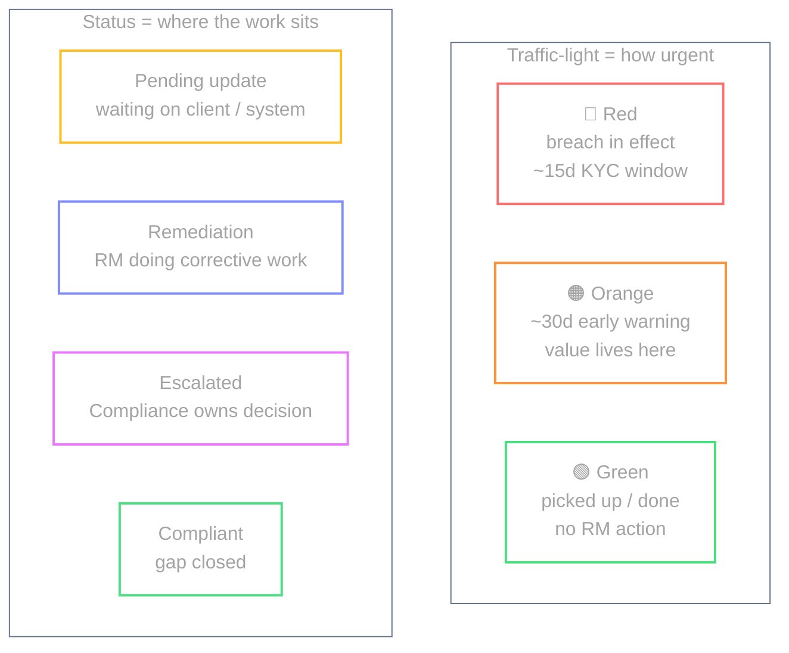
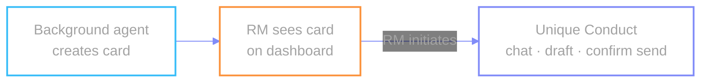
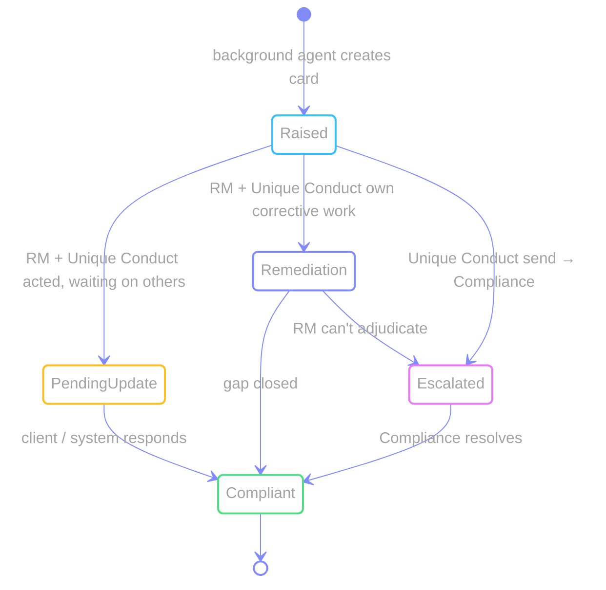
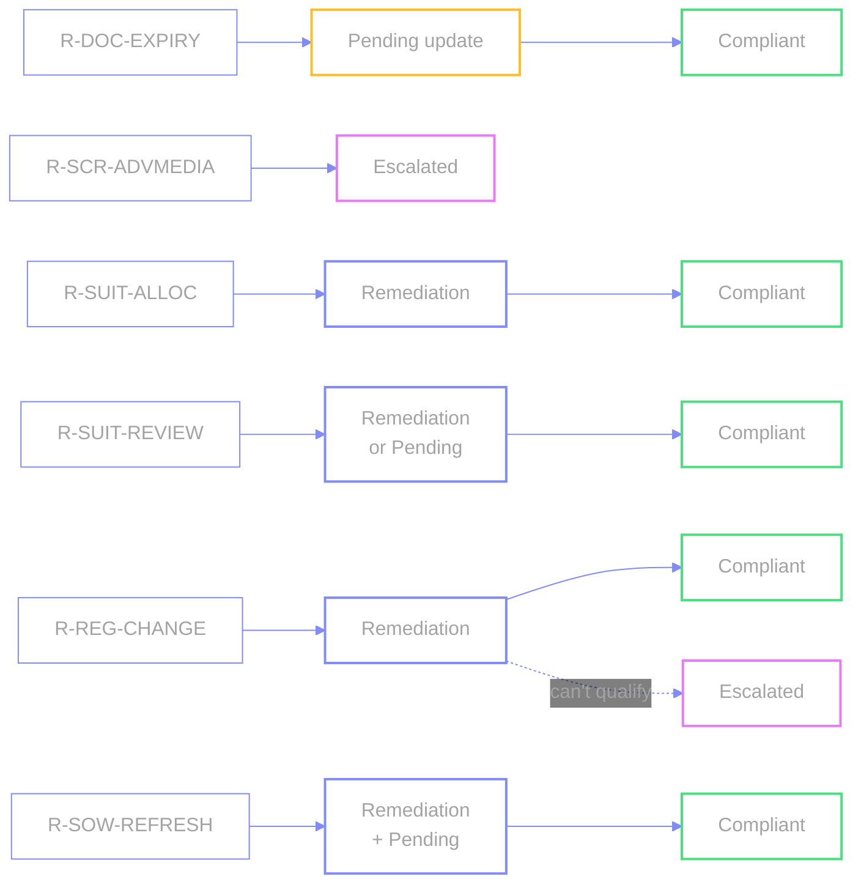

# Urgency vs work status

Two independent axes on every item.

## Who does what

## Status transitions

## Typical path per use case

### Boundaries that matter

| Boundary | Meaning |
| --- | --- |
| **Background agent vs Unique Conduct** | Cards only vs chat + draft + in-platform send (after RM **sees the card** and initiates) |
| **Pending update vs Remediation** | Both open — but waiting on someone else vs RM doing the work |
| **Remediation vs Escalated** | Corrective **action** (RM) vs **decision** (Compliance) |

← [index](./README.md)
