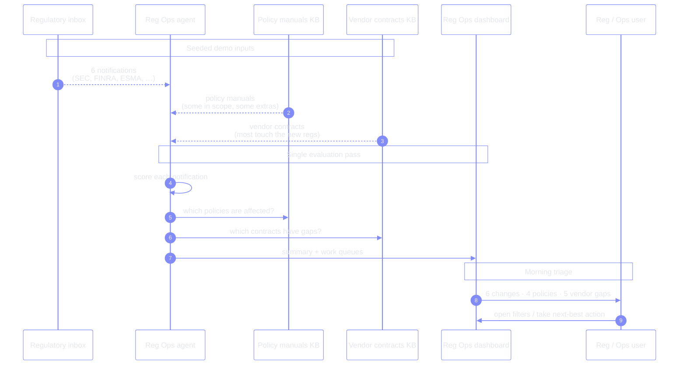
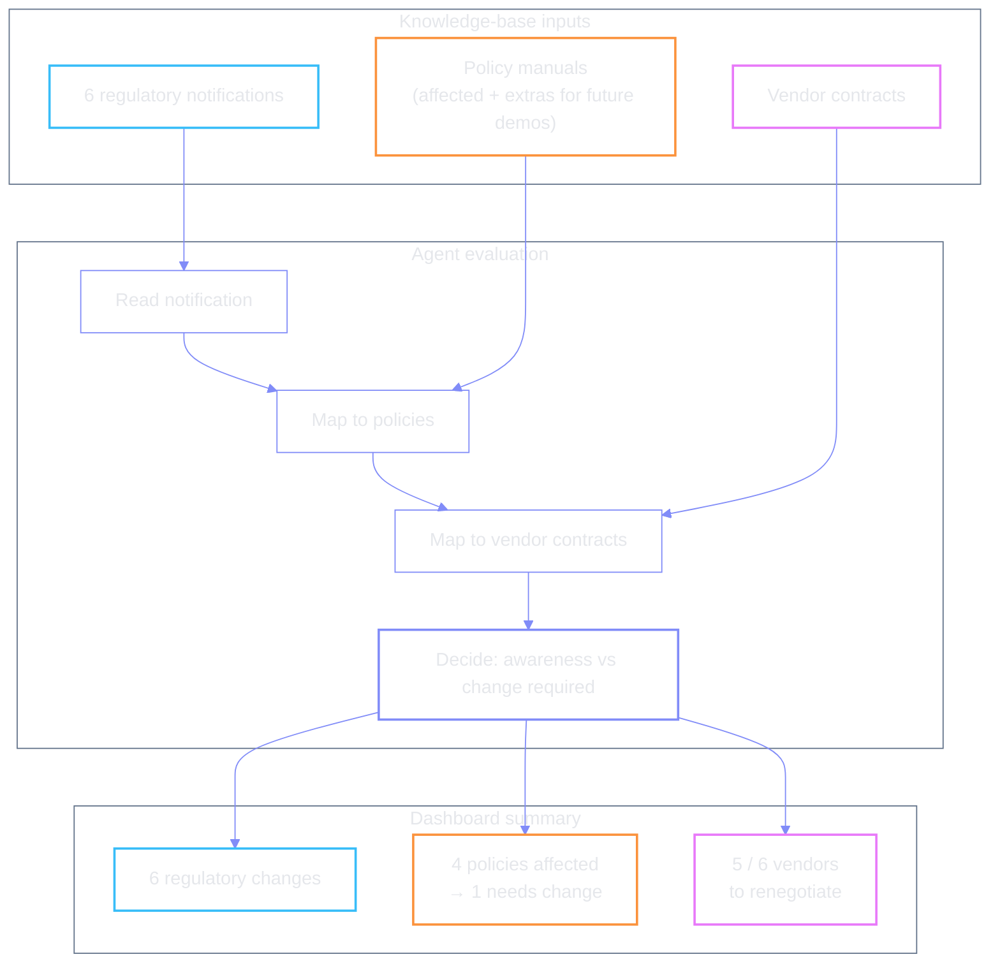

# Regulatory scan — notifications → policies → vendors

The agent evaluates three knowledge-base inputs in one pass, then lands a summary
on the dashboard.

| | |
| --- | --- |
| **Sources** | Regulatory inbox + policy KB + vendor-contract KB |
| **Trigger** | Initial load · **Rerun scan** · (ideal demo) new seventh email |
| **Output** | KPI strip + vendor queue + policy queue + change list |
| **Extras** | Extra policies intentionally unused today — room to grow the demo |

← [index](./README.md) · [lifecycle](./lifecycle.md) · [next →](./02-vendor-followup.md)
