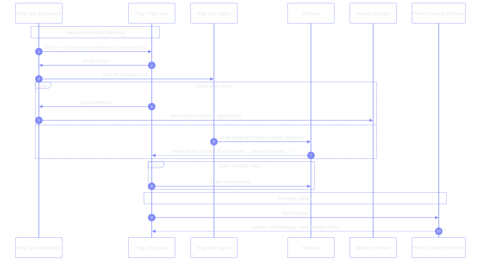
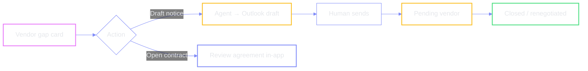

# Vendor follow-up — next-best action → Outlook draft

Demo anchor: **Prime Custody** — performance instantiation methodology is
*referenced* in the contract but not attached, which is out of line with the
new guidance. Next-best action: draft a notice asking for the missing artefact.

### Demo flavour (Prime Custody)

| | |
| --- | --- |
| **Issue** | Performance instantiation methodology referenced but not attached |
| **Ask** | Provide the missing methodology / align with guidance |
| **Channel** | Outlook draft, openable via hyperlink while other work continues |
| **Repeatable** | Same draft-notice flow available for any regulatory change’s vendors |

← [prev](./01-regulatory-scan.md) · [index](./README.md) · [next →](./03-policy-update.md)
