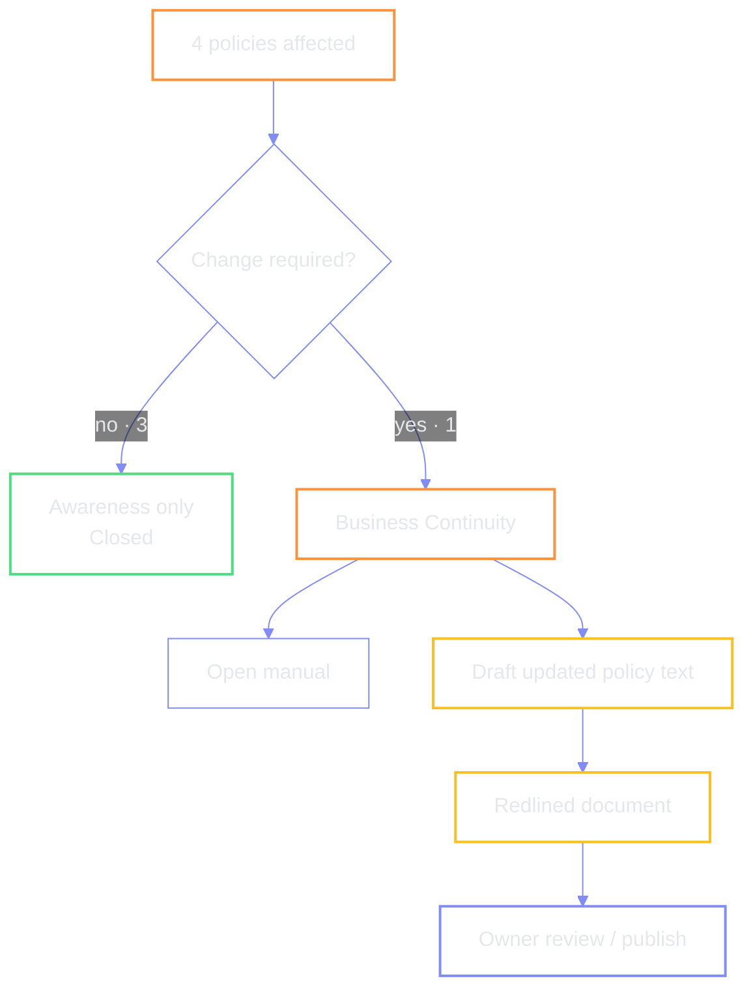

# Policy update — gap → redlined draft

Of the four policies the scan marks as affected, only **one** needs a text
change in the demo: the **Business Continuity** policy. The smart action drafts
updated text with a redline for the policy owner.

```mermaid
%%{init: {'theme': 'base', 'themeVariables': { 'actorBkg': 'transparent', 'actorBorder': '#818cf8', 'actorTextColor': '#e5e7eb', 'signalColor': '#818cf8', 'signalTextColor': '#e5e7eb', 'labelTextColor': '#e5e7eb', 'labelBoxBkgColor': 'transparent', 'noteBkgColor': 'transparent', 'noteTextColor': '#e5e7eb', 'noteBorderColor': '#818cf8', 'textColor': '#e5e7eb', 'primaryTextColor': '#e5e7eb', 'fontFamily': 'ui-sans-serif, system-ui'}}}%%
sequenceDiagram
  autonumber
  participant Dash as Reg Ops dashboard
  participant Ops as Reg / Ops user
  participant KB as Policy manual
  participant Agent as Reg Ops agent
  participant Out as Redlined draft

  Note over Dash,Ops: Policy-changes queue
  Dash->>Ops: 1 policy requires change
  Ops->>Dash: Open policy manual
  Dash->>KB: Business Continuity policy
  Note over Ops,Dash: Today: opening the manual<br/>leaves the dashboard (see open issues)

  Ops->>Dash: return to Reg Ops dashboard
  Ops->>Dash: Draft updated policy text
  Dash->>Agent: produce redline vs current manual
  Agent->>Out: HTML / document with track-changes style markup
  Out-->>Ops: review redline

  Note over Ops,Out: Demo caveat — PDFs lose formatting;<br/>chat-supplied text may be cleaner for live demos
```



| | |
| --- | --- |
| **Source** | Policy manuals in knowledge base |
| **Demo policy** | Business Continuity |
| **Action** | Draft updated policy text → redline |
| **Format note** | PDF uploads did not preserve layout; prefer source text in chat for polished demos |

← [prev](./02-vendor-followup.md) · [index](./README.md) · [next →](./04-change-threading.md)
