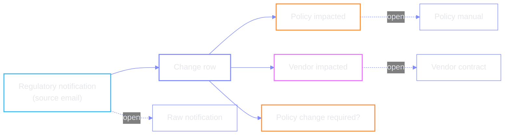
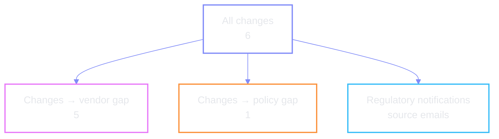
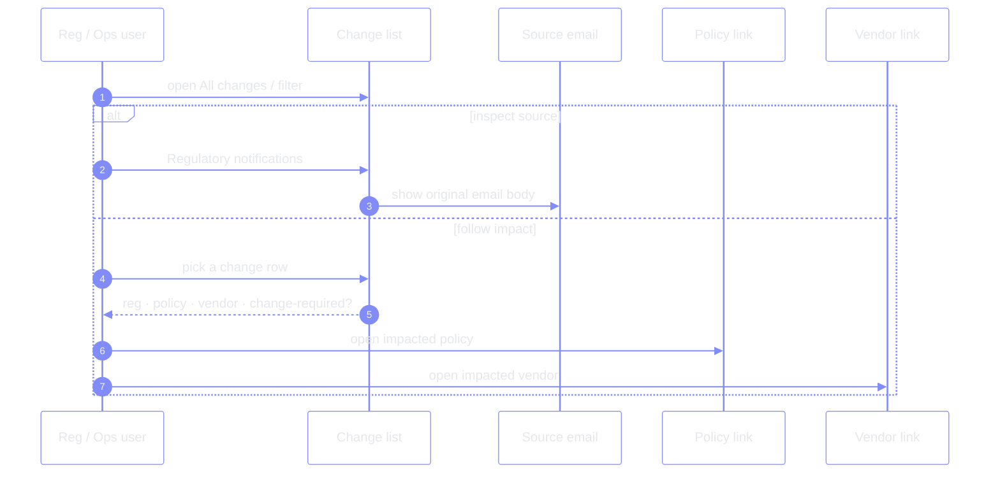

# Change threading — notification ↔ policy ↔ vendor

Below the work queues, the HTML dashboard lists each regulatory change with
links so the operator can **thread the needle** between the source email, the
impacted policy, and the impacted vendor — without leaving the change row.

## Filters

These filters match the summary strip: five vendor-gap changes and one
policy-gap change are the same numbers called out at the top of the dashboard.

| | |
| --- | --- |
| **Purpose** | Audit trail + navigation between artefacts for one regulatory delta |
| **Redundant path** | Vendor / policy also reachable from the queues above — links here are the alternate needle |
| **Source of truth for mail** | “Regulatory notifications” view pulls the direct email the agent scored |

← [prev](./03-policy-update.md) · [index](./README.md) · [next →](./05-open-issues.md)
