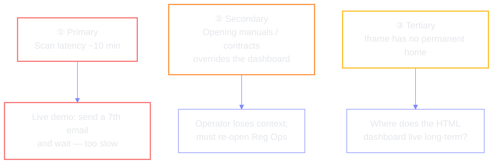
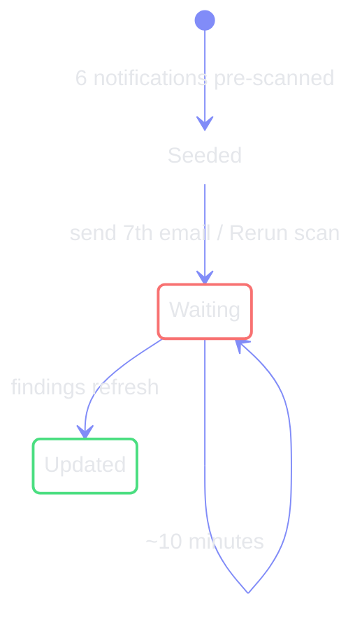
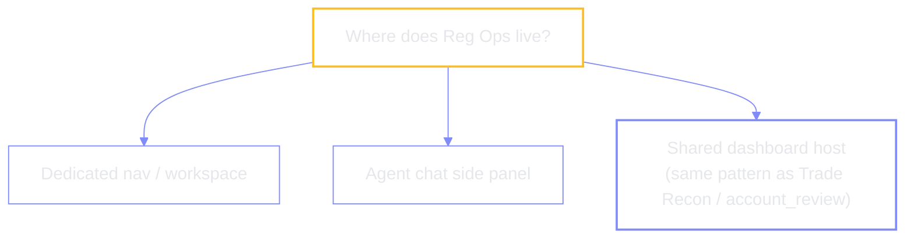

# Open issues (asks for Data Science / platform)

Captured from the walkthrough — what blocks a polished Millennium demo today.

## ① Scan latency (~10 minutes)

Unlike the Trade Recon dashboard (auto-update), **Rerun scan** is a long agent
job. Ideal demo beat: drop a seventh regulatory email mid-session and watch the
dashboard refresh — currently impractical.

| Ask | Direction |
| --- | --- |
| Faster incremental scan | Re-score only new mail, not the full corpus |
| Demo mode | Pre-warm / stub the seventh notification |
| Progress UX | Show scan stage so the wait is narratable |

## ② Document open overrides the dashboard

Opening a policy manual or vendor contract navigates away from the Reg Ops HTML
surface. The operator must click back into the dashboard — breaks the “stay in
flow” story while drafting notices / redlines in parallel.

```mermaid
%%{init: {'theme': 'base', 'themeVariables': { 'primaryColor': 'transparent', 'secondaryColor': 'transparent', 'tertiaryColor': 'transparent', 'mainBkg': 'transparent', 'primaryTextColor': '#e5e7eb', 'secondaryTextColor': '#e5e7eb', 'tertiaryTextColor': '#e5e7eb', 'textColor': '#e5e7eb', 'nodeBorder': '#818cf8', 'lineColor': '#818cf8', 'clusterBkg': 'transparent', 'clusterBorder': '#64748b', 'titleColor': '#e5e7eb', 'edgeLabelBackground': 'transparent', 'fontFamily': 'ui-sans-serif, system-ui'}}}%%
flowchart LR
  D["Reg Ops dashboard"] -->|Open policy / contract| DOC["Document viewer"]
  DOC -.->|context lost| D2["Re-open Reg Ops"]

  style D fill:none,stroke:#818cf8,stroke-width:2px
  style DOC fill:none,stroke:#fb923c,stroke-width:2px
  style D2 fill:none,stroke:#f87171,stroke-width:2px
```

| Ask | Direction |
| --- | --- |
| Side panel / split view | Keep dashboard mounted while previewing |
| New tab / drawer | Document open without replacing the host |
| Return deep-link | At minimum, one-click restore of scroll + filters |

## ③ Iframe permanent home

The current surface is an HTML dashboard embedded somewhere in the product. It
is unclear where the iframe should live as a first-class Reg Ops home (nav item,
agent workspace, chat side panel, etc.).

This repo’s direction for new dashboards is the Astro + MCP host pattern used by
[`account_review`](../../account_review/docs/README.md) — a natural candidate for
③ once the domain is modelled.

## Related demo notes (not blockers)

| Note | Detail |
| --- | --- |
| PDF formatting | Uploaded policy PDFs lost layout in the redline; prefer text-in-chat for demos |
| Extra policies | Unused manuals are intentional headroom for later scenarios |

← [prev](./04-change-threading.md) · [index](./README.md) · [glossary](./glossary.md)
