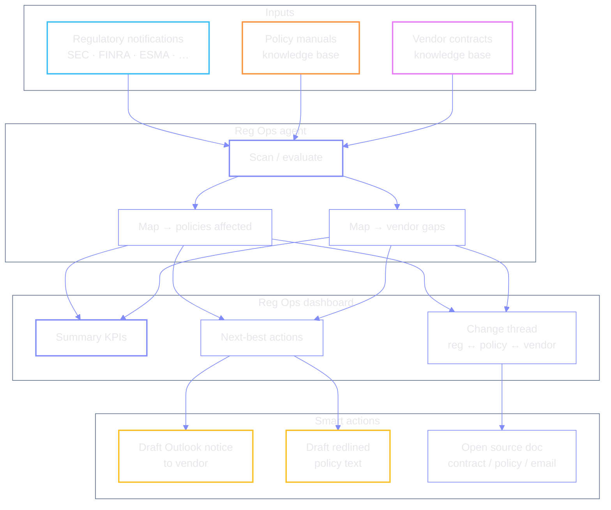
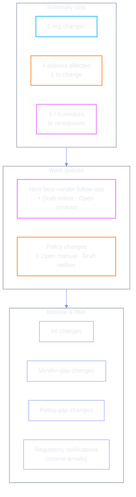

# Reg Ops — Regulatory & Operations Agent

Visual guide to the Millennium demo agent that sits in the **regulatory /
operations** seat. Two buckets run in tandem:

1. **Regulatory Intelligence** — read regulator notifications, map them onto
   internal policy manuals, flag what must change.
2. **Third-party risk** — for those policy / regulatory deltas, find vendor
   contracts that now have gaps and need renegotiation.

**Idea:** one morning surface that turns an inbox of SEC / FINRA / ESMA mail into
next-best actions — draft vendor notices, redline policy text, and a threadable
trail from notification → policy → contract.

Stroke colors (no fills) — readable on light and dark. Label text is `#e5e7eb`
so it stays legible on dark previews.

| Role | Stroke |
| --- | --- |
| Regulatory change | `#38bdf8` |
| Policy gap / update | `#fb923c` |
| Vendor gap / renegotiation | `#e879f9` |
| Smart action (draft) | `#fbbf24` |
| Closed / no change needed | `#4ade80` |
| Scan / agent work | `#818cf8` |
| Demo blocker | `#f87171` |

## Demo snapshot (seed numbers)

| Metric | Count | Note |
| --- | --- | --- |
| Regulatory changes | **6** | Notifications from SEC, FINRA, ESMA, etc. |
| Policies affected | **4** | Only **1** needs a text change |
| Vendor contracts to renegotiate | **5** / 6 | Gaps vs new guidance / policy |

## Docs map

| File | Focus |
| --- | --- |
| [lifecycle.md](./lifecycle.md) | Scan → triage → close; status model |
| [01-regulatory-scan.md](./01-regulatory-scan.md) | Inputs + agent evaluation pass |
| [02-vendor-followup.md](./02-vendor-followup.md) | Next-best action → draft Outlook notice |
| [03-policy-update.md](./03-policy-update.md) | Policy gap → redlined draft |
| [04-change-threading.md](./04-change-threading.md) | Filters + needle from email → docs |
| [05-open-issues.md](./05-open-issues.md) | Scan latency, doc navigation, iframe home |
| [glossary.md](./glossary.md) | Regulators, artefacts, seat |

## Dashboard regions (as demoed)

