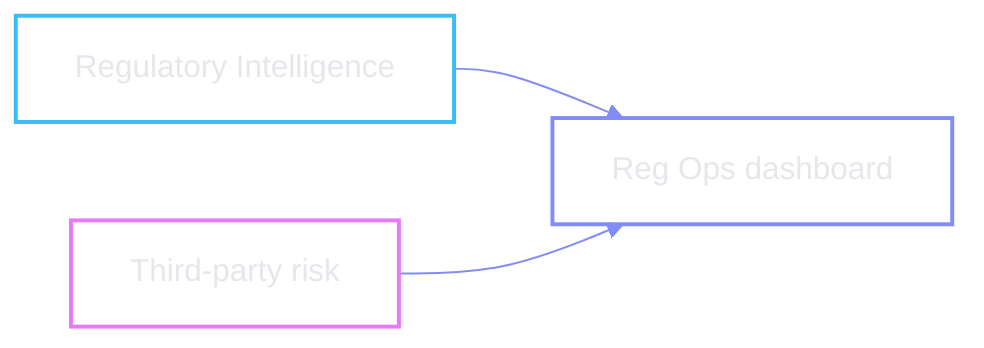

# Glossary

```mermaid
%%{init: {'theme': 'base', 'themeVariables': { 'primaryColor': 'transparent', 'primaryTextColor': '#e5e7eb', 'textColor': '#e5e7eb', 'lineColor': '#818cf8', 'fontFamily': 'ui-sans-serif, system-ui'}}}%%
mindmap
  root((Reg Ops))
    Seat
      Regulatory
      Operations
    Regulators
      SEC
      FINRA
      ESMA
    Artefacts
      Notifications
      Policy manuals
      Vendor contracts
    Gaps
      Policy gap
      Vendor gap
    Actions
      Draft notice
      Draft redline
      Rerun scan
```

| Term | Meaning |
| --- | --- |
| **Reg Ops seat** | Regulatory + Operations persona — owns policy currency and third-party risk from regs |
| **Regulatory Intelligence** | Agent lane that reads notifications and maps them onto internal policies |
| **Third-party risk** | Agent lane that finds vendor contracts misaligned with new guidance / policy |
| **Regulatory notification** | Inbound email (or equivalent) from a regulator — SEC, FINRA, ESMA, etc. |
| **Policy manual** | Internal policy document in the knowledge base (e.g. Business Continuity) |
| **Vendor contract** | Third-party agreement in the knowledge base (e.g. Prime Custody) |
| **Policy gap** | Policy is affected *and* needs a text / process change |
| **Vendor gap** | Contract references missing artefacts or obsolete terms vs new guidance |
| **Next-best action** | Prioritised follow-up the dashboard surfaces (usually draft a vendor notice) |
| **Redline** | Suggested policy text with track-changes style markup for owner review |
| **Rerun scan** | Re-evaluate inbox + KB; today ~10 minutes (see [open issues](./05-open-issues.md)) |
| **SEC / FINRA / ESMA** | US securities, US broker-dealer SRO, EU securities markets authority |

## Two agents, one dashboard



Demo data honesty: the six notifications, policy manuals, and vendor contracts
are seeded for the Millennium demo — not a live regulator feed.

← [index](./README.md)
