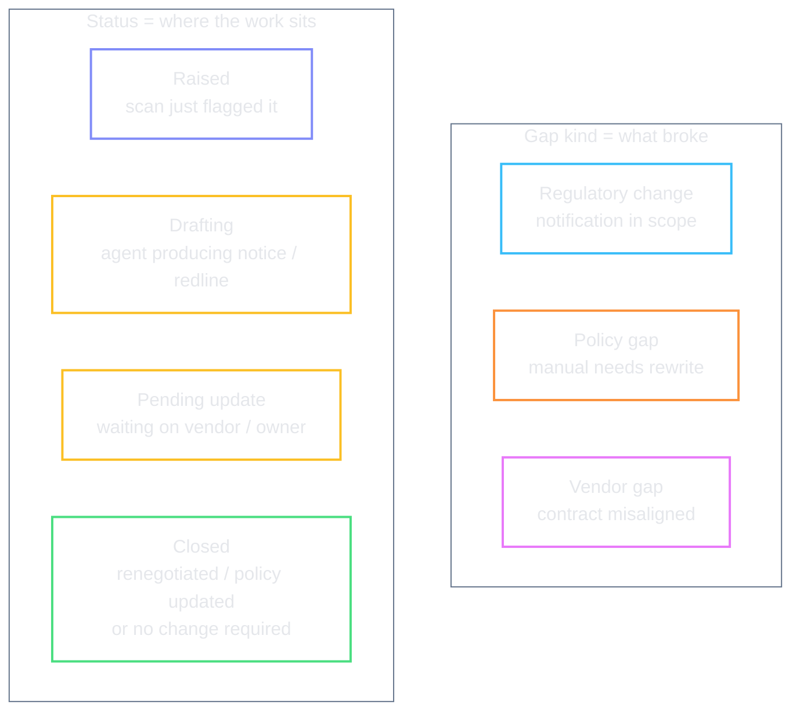
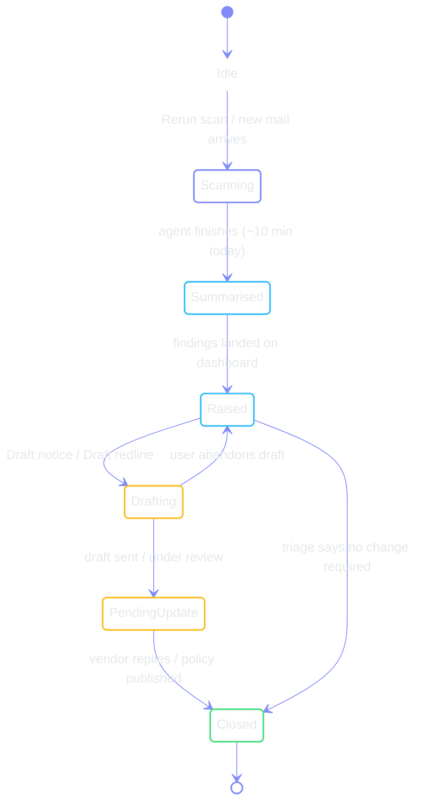
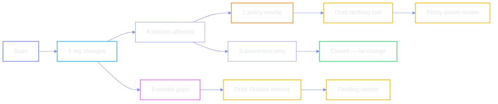

# Scan lifecycle & work status

Two independent axes on every finding: **what kind of gap** it is, and **where
the work sits**.

## End-to-end scan

## Typical path per workstream

### Boundaries that matter

| Boundary | Meaning |
| --- | --- |
| **Affected vs needs change** | A policy can be *in scope* of a reg without requiring a text edit |
| **Vendor gap vs policy gap** | Same notification can open both queues independently |
| **Drafting vs Pending update** | Agent is still writing vs human is waiting on the counterparty |

← [index](./README.md)
