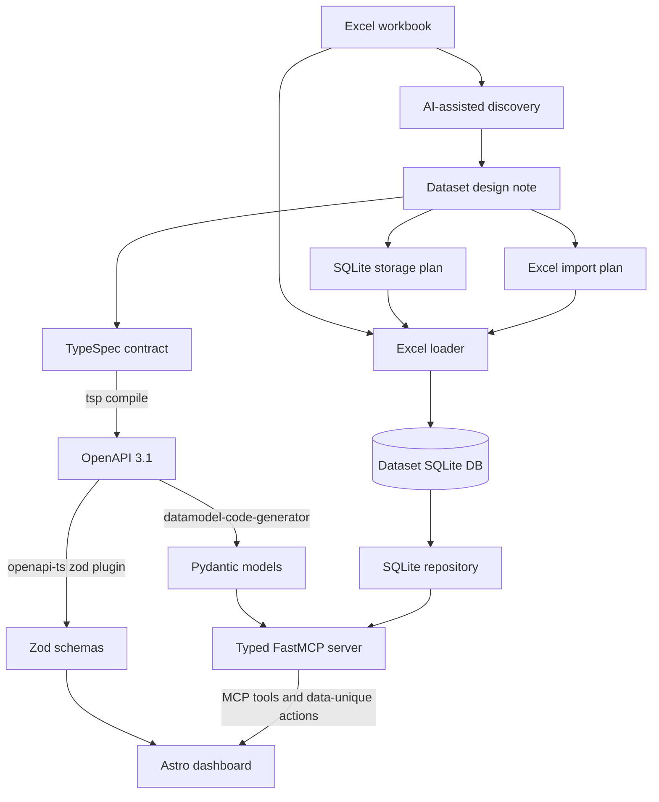

# TypeSpec-Driven MCP Dashboards

`mcp_dashboards` is a framework for turning an Excel-backed dataset into a typed
FastMCP server and a typed Astro dashboard.

The architecture separates three concerns:

- **Domain contract**: what MCP tools and dashboard components should see.
- **Storage shape**: how the imported workbook is stored and edited in SQLite.
- **Dashboard UI**: how typed MCP responses are rendered and acted on in Astro.

TypeSpec is the source of truth for the public domain contract. A dataset storage
plan is the source of truth for SQLite tables and import rules. Generated
artifacts are committed for review, but they are not hand edited.

## Goals

- Start from a workbook that can be interpreted as one or more database
  resources.
- Use AI-assisted discovery to design the domain model, storage model, and
  dashboard model before code generation.
- Generate Python and TypeScript validation types from the same TypeSpec
  contract.
- Keep each dataset isolated: its own Excel file, SQLite database, FastMCP
  server, generated models, and Astro dashboard.
- Prefer TypeSpec-aligned SQLite storage, so the mapping the FastMCP server has
  to perform is mechanical and reviewable rather than inventive.

## Project Layout

```text
tutorials/mcp/mcp_dashboards/
  package.json
  scripts/
  helpers/
    contracts/
    python/
    astro/
  datasets/
    account_review/
      contract/
      fastmcp/
      astro/
```

- `package.json` owns the shared TypeSpec, OpenAPI, and Zod generation commands.
- `scripts/` owns local dev entrypoints such as `dev-account-review.sh`.
- `helpers/contracts/` owns the generation script that compiles TypeSpec and
  emits Python and TypeScript artifacts.
- `helpers/python/` owns reusable Python helpers: settings, Excel loading, SQLite
  repository access, shared tool-error handling, and elicitation utilities. It
  deliberately contains no generic CRUD tool registrar — see
  [Why there is no shared CRUD layer](#why-there-is-no-shared-crud-layer).
- `helpers/astro/` owns the dataset-agnostic browser host: the `data-unique-*`
  interpreter, the MCP client, the elicitation form, and the whole `live-local`
  host. Datasets import it as `@mcp-dashboards/host/*`. See
  [The shared dashboard host](#the-shared-dashboard-host).
- `datasets/account_review/` is the reference dataset implementation. Copy it
  when adding a new dashboard rather than maintaining a separate Astro template.
- `datasets/<name>/contract/` owns the dataset TypeSpec source and generated
  OpenAPI document.
- `datasets/<name>/fastmcp/` owns the dataset Excel file, SQLite database,
  generated Pydantic models, import plan, and FastMCP server.
- `datasets/<name>/astro/` owns the dataset dashboard and generated Zod schemas.

## Source Of Truth

The framework has more than one contract boundary, so it also has more than one
source of truth:

- `contract/main.tsp` is the source of truth for public domain models, tool
  request payloads, tool response payloads, field descriptions, string formats,
  enums, and validation rules.
- The dataset storage plan is the source of truth for SQLite tables, primary
  keys, relationships, indexes, and editable storage columns. Prefer deriving
  this plan from the TypeSpec domain model.
- The Excel import plan is the source of truth for translating workbook sheets
  and columns into the TypeSpec-aligned SQLite schema.
- Generated files such as `openapi.json`, `models.py`, `zod.gen.ts`, and
  `types.gen.ts` are derived artifacts.

OpenAPI 3.1 is the reviewable intermediate contract. It is generated from
TypeSpec and then used by both Python and TypeScript code generators.

```text
contract/main.tsp
  -> contract/openapi.json
  -> fastmcp/generated/models.py
  -> astro/src/lib/generated/zod.gen.ts
  -> astro/src/lib/generated/types.gen.ts
```

OpenAPI is used even though the runtime transport is FastMCP rather than HTTP.
The HTTP-shaped operations give the generators a stable way to understand
request schemas, response schemas, list results, create payloads, update payloads,
and filters.

## Component Responsibilities

- **Excel workbook**: the original business dataset. It is source data, not
  automatically the public API shape.
- **AI-assisted discovery**: inspects workbook sheets, columns, sample values,
  repeated groups, likely resources, dashboard needs, and editing workflows.
- **Dataset design note**: records the proposed domain resources, SQLite storage
  mode, import rules, optional adapter needs, and dashboard use cases.
- **TypeSpec contract**: defines the typed domain contract exposed to MCP and
  Astro.
- **OpenAPI document**: generated intermediate schema used by downstream
  generators.
- **Generated Pydantic models**: Python runtime validation for FastMCP tool
  inputs and outputs.
- **Generated Zod schemas**: TypeScript runtime validation for the mock fixture
  (at build time, in `lib/mode.ts`) and for live MCP tool responses (at runtime,
  in the live-local host).
- **Excel loader**: creates or resets the dataset SQLite database from the
  workbook, and exposes `create_table` / `insert_rows` for dataset import plans.
- **SQLite repository**: shared low-level access to SQLite tables, including
  identifier allowlisting, schema caching, and batched `IN` reads.
- **Excel import plan**: dataset-owned translation from workbook sheets and
  columns into SQLite tables that match the TypeSpec domain model.
- **FastMCP server**: registers typed tools, validates payloads, calls the
  repository, maps rows onto generated Pydantic models, and returns them. The
  mapping is small and mechanical because storage is TypeSpec-aligned, but it is
  not zero — see [Domain-to-storage mapping](#domain-to-storage-mapping).
- **Astro dashboard**: renders typed responses and binds actions through the
  `data-unique-*` DOM contract, documented in [dom-contract.md](./dom-contract.md).

## End-To-End Flow



## AI-Assisted Discovery

The first pass over a workbook should not blindly convert every column into a
TypeSpec property. The agent should inspect the workbook and propose the domain
and storage design before implementation.

The discovery step should identify:

- Which sheets are real resources, lookup tables, summaries, or documentation.
- Which columns are stable identifiers, display labels, dates, amounts, statuses,
  categories, and free-text notes.
- Which values should become TypeSpec enums, string formats, numeric bounds, or
  nullable fields.
- Which repeated flat column groups should become named domain concepts.
- Which fields are public domain fields and which are storage-only details.
- Which create, update, list, filter, sort, and aggregation models are needed.
- Whether SQLite should mirror the workbook or use a curated dataset schema.
- Which import rules create SQLite rows, generated keys, relationships, derived
  values, and validation warnings.
- Which dashboard views and actions the dataset must support.

The output is a dataset design note plus source files:

- `contract/main.tsp` for the public domain contract.
- A storage plan for SQLite tables and import behavior.
- An Excel import plan for workbook-to-storage translation.
- Optional storage adapter notes only if the SQLite shape intentionally differs
  from the TypeSpec domain model.
- Dataset-specific FastMCP and Astro implementation notes.

## SQLite Storage Design

AI discovery can design SQLite as well as TypeSpec. The framework supports two
storage modes.

**Flat import mode** loads each workbook sheet into a SQLite table that closely
matches the source columns. This is fast, transparent, and useful for demos,
small dashboards, and early exploration.

**Curated storage mode** reshapes the workbook into dataset-specific tables. This
is better when the workbook contains repeated groups, multiple resources, joins,
durable edits, or data that should be normalized.

`account_review` uses curated storage with two tables:

- `clients`, one wide row per client whose column names are the TypeSpec domain
  paths with dots replaced by underscores (`identity.name` is stored as
  `identity_name`, `case_action.status` as `case_action_status`).
- `figure_metrics`, one row per dashboard metric, keyed by `client_id` with a
  `group_name` and `position`, replacing the workbook's repeated
  `fig{1..3}_*` / `hold{1..3}_*` column groups.

Flat storage is still useful, but it should be an explicit shortcut. It reduces
loader work at the cost of pushing translation work into the FastMCP server.
Curated storage costs more up front because the loader must implement a real
import plan, but it makes the remaining runtime mapping mechanical.

### Domain-to-storage mapping

Curated storage narrows the mapping the server performs; it does not remove it.
Two things still have to be translated at runtime, and `server.py` owns both:

- **Nesting.** SQLite rows are flat, TypeSpec models are nested, so a row is
  distributed across `ClientIdentity`, `ComplianceProfile`, `CaseAction`, and the
  rest. The column name is derivable (`_storage_column` replaces dots with
  underscores), but the object tree still has to be built explicitly.
- **The join.** `Client.figures` is assembled from `figure_metrics` rows, which
  live in a different table and cannot be read as part of the client row.

`server.py` also maps four short aliases (`status`, `risk_level`, `segment`,
`criticality`) that `ClientFilter` and `ClientUpdate` accept onto their full
domain paths. `FILTER_ALIASES` is the single Python-side definition; the
dashboard's copy is `astro/src/lib/domainFields.ts`.

An earlier version of this document claimed a TypeSpec-aligned schema needs "no
separate domain-to-storage mapping". That is not achievable while storage is
relational and the contract is nested — treat the mapping as a normal, named part
of a dataset server rather than a sign something went wrong.

## Excel Import Plan

If SQLite is designed from the TypeSpec domain model, the main translation is no
longer from SQLite to TypeSpec. It is from Excel to SQLite.

For `account_review`, the source workbook has flat columns such as
`client_name`, `client_ref`, `risk_level`, `fig1_label`, `fig1_value`, and
`hold3_status`. Its dataset import plan loads those into a TypeSpec-aligned
`clients` table with domain-prefixed columns and a normalized `figure_metrics`
table for the repeated dashboard metric groups.

The import plan handles:

- Workbook sheet selection.
- Source column to storage column mappings, for example `client_name` ->
  `identity_name`.
- Generated keys and relationships between imported rows.
- Repeated groups, for example `fig{1..3}_{label,value,pct,status}` ->
  rows in `figure_metrics`.
- Data cleaning, validation warnings, default values, and rejected rows.
- Hidden workbook columns that are stored for traceability but not exposed in
  TypeSpec.

`account_review/fastmcp/import_plan.py` implements this as ordinary Python: two
`TableSchema` constants, a `_client_row` function that renames workbook keys, and
a `_figure_rows` function that unrolls the repeated groups. It inserts clients one
at a time so it can read back each `lastrowid` and attach figure rows to the key
SQLite actually assigned, rather than assuming workbook order matches the
generated ids.

A declarative table of source-to-target column pairs would cover the renaming
part, and is worth extracting once a second dataset needs it. It does not cover
the repeated-group unrolling or the key round-trip, so plan on some imperative
code either way.

## Reuse Boundaries

The framework shares aggressively in some places and not at all in others. The
split is not arbitrary: machinery that is the same for every dataset is shared,
and anything shaped by a dataset's own contract is written per dataset. The two
sides of the system land on opposite sides of that line, for reasons worth
spelling out.

### Why there is no shared CRUD layer

The framework used to ship a `register_typed_crud_tools` helper that registered
generic list / count / get / create / update / delete tools against a Pydantic
model. It has been removed, and the reference dataset never used it.

The reason is that a dataset's tools are the interesting part. Their names,
arguments, bounds, enums, and return models come from that dataset's TypeSpec
contract, and a generic registrar can only express the intersection of every
dataset — which is close to nothing. `account_review` needs a nested-model
mapping, a batched join, an enum-constrained `count_clients_by`, and an
Excel reset; almost none of that is reusable as-is.

So a dataset server is written by hand (in practice, by a coding agent) against
its own generated models, and shares only genuinely generic machinery:
`SqliteCrudRepository` for allowlisted SQL, `mcp_dashboards.tools.tool_errors`
for logging and error translation, and `AppSettings` for paths and binding.

### The shared dashboard host

The browser side splits the other way, because the `data-unique-*` contract is
genuinely uniform across datasets: what a host does is read attributes and render
rows, and neither depends on the domain. `helpers/astro/host/` therefore holds
almost all of it — the DOM interpreter, the MCP client, the elicitation form, and
the `live-local` host — with no reference to any domain model, tool name, or
table, and no npm dependencies at all.

A dataset keeps two small pieces:

- `src/host/liveHost.ts`, a handful of lines mapping its generated Zod schemas to
  tool names and calling `startLiveHost`.
- `src/host/mockHost.ts`, a client-side mirror of that dataset's list / count /
  update semantics for preview mode. This one is irreducibly per-dataset, but it
  does no DOM work of its own.

To keep the shared host dependency-free it describes a schema structurally
(`{ parse(payload: unknown): unknown }`) rather than importing zod. That also
avoids a real hazard: if the dataset app and the shared package ever resolved two
different copies of zod, an `err instanceof ZodError` check would silently stop
matching and validation failures would surface as opaque errors.

Note the asymmetry with the server side above. Sharing works here and not there
because the DOM contract is the same for every dataset, whereas a dataset's tools
are exactly the part that differs. See
[`helpers/astro/README.md`](../helpers/astro/README.md).

## The Astro Build

The `live` artifact is a single HTML file containing no JavaScript at all —
currently 79 KB, zero `<script>` tags, zero external stylesheets. It has to be,
because the Unique platform supplies its own `data-unique-*` engine; a dashboard
carrying its own would be a second interpreter competing over the same
attributes.

Astro is used here as a compile-time template engine rather than a client
framework. Components, props and typed helpers all evaporate at build, leaving
markup and attributes. Four conditions keep the output script-free, and all four
must hold:

- No client islands anywhere in `src/` — no `client:*` directive and no
  non-inline `<script>`, so Astro emits no client bundle.
- `output: "static"` with a single page, so there is no server runtime to ship.
- `build.inlineStylesheets: "always"`, so CSS is inlined rather than emitted as a
  linked `_astro/*.css` file. Styling matters here because routing is done with
  CSS `:target` rather than a script.
- A per-mode `public/`. Astro copies `public/` into every `outDir` verbatim, so
  `scripts/build-hosts.mjs` takes the target mode and deletes any host bundle
  that mode does not use — otherwise a leftover from a previous `preview` build
  would be copied into `dist/live/` and break the guarantee without being
  referenced anywhere.

The same source also builds `preview` and `live-local`, selected by
`DASHBOARD_MODE`. Crucially the markup does not vary: all three emit the same 254
`data-unique-*` attributes, and the only differences are the injected `<script>`
tags, a hidden prompt-preview element, and a deliberately loud mode banner. That
is what makes local modes trustworthy — they exercise the same bindings the
platform will.

See [dashboard-build.md](./dashboard-build.md) for the full mechanism, including
how the layered reuse works and how to check the zero-JS property.

## Per-Dataset Ownership

Each dataset owns its mutable data and both runtime apps:

```text
datasets/account_review/
  contract/
    main.tsp
    openapi.json
  fastmcp/
    data/account_review_dataset.xlsx
    data/account_review.sqlite
    generated/models.py
    import_plan.py
    server.py
  astro/
    src/host/liveHost.ts # thin entry: registers this dataset's schemas
    src/host/mockHost.ts # preview-mode mirror of this dataset's tools
    src/lib/generated/zod.gen.ts
    src/lib/generated/types.gen.ts
```

Both host entries are bundled into `astro/public/` by
`scripts/build-hosts.mjs`, pulling the shared modules in from `helpers/astro/`.

This keeps datasets independent. The shared framework never chooses a global
SQLite path; each FastMCP server passes dataset-local paths into `AppSettings`.

## Runtime Flow

1. The dataset FastMCP server starts from `datasets/<name>/fastmcp/server.py`.
2. The server constructs `AppSettings` with dataset-local Excel and SQLite paths,
   plus the host and port the streamable-http transport binds to.
3. The repository calls the Excel loader if the dataset SQLite database is
   missing, reset, or does not have the expected shape. This runs once per
   process; the table schema is then cached.
4. Dataset-specific tools such as `list_clients`, `count_clients_by`, and
   `update_client` validate inputs with generated Pydantic models. FastMCP
   enforces the JSON-Schema bounds (`limit` 1..500, `offset` >= 0, the
   `count_clients_by` column enum) before the handler runs.
5. Tools are declared `def`, not `async def`, so FastMCP runs their blocking
   SQLite work in a worker thread instead of on the event loop.
6. Tools read, update, filter, sort, or aggregate the TypeSpec-aligned tables and
   map rows onto generated Pydantic response models.
7. Failures propagate through `tool_errors`, which logs a full traceback and
   re-raises as a `ToolError`, so the client sees a protocol-level error rather
   than a success payload containing an error field.
8. The Astro dashboard validates the mock fixture at build time and live tool
   responses at runtime with generated Zod schemas.
9. Dashboard components render fields and trigger MCP calls through the
   `data-unique-*` DOM contract.

## Authoring Workflow

1. Copy the workbook into `datasets/<name>/fastmcp/data/`.
2. Run AI-assisted discovery over workbook sheets, sample rows, values, and
   intended dashboard use cases.
3. Choose flat import mode or curated storage mode.
4. Write the dataset design note, TypeSpec contract, storage plan, and Excel
   import plan.
5. Run `npm run generate <dataset>` to regenerate OpenAPI, Pydantic, and Zod
   artifacts. Omit the argument to regenerate every dataset. Output is
   byte-stable, so `npm run generate:check` fails if a commit is missing a
   regeneration.
6. Write the dataset FastMCP server by hand against the generated models, using
   the shared repository, `tool_errors`, and `AppSettings`.
7. Instantiate or adapt the Astro dashboard with generated Zod schemas.
8. Validate the full flow: Excel -> SQLite -> FastMCP -> Astro.

## Authoring Rules

- Do not hand edit generated files. Regenerate them from TypeSpec. This includes
  `openapi.json`, `models.py`, `zod.gen.ts`, `types.gen.ts`, and the bundled
  `astro/public/*.js` host scripts.
- Keep TypeSpec focused on the public domain contract, not raw spreadsheet
  convenience.
- Keep SQLite storage dataset-local.
- Let AI discovery design SQLite when the workbook shape is not a good storage
  model.
- Prefer SQLite tables whose columns are the TypeSpec domain paths, so the
  server's mapping stays mechanical.
- Keep the domain-to-storage mapping in one named place per dataset server, and
  make it fail loudly on an unmapped field rather than dropping it.
- Preserve flat import mode for small demos and early prototypes when it is the
  simplest correct choice.
- Add a contract field and its mapping in the same change. `_update_to_storage`
  raises on a `ClientUpdate` field with no storage column precisely so a
  half-finished change cannot look like a working one.

## Implementation Status

Parts of this document describe the intended framework rather than shipped code.
As of now:

| Described | Status |
| --- | --- |
| TypeSpec -> OpenAPI -> Pydantic + Zod generation | Implemented, byte-stable, committed |
| Curated TypeSpec-aligned SQLite storage | Implemented for `account_review` |
| Zod validation of live MCP responses | Implemented in the live-local host |
| Platform iframe row binding (`binding.py`) | Implemented for `account_review` list/update responses; documented in [dom-contract.md](./dom-contract.md#platform-row-shape-vs-live-local) |
| AI-assisted discovery, dataset design note | Process guidance; no tooling enforces it |
| Declarative Excel import plan | Not implemented; import plans are Python |
| Flat import mode | Supported by the Excel loader, unused by any dataset |
| Shared, dataset-agnostic dashboard host | Extracted to `helpers/astro/`; 813 of 933 host lines are shared, leaving a dataset a schema registry and a preview mirror |
| Script-free `live` build | Holds today (one 79 KB HTML file, zero `<script>` tags), but nothing enforces it — `npm run check` does not assert it |
| Second dataset proving reusability | Does not exist. The `helpers/astro/` seam is drawn from reading the code, not from a real second consumer, so expect to adjust it |
| MCP elicitation | `update_client` (status confirm), `draft_client_email` / `send_email` (draft form; send also confirms delivery). Audience is `client` or `compliance`. |
| Authentication | Local/live-local defaults to `AUTH_DISABLED=true`. Azure deploy (`datasets/account_review/fastmcp/deploy.sh`) wires Zitadel via `unique_mcp` when `ZITADEL_*` credentials are present |
| DB admin website | Implemented for `account_review`: `/` serves `static/admin.html`; `/api/*` lists/updates/deletes rows and `POST /api/reset` rebuilds from Excel |
