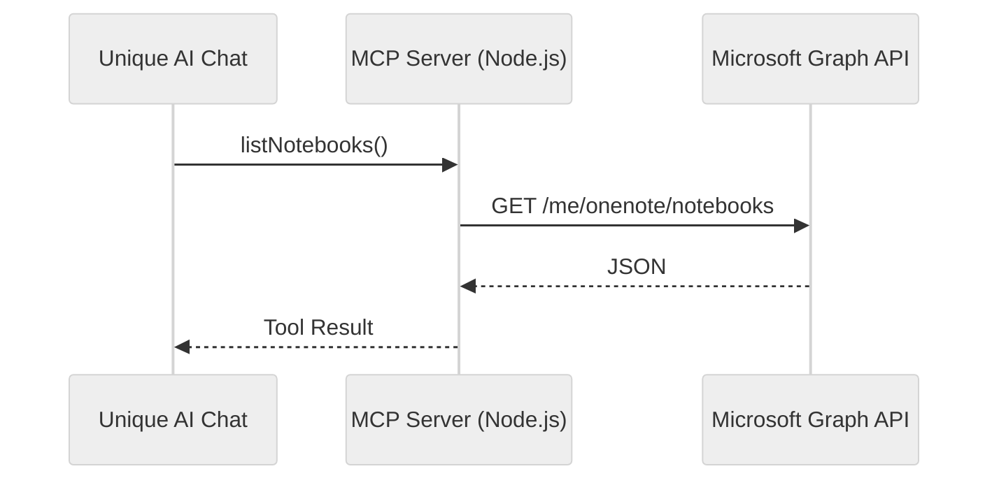

<!-- confluence-page-id: 1878556679 -->
<!-- confluence-space-key: PUBDOC -->

!!! danger "Prototype Disclaimer"
    As clearly outlined in [**Experimental Prototypes**](https://unique-ch.atlassian.net/wiki/x/DwDtbw) this is a prototype. 
    
    Prototypes are provided as-is for demonstration and evaluation only — **not products** — with no support, warranties, or production use. Any assistance or commercialization requires a separate commercial agreement.

## Overview

MCP server integrating Microsoft OneNote with Unique AI Chat using [@modelcontextprotocol/sdk](https://github.com/modelcontextprotocol/typescript-sdk) and [Microsoft Graph JavaScript Client](https://github.com/microsoftgraph/msgraph-sdk-javascript).

**SSE Endpoint:** `https://onenote-mcp-app.azurewebsites.net/sse`

Example flow with `listNotebooks`:

## Tools

| Tool | Description |
|------|-------------|
| `authenticate` | Start device code auth flow |
| `listNotebooks` | List all notebooks |
| `listSections` | List sections in a notebook |
| `listPages` | List pages in a section |
| `getPage` | Get page content (HTML) |
| `searchPages` | Search pages by keyword |
| `createPage` | Create a new page |
| `appendToPage` | Append content to existing page |

## Deployment

Deployed as a Docker container on **Azure App Service** (Sweden Central region).

| Resource | Details |
|----------|---------|
| App Service | `onenote-mcp-app` (B1 plan) |
| Container Registry | `onenotemcpacr` |
| Resource Group | `rg-lab-demo-001-onenote-mcp` |

## Limitations

- **Single-user auth** — all connections share one Microsoft account
- **Token in memory** — container restart requires re-authentication

## Source Code

[GitHub: ai/tutorials/mcp/mcp_onenote](https://github.com/Unique-AG/ai/tree/main/tutorials/mcp/mcp_onenote)
