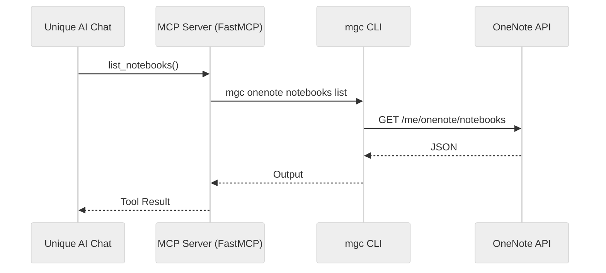

<!-- confluence-page-id: 1878556679 -->
<!-- confluence-space-key: PUBDOC -->

!!! danger "Prototype Disclaimer"
    As clearly outlined in [**Experimental Prototypes**](https://unique-ch.atlassian.net/wiki/x/DwDtbw) this is a prototype. 
    
    Prototypes are provided as-is for demonstration and evaluation only — **not products** — with no support, warranties, or production use. Any assistance or commercialization requires a separate commercial agreement.

## Overview

MCP server integrating Microsoft OneNote with Unique AI Chat using [FastMCP](https://github.com/jlowin/fastmcp) and [Microsoft Graph CLI](https://learn.microsoft.com/en-us/graph/cli/overview).

## Tools

| Tool | Description |
|------|-------------|
| `list_notebooks` | List notebooks |
| `list_sections` | List sections in a notebook |
| `list_pages` | List pages in a section |
| `get_page_content` | Get page content |
| `search_pages` | Search pages by keyword |
